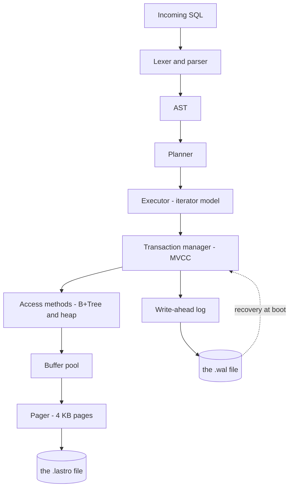

# lastro

[Português](README.md) · **English**

[](https://github.com/madeiragab/lastro/actions/workflows/ci.yml)

[](https://madeiragab.github.io/lastro/)

> The real engine compiled to WebAssembly, with nothing to install. The same pager, the same
> B+Tree, the same log; only the disk becomes a file in memory inside your tab.

**An embedded relational database, written from scratch in Rust.**

On-disk pages, B+Tree, write-ahead log with crash recovery, SQL parser and MVCC.
No external engine underneath. The goal is not to beat SQLite — it is to understand, line by
line, what a database does between your `INSERT` and the data being safe on disk.

---

## Status

Under construction. Nothing here is stable. Every number in the result tables was measured,
with the command to reproduce it alongside; none was estimated.

| Layer | State |
|---|---|
| Specification and documentation | done |
| Roadmap stages 0 through 3 | done |
| File format, slotted page, encodings | done |
| Pager and freelist | done |
| Buffer pool with clock policy | done |
| B+Tree | done |
| WAL: record format, the WAL rule, ARIES recovery | done |
| B+Tree transactional over the log | done |
| Crash fuzzer | done |
| SQL: lexer, syntax tree, parser | done |
| SQL: catalog, binder, planner, executor | done |
| SQL: joins, secondary indexes, UPDATE, DELETE | done |
| MVCC: row versions, snapshots, the visibility rule | done |
| MVCC: dead version collection (`VACUUM`) | done |
| Proof: model, property, crash fuzzer | done |
| Proof: anomaly battery | done |
| Proof: sqllogictest, benchmark against SQLite | done |

What already runs: creating and opening a `.lastro` file, allocating and freeing pages with
freelist reuse, storing variable-length cells in slotted pages with compaction, a B+Tree index
with splitting and merging on top of that, a write-ahead log with full ARIES recovery, and a SQL
layer with `CREATE TABLE`, `CREATE INDEX`, `INSERT`, `SELECT` with joins, `DISTINCT` and
`ORDER BY`, `UPDATE`, `DELETE`, `VACUUM` and `EXPLAIN`.

A committed transaction survives a crash that lost its page, and an uncommitted one is reversed
even if its page already reached disk. The WAL rule sits in the buffer pool's eviction path: no
dirty page reaches disk before the record describing it. It is one line of code, and it is the
difference between a database and a file that sometimes has your data.

The library has one dependency, `tempfile`, and only because an external sort has to put its
runs somewhere. CRC32C, the varint codec and every encoding are written here.

---

## Documentation

The project was specified before it was written. The on-disk binary format, the log record
format and the invariants of every structure are defined below.

| Document | Subject |
|---|---|
| [01 · Architecture](docs/en/01-architecture.md) | The layers, and what each one hides from the one above |
| [02 · File format](docs/en/02-file-format.md) | Binary layout: header, slotted page, cells, key encoding |
| [03 · Pager and buffer pool](docs/en/03-pager.md) | Pages, pin/unpin, clock policy, freelist |
| [04 · B+Tree](docs/en/04-btree.md) | Search, split, merge, range scan, invariants |
| [05 · WAL and recovery](docs/en/05-wal-recovery.md) | Log format, the WAL rule, the three ARIES phases |
| [06 · SQL](docs/en/06-sql.md) | Grammar, planner, executor operators |
| [07 · MVCC](docs/en/07-mvcc.md) | Versioning, snapshots, visibility rule, collection |
| [08 · Testing and proof](docs/en/08-testing.md) | Crash fuzzer, sqllogictest, anomalies, benchmark |
| [09 · Roadmap](docs/en/09-roadmap.md) | Build order and definition of done per layer |
| [10 · Glossary](docs/en/10-glossary.md) | Database vocabulary, no hand-waving |
| [ADR](docs/en/adr.md) | Architecture decisions, and what was rejected |
| [Bug diary](POSTMORTEM.en.md) | The five defects the existing tests let through, and what each one taught |

---

## What it is and what it is not

**It is:** an embedded, single-node, single-writer database in the spirit of SQLite. One file,
one library, no server. Genuinely transactional and durable — not a dictionary saved to disk.

**It is not:** distributed, replicated, or tuned to win benchmarks. There is no cost-based
planner, no join optimizer, no intra-query parallelism. Each of those is an entire project on
its own, and a shallow project across five fronts is worth less than a serious one on a single
front.

---

## Architecture in one picture



Details in [01 · Architecture](docs/en/01-architecture.md).

---

## The heart of the project

The question that drives everything: **what happens if the machine dies in the exact middle of
a `COMMIT`?**

The correct answer is that either the whole transaction happened, or no part of it did. Never
half. The only honest way to assert that is to test it — which is what the **crash fuzzer** is
for:

> The process kills itself, with no chance to clean anything up, at a random point inside the
> commit path. Reopens the database. Runs recovery. A checker asserts that the state is exactly
> either the one before the transaction or the one after it. Repeat tens of thousands of times
> in continuous integration.

Writing a database is the easy part. Proving that it does not lose your data is the real
project. Details in [05 · WAL and recovery](docs/en/05-wal-recovery.md) and
[08 · Testing](docs/en/08-testing.md).

---

## Running it

A whole session, from nothing:

```bash
cargo run --bin lastro-cli -- sql herd.lastro "
  CREATE TABLE cattle (id INTEGER PRIMARY KEY, tag TEXT NOT NULL, weight REAL);
  INSERT INTO cattle VALUES (1, 'BR-0042', 431.5), (2, 'BR-0043', 380.0);
  SELECT tag, weight FROM cattle WHERE weight > 400;
"
```

And the plan the database chose, which is where the planner's rules become visible:

```bash
cargo run --bin lastro-cli -- sql herd.lastro "EXPLAIN SELECT * FROM cattle WHERE id = 1"
```

```
RowIdScan cattle (= 1)
```

A comparison against the primary key stops being a scan and becomes a descent, because the
primary key **is** the key of the table's own tree. Without it that line reads `SeqScan`.

The tests, model-based, property-based and the crash fuzzer included:

```bash
cargo test
```

Create an empty database:

```bash
cargo run --bin lastro-cli -- create example.lastro
```

Read the metadata page and check its invariants:

```bash
cargo run --bin lastro-cli -- info example.lastro
```

Summarize every page in the file, or open one:

```bash
cargo run --bin lastro-cli -- pages example.lastro
```

```bash
cargo run --bin lastro-cli -- page example.lastro 1
```

---

### What the planner does, and what it does not

Of the six rules in the specification, five are implemented and visible in `EXPLAIN`:

| Rule | State |
|---|---|
| 1 · Access selection | ✅ row id ranges, and equality on an index's leading column |
| 2 · Predicate pushdown | ✅ whatever the range cannot express stays as a filter |
| 3 · Projection pushdown | not applicable |
| 4 · Join selection | ✅ hash when the equality separates the sides, nested loop otherwise |
| 5 · Sort elimination | ✅ when the order asked for is the primary key ascending |
| 6 · Limit pushdown | ✅ `LIMIT` over `Sort` becomes a top-N, counting the `OFFSET` |

Rule 3 is not "not done", it is **without effect in this representation**: a row is the table's
whole tuple, decoded by the scan. There is nothing a projection above can do to make the scan
read less, short of a columnar layout or a covering index. Recorded that way rather than listed
as outstanding.

Ranges over a secondary index — `WHERE weight > 400` with an index on `weight` — are also left
out, for a specific reason: getting the edges of a range over a composite key right is exactly
the kind of detail that goes wrong in silence. Equality is correct and checkable; ranges wait.

---

## Proof

No number goes in here without having been measured, with the command next to it. Full
methodology in [08 · Testing and proof](docs/en/08-testing.md).

**Durability** — the crash fuzzer. Power is cut at the *n*-th sync point, and the sweep covers
every one of them. After each cut the database is fully reopened and checked.

| Metric | Value |
|---|---|
| Seeds per continuous integration run | 120 |
| Seeds in the daily run | 20,000, in 8m27s |
| Sync points swept exhaustively | all of them, across one full workload |
| Atomicity violations | 0 |

To reproduce: `LASTRO_FUZZ_SEEDS=20000 cargo test --release --test crash_fuzz`. Any seed that
fails prints the seed and the cut point, and becomes a fixed test.

The property being checked, precisely: **after recovery the database holds a state corresponding
to some prefix of the confirmed commit sequence.** Not one commit more, not one fewer, and never
anything in between.

Why power loss and not `SIGKILL`: a killed process loses its own buffers, but every write that
already reached the operating system stays in the page cache and gets written out anyway. The
data survives, the WAL rule is never put under pressure, and the test passes whether or not the
rule is even there. What is modelled is the thing that actually matters — **only what was
`fsync`ed survives.**

**Compatibility** — the sqllogictest corpus, written by the SQLite project years before this one
existed. Every other test here was written by the same person who wrote the code under test, which
is the weakest kind of evidence there is: it only proves the engine does what its author expected.
This corpus has no idea what lastro finds easy.

| Measure | Value |
|---|---|
| Files considered | 11 |
| Files run to the end | 6 |
| Files abandoned at setup | 5 |
| Assertions attempted | 9,172 |
| Passed | **9,172** |
| Failed | **0** |
| Skipped, feature not implemented | 16,924 |

**100.0% of what ran. And 35.1% of the corpus could run at all.** The two numbers travel together
on purpose: publishing "100% pass" while hiding that two thirds of the assertions were never
attempted would be a statistical lie. The denominator ships with the numerator, every time.

A missing feature is **not** a failure — it is an absence, and each one is listed with how often
the corpus asked for it. The largest: function calls (6,243), `SELECT` with no `FROM` (4,577),
comma-separated `SELECT` over several tables (1,970), scalar subqueries (1,149), `CROSS JOIN`
(237), `EXISTS` (179). Five files stop at their `CREATE`, over `INSERT ... SELECT` and
`CREATE TRIGGER`.

Reproduce: `LASTRO_SQLLOGIC_DIR=<dir> cargo test --release --test sqllogic -- --nocapture`. The
corpus is **fetched by CI rather than vendored** — evidence a repository carries around is
evidence that repository can edit.

The corpus found three real bugs, all of the worst kind: a wrong answer with no error. `DISTINCT`
was read as a column name, `ORDER BY 1` sorted by a constant, and type names like `VARCHAR(8)`
rejected the whole schema. The first two are in the bug diary. That is exactly what borrowing
somebody else's tests is for: they ask for things the author would not have thought to ask.

**Transactional correctness** — the classic isolation anomalies, measured at two levels because
they answer different questions.

What the **visibility rule** alone prevents, exercised with the version histories each anomaly
would produce:

| Anomaly | Prevented by the rule? |
|---|---|
| Dirty read | ✅ |
| Non-repeatable read | ✅ |
| Phantom read | ✅ |
| Write skew | ❌ |

The `❌` is expected. Snapshot isolation permits write skew by definition, and there is a test
that **asserts the anomaly** rather than hiding it. If the isolation is ever hardened, that test
fails — and the failure is the correct signal that the documentation has to change with it.

What the **engine** prevents, which is a different thing:

| Anomaly | Prevented by the engine? | By what |
|---|---|---|
| Dirty read | ✅ | the visibility rule |
| Non-repeatable read | ✅ | the snapshot held since `BEGIN` |
| Phantom read | ✅ | the same snapshot |
| Lost update | ✅ | one writer at a time |
| Write skew | ✅ | one writer at a time |

**The last two lines are not the isolation level's doing.** They follow from the engine refusing
a second writer: the two-transaction schedule cannot even be built. A battery that only ran the
engine would report "prevented" for all five, and would be reporting the concurrency model while
appearing to report the isolation level. That distinction is why the battery has two levels.

**Performance** — against SQLite 3.46, on the same workloads and with the **same durability**:
write-ahead logging with an `fsync` at every commit on both sides, 2 MiB of cache each, and both
forced to re-parse the text of every statement, because lastro has no prepared statements.
Measuring against `synchronous = NORMAL` would be comparing a database that survives power loss
against one that does not.

5,000 rows, 3 runs, median. A shared CI machine — the spread column says how much to trust it.

| Workload | lastro | SQLite | ratio |
|---|---|---|---|
| Insert in key order | 17.0 µs/row | 1.9 µs/row | 9.1× slower |
| Insert in random order | 27.1 µs/row | 2.1 µs/row | 12.6× slower |
| Lookup by primary key | 3.2 µs/lookup | 5.3 µs/lookup | 0.6× |
| Range scan over a tenth of the table | 114.0 µs/scan | 42.7 µs/scan | 2.7× slower |
| Update by primary key | 32.3 µs/update | 2.5 µs/update | 12.9× slower |
| One row per transaction | 378.1 µs/commit | 272.5 µs/commit | 1.4× slower |

**The lookup line is not a win.** At 5,000 rows the whole table fits in cache on both sides, so what
is being measured is parsing the statement plus one descent of the tree. lastro's grammar is a
fraction of SQLite's, so its parser is faster for being smaller, not for being better. Switching
both sides to prepared statements would flip that line immediately.

**Where the time goes on writes.** Every B+Tree mutation here reads the whole node into vectors,
edits, and writes it back: O(page) with an allocation per insert, where SQLite edits the page in
place. On top of that, each insert opens an edit session and logs its diff. Those two decisions are
what the 9× and the 12× are made of, and both were taken for clarity — the code that rebuilds a
node is readable, the code that edits it in place is not. It is documented as a cost, not as a
surprise.

**The scan** pays for a cursor that holds no pin between calls: every row re-pins its frame in the
buffer pool. That was deliberate (a cursor holding a pin is a cursor that can wedge the pool), and
2.7× is the price.

**The last line is what validates the measurement.** When every commit costs an `fsync`, the disk
dominates and the gap between the engines shrinks to 1.4×. If that line showed 10× as well, it
would be a sign the comparison was measuring something else.

Reproduce: `cargo run --release -p lastro-bench`. The program prints the plans alongside the times,
because a ratio without a plan explains nothing.


---

## Bug diary

A record of the mistakes that cost real time, because that is the part that actually taught
something.

### The `ORDER BY` that ordered by nothing

`ORDER BY 1` means the first output column. The planner read the `1` as the number one, bound the
sort to a constant, and sorting by a constant is not sorting: the rows came back in whatever order
the scan produced them. Every value correct, the order wrong, and no error anywhere.

It is the most dangerous category of bug there is — the one that produces a plausible answer. No
test written here caught it, because writing a test for `ORDER BY 1` requires first suspecting it
could be broken. SQLite's corpus found 43 cases at once.

The fix has a subtlety: the sort sits **below** the projection in the plan, so the ordinal cannot
become "output column n" — that column does not exist yet. It becomes the expression that column is
computed from. And an ordinal outside the output is now refused rather than ignored.

### The `DISTINCT` that was a column name

`DISTINCT` was not in the keyword list, so `SELECT DISTINCT cor FROM t` parsed as a column called
`DISTINCT` aliased to `cor`, and failed with "there is no column called DISTINCT". The error even
looks honest, and is the opposite: the front end accepted the statement and answered a different
question. A missing feature should be a refusal in the parser, never a complaint about the schema.

The distinction earns its keep because the sqllogictest runner classifies on exactly that line:
what the parser refuses is an absence, what it accepts and then gets wrong is this project's bug.
While `DISTINCT` became a column name it counted as a bug — correctly.

### The metadata page that went down before the others

Found by the crash fuzzer on its first run, which is the best possible argument for having
written the fuzzer.

At sync time the pending pages were written in page-number order. The metadata page is number
zero, so it reached the disk **first** — counting pages that had not got there yet. The next open
found a file holding three pages and metadata claiming five, and refused the database.

The missing rule is simple and holds for anything that points at anything else: **what refers
goes down after what is referred to.** The metadata page now goes last, and only if all the
others made it.

A second thing came with it, not a bug but undue strictness: opening refused a file shorter than
the metadata claimed. After a crash that is normal, not corruption. The missing pages come back
blank and recovery fills in whatever the log has to say about them.

### The birth of a page that nobody wrote down

The best find of this round, and the best hidden.

Setting up a page writes the byte that says what it is: leaf, interior, heap.
That byte is written **once**, at setup, and never again — no insert, delete or
split ever touches it afterwards.

And `BTree::create` set up the root page **outside any edit session**. The setup
never became a log record.

What followed: later inserts were logged normally, and each diff covered the
bytes that changed — the slot count, the free space pointers, the new cell. The
type byte was in no diff at all, because it was the same before and after. So
after a crash, redo rebuilt the page's contents **onto a page that never learned
what it was**, and the tree found no type at its own root.

What makes it instructive: the "log only what changed" scheme is correct, and
still loses information — because *never having changed* and *never having been
written* are different things, and a diff cannot tell them apart. The missing
rule is that **everything a page is has to go through the log, including the
moment it came into being.**

A second thing came with it: `begin_edit` now reports whether it opened the
session, so a caller finding one already running leaves it to whoever started it.
Closing somebody else's session early would log half an operation and call it
whole.

### The redo that skipped everything, silently

By far the worst so far, because nothing visibly broke.

A checkpoint empties the log. Since an LSN is the record's own offset in the file, emptying the
file restarted the numbering at zero. But pages on disk still carry the LSN they were stamped
with — large numbers, from the log's previous life.

The redo pass compares `page.lsn < record.lsn`, precisely so it can skip what a page already
reflects. With the numbering restarted, **every** page looked newer than **every** record. Redo
skipped the entire transaction and reported success.

The symptom was a tree with a key outside its node's range, three layers away from the cause.
What caught it was `check_tree`, not a behavioural test — again.

The fix uses the field the specification had already reserved: the file offset became
`lsn - base`, and the base lives in `last_checkpoint_lsn` on the metadata page. The numbering
never restarts; only the file does.

### The freed page that redo resurrected

When two nodes merge, the leftover page goes back on the freelist. That was done by writing the
freelist header straight to disk, outside the log.

After a crash, redo reapplied that page's older records — restoring tree content on top of the
freelist header. The chain of free pages then pointed into live data, and the next allocation
handed back an invented page number.

Pages are now released only at a checkpoint, when the log is empty and nothing is left to replay
over them. A transaction that aborts simply does not release: the page leaks space, and that is
declared as a limitation rather than disguised.

### The page count that travelled backwards

`page_count` was only written at a checkpoint. After a crash the allocator went back to handing
out page numbers that already held committed data, and the next transaction wrote over them.

Commit now syncs the metadata page **before** writing the commit record. Erring early is the safe
direction: a crash between the two leaves the transaction to be undone and the metadata merely
over-counting pages, which leaks space instead of losing data.

### The single range that covered the whole page

Less serious, more instructive. The log stores the smallest difference between a page's before
and after images. With one contiguous range that is a bad fit for a slotted page: slots grow from
the front, cells from the back, so almost any change touches both ends and the minimal range
spans all 4096 bytes.

Measured: 4359 bytes of log for a 200 byte insert — worse than simply writing the whole page.
Splitting the diff into separate runs, merging those too close together to be worth their own
record, brought it under 1500.

The lesson: "log only what changed" is cheap only if you know **where** it changed. In a structure
that grows from both ends, one range is not the answer.

### The invariant that was wrong twice

The specification asserted that every B+Tree node outside the root would be at least 40% full.
That is what every textbook says, and here it is false.

**First attempt.** I wrote the 40% threshold, and it does not survive variable-length cells: a
single cell can occupy a third of a page, so a perfectly even split leaves both halves under the
floor with nothing wrong.

**Second attempt.** I replaced it with something stronger and apparently bulletproof: *no two
adjacent siblings fit into a single page together* — that is, nothing that could have been merged
was left unmerged. I wrote the check, ran the property test, and it failed.

The minimal case proptest shrank to **contained no deletes at all.** Only inserts.

The reason, obvious afterwards: when a full node splits down the middle, each half holds about
half a page. One of them now sits beside an untouched neighbour — a neighbour it never had to fit
alongside, because before the split it was part of one large node. Splitting creates mergeable
pairs. It is not a delete bug, it is what insertion does.

**What stands now.** The fill factor is not asserted, it is **measured**, by `BTree::stats`, and
the tests assert on the measurement. Invariant 4 became something modest and true: no node
outside the root is empty.

The lesson is not about B+Trees. It is that an invariant written from what the textbook says,
without being run against random input, is a hypothesis — and the first two hypotheses here were
wrong for different reasons.

### The right sibling that was never looked at

Found by the same test, before the one above. Rebalancing after a delete only tried to merge the
node with its **left** sibling. A node that could have merged rightward just sat there.

Nothing visibly breaks when that happens. Every query still returns the right answer; the tree
merely drifts sparser than it should, forever. It is the kind of defect a behavioural test never
catches, and the reason the invariant check exists.

---

## References

- **CMU 15-445 / 15-721**, Andy Pavlo — this project's syllabus, lecture by lecture, freely available
- **Database Internals**, Alex Petrov — B-trees and recovery logging in depth
- **Architecture of SQLite** — `sqlite.org/arch.html`
- **ARIES**, Mohan et al., 1992 — the original write-ahead logging paper
- **Rust Atomics and Locks**, Mara Bos — for the concurrency layer

---

## License

MIT.
