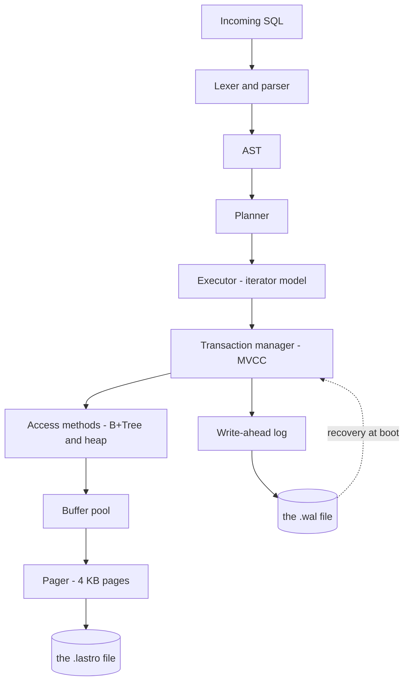

# lastro

[Português](README.md) · **English**

[](https://github.com/madeiragab/lastro/actions/workflows/ci.yml)

**An embedded relational database, written from scratch in Rust.**

On-disk pages, B+Tree, write-ahead log with crash recovery, SQL parser and MVCC.
No external engine underneath. The goal is not to beat SQLite — it is to understand, line by
line, what a database does between your `INSERT` and the data being safe on disk.

---

## Status

Under construction. Nothing here is stable, and the result tables are empty on purpose — a
number only goes in after it has been measured.

| Layer | State |
|---|---|
| Specification and documentation | done |
| File format, slotted page, encodings | done |
| Pager and freelist | done |
| Buffer pool with clock policy | done |
| B+Tree | done |
| WAL + crash recovery | not started |
| SQL (parser, planner, executor) | not started |
| MVCC / snapshot isolation | not started |
| Proof suite | partial: model and property tests done, crash fuzzer not |

What already runs: creating and opening a `.lastro` file, allocating and freeing pages with
freelist reuse, storing variable-length cells in slotted pages with compaction, reading and
writing all of it through a fixed-size buffer pool, and inspecting the file with `lastro-cli`.

The library has no dependencies: CRC32C, the varint codec and the encodings are written here.

---

## Documentation

The project was specified before it was written. The on-disk binary format, the log record
format and the invariants of every structure are defined below.

| Document | Subject |
|---|---|
| [01 · Architecture](docs/en/01-architecture.md) | The layers, and what each one hides from the one above |
| [02 · File format](docs/en/02-file-format.md) | Binary layout: header, slotted page, cells, key encoding |
| [03 · Pager and buffer pool](docs/en/03-pager.md) | Pages, pin/unpin, clock policy, freelist |
| [04 · B+Tree](docs/en/04-btree.md) | Search, split, merge, range scan, invariants |
| [05 · WAL and recovery](docs/en/05-wal-recovery.md) | Log format, the WAL rule, the three ARIES phases |
| [06 · SQL](docs/en/06-sql.md) | Grammar, planner, executor operators |
| [07 · MVCC](docs/en/07-mvcc.md) | Versioning, snapshots, visibility rule, collection |
| [08 · Testing and proof](docs/en/08-testing.md) | Crash fuzzer, sqllogictest, anomalies, benchmark |
| [09 · Roadmap](docs/en/09-roadmap.md) | Build order and definition of done per layer |
| [10 · Glossary](docs/en/10-glossary.md) | Database vocabulary, no hand-waving |
| [ADR](docs/en/adr.md) | Architecture decisions, and what was rejected |

---

## What it is and what it is not

**It is:** an embedded, single-node, single-writer database in the spirit of SQLite. One file,
one library, no server. Genuinely transactional and durable — not a dictionary saved to disk.

**It is not:** distributed, replicated, or tuned to win benchmarks. There is no cost-based
planner, no join optimizer, no intra-query parallelism. Each of those is an entire project on
its own, and a shallow project across five fronts is worth less than a serious one on a single
front.

---

## Architecture in one picture



Details in [01 · Architecture](docs/en/01-architecture.md).

---

## The heart of the project

The question that drives everything: **what happens if the machine dies in the exact middle of
a `COMMIT`?**

The correct answer is that either the whole transaction happened, or no part of it did. Never
half. The only honest way to assert that is to test it — which is what the **crash fuzzer** is
for:

> The process kills itself, with no chance to clean anything up, at a random point inside the
> commit path. Reopens the database. Runs recovery. A checker asserts that the state is exactly
> either the one before the transaction or the one after it. Repeat tens of thousands of times
> in continuous integration.

Writing a database is the easy part. Proving that it does not lose your data is the real
project. Details in [05 · WAL and recovery](docs/en/05-wal-recovery.md) and
[08 · Testing](docs/en/08-testing.md).

---

## Running it

The tests, model-based and property-based ones included:

```bash
cargo test
```

Create an empty database:

```bash
cargo run --bin lastro-cli -- create example.lastro
```

Read the metadata page and check its invariants:

```bash
cargo run --bin lastro-cli -- info example.lastro
```

Summarize every page in the file, or open one:

```bash
cargo run --bin lastro-cli -- pages example.lastro
```

```bash
cargo run --bin lastro-cli -- page example.lastro 1
```

---

## Proof

No number goes in here without having been measured, with the command next to it. Full
methodology in [08 · Testing and proof](docs/en/08-testing.md).

**Compatibility** — SQLite's SQL Logic Test suite, written by third parties, run against the
SQL subset implemented here.

| Metric | Value |
|---|---|
| Tests run | pending |
| Passed | pending |

**Transactional correctness** — the classic isolation anomalies. The goal is not to pass them
all: snapshot isolation permits *write skew* by definition. The table shows what is prevented
and what is not, because a database that lies about its own isolation level is worse than a slow
one.

| Anomaly | Prevented? |
|---|---|
| Dirty read | pending |
| Non-repeatable read | pending |
| Phantom read | pending |
| Lost update | pending |
| Write skew | pending |

**Performance** — compared against SQLite on identical workloads. Expectation: `lastro` loses by
a wide margin. SQLite has 25 years of optimization. The charts will be published showing the
loss, together with the analysis of where the time goes. An interesting benchmark is not the one
that shows who won, it is the one that explains why.

---

## Bug diary

A record of the mistakes that cost real time, because that is the part that actually taught
something.

### The invariant that was wrong twice

The specification asserted that every B+Tree node outside the root would be at least 40% full.
That is what every textbook says, and here it is false.

**First attempt.** I wrote the 40% threshold, and it does not survive variable-length cells: a
single cell can occupy a third of a page, so a perfectly even split leaves both halves under the
floor with nothing wrong.

**Second attempt.** I replaced it with something stronger and apparently bulletproof: *no two
adjacent siblings fit into a single page together* — that is, nothing that could have been merged
was left unmerged. I wrote the check, ran the property test, and it failed.

The minimal case proptest shrank to **contained no deletes at all.** Only inserts.

The reason, obvious afterwards: when a full node splits down the middle, each half holds about
half a page. One of them now sits beside an untouched neighbour — a neighbour it never had to fit
alongside, because before the split it was part of one large node. Splitting creates mergeable
pairs. It is not a delete bug, it is what insertion does.

**What stands now.** The fill factor is not asserted, it is **measured**, by `BTree::stats`, and
the tests assert on the measurement. Invariant 4 became something modest and true: no node
outside the root is empty.

The lesson is not about B+Trees. It is that an invariant written from what the textbook says,
without being run against random input, is a hypothesis — and the first two hypotheses here were
wrong for different reasons.

### The right sibling that was never looked at

Found by the same test, before the one above. Rebalancing after a delete only tried to merge the
node with its **left** sibling. A node that could have merged rightward just sat there.

Nothing visibly breaks when that happens. Every query still returns the right answer; the tree
merely drifts sparser than it should, forever. It is the kind of defect a behavioural test never
catches, and the reason the invariant check exists.

---

## References

- **CMU 15-445 / 15-721**, Andy Pavlo — this project's syllabus, lecture by lecture, freely available
- **Database Internals**, Alex Petrov — B-trees and recovery logging in depth
- **Architecture of SQLite** — `sqlite.org/arch.html`
- **ARIES**, Mohan et al., 1992 — the original write-ahead logging paper
- **Rust Atomics and Locks**, Mara Bos — for the concurrency layer

---

## License

MIT.
