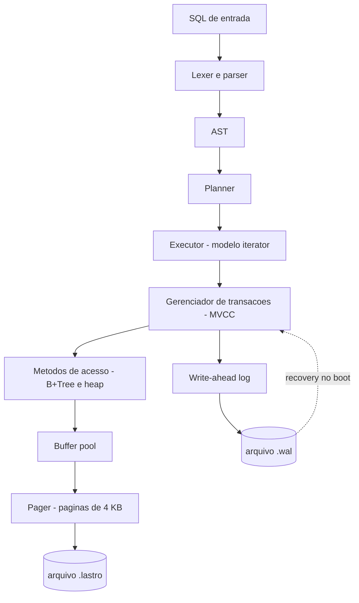

# lastro

**Português** · [English](README.en.md)

[](https://github.com/madeiragab/lastro/actions/workflows/ci.yml)

[](https://madeiragab.github.io/lastro/)

> O motor de verdade compilado para WebAssembly, sem instalar nada. O mesmo pager, a mesma
> B+Tree, o mesmo log; só o disco vira um arquivo em memória na sua aba.

**Um banco de dados relacional embutido, escrito do zero em Rust.**

Páginas em disco, B+Tree, write-ahead log com crash recovery, parser SQL e MVCC.
Sem dependência de engine externa. O objetivo não é competir com o SQLite — é entender,
linha por linha, o que um banco de dados faz entre o seu `INSERT` e o dado estar seguro no disco.

---

## Como este projeto foi escrito

Escrito com assistência de IA, em sessões longas, com revisão minha camada por camada. O
histórico do repositório não esconde: os commits saem rápido e carregam `Co-Authored-By`.

Vale dizer o que a assistência **não** decidiu, porque é o que sobra quando se tira a
digitação. A especificação — formato binário, formato do registro de log, as invariantes de
cada estrutura — veio antes do código e está em [`docs/`](docs/pt/). O critério de pronto de
cada camada é o teste que ela tem que passar, não a funcionalidade que ela expõe. Modelar o
corte de energia em vez de matar o processo foi uma decisão sobre o que o teste precisa
provar, e é a diferença entre o crash fuzzer valer alguma coisa ou nada. Cada número nas
tabelas foi medido, com o comando ao lado.

Se a pergunta é quanto disto eu entendo de fato, a resposta mais honesta que eu tenho é o
[Diário de bugs](POSTMORTEM.md): cinco erros, o sintoma de cada um, por que os testes que
existiam deixaram passar e o que ficou. Depuração não terceiriza.

---

## Status

Em construção. Nada aqui é estável. Todo número nas tabelas de resultado foi medido, com o
comando ao lado para reproduzir; nenhum foi estimado.

| Camada | Estado |
|---|---|
| Especificação e documentação | concluída |
| Etapas 0 a 3 do roadmap | concluídas |
| Formato de arquivo, slotted page, codificações | concluído |
| Pager e freelist | concluído |
| Buffer pool com política clock | concluído |
| B+Tree | concluído |
| WAL: formato do registro, regra WAL, recovery ARIES | concluído |
| B+Tree transacional sobre o log | concluído |
| Crash fuzzer | concluído |
| SQL: lexer, árvore sintática, parser | concluído |
| SQL: catálogo, binder, planner, executor | concluído |
| SQL: junções, índices secundários, UPDATE, DELETE | concluído |
| MVCC: versão de linha, snapshot, regra de visibilidade | concluído |
| MVCC: coleta de versões mortas (`VACUUM`) | concluído |
| Provas: modelo, propriedade, crash fuzzer | concluído |
| Provas: bateria de anomalias | concluída |
| Provas: sqllogictest, benchmark contra SQLite | concluído |

O que já roda: criar e abrir um arquivo `.lastro`, alocar e liberar páginas com reuso pela
freelist, guardar células de tamanho variável em slotted pages com compactação, um índice B+Tree
com split e fusão sobre isso, um write-ahead log com recovery ARIES completo, e uma camada SQL
com `CREATE TABLE`, `CREATE INDEX`, `INSERT`, `SELECT` com junções, `DISTINCT` e `ORDER BY`,
`UPDATE`, `DELETE`, `VACUUM` e `EXPLAIN`.

Uma transação confirmada sobrevive a uma queda que perdeu a página, e uma não confirmada é
desfeita mesmo que a página já tenha chegado ao disco. A regra WAL está no caminho de despejo do
buffer pool: nenhuma página suja vai ao disco antes do registro que a descreve. É uma linha de
código, e é a diferença entre um banco de dados e um arquivo que às vezes tem seus dados.

Uma dependência só na biblioteca, `tempfile`, e apenas porque um sort externo precisa de algum
lugar para os runs. CRC32C, varint e todas as codificações são escritos aqui.

---

## Documentação

O projeto foi especificado antes de ser escrito. O formato binário do arquivo, o formato do
registro de log e as invariantes de cada estrutura estão definidos abaixo.

| Documento | Assunto |
|---|---|
| [01 · Arquitetura](docs/pt/01-arquitetura.md) | As camadas, o que cada uma esconde da de cima |
| [02 · Formato de arquivo](docs/pt/02-formato-de-arquivo.md) | Layout binário: header, slotted page, células, codificação de chave |
| [03 · Pager e buffer pool](docs/pt/03-pager.md) | Páginas, pin/unpin, política clock, freelist |
| [04 · B+Tree](docs/pt/04-btree.md) | Busca, split, merge, range scan, invariantes |
| [05 · WAL e recovery](docs/pt/05-wal-recovery.md) | Formato do log, regra WAL, as três fases do ARIES |
| [06 · SQL](docs/pt/06-sql.md) | Gramática, planner, operadores do executor |
| [07 · MVCC](docs/pt/07-mvcc.md) | Versionamento, snapshot, regra de visibilidade, coleta |
| [08 · Testes e provas](docs/pt/08-testes.md) | Crash fuzzer, sqllogictest, anomalias, benchmark |
| [09 · Roadmap](docs/pt/09-roadmap.md) | Ordem de construção e critério de pronto por camada |
| [10 · Glossário](docs/pt/10-glossario.md) | Vocabulário de banco de dados, sem enrolação |
| [ADR](docs/pt/adr.md) | Decisões de arquitetura e o que foi descartado |
| [Diário de bugs](POSTMORTEM.md) | Os cinco erros que os testes existentes deixaram passar, e o que cada um ensinou |

---

## O que é e o que não é

**É:** um banco embutido single-node e single-writer, no espírito do SQLite. Um arquivo, uma
biblioteca, sem servidor. Transacional e durável de verdade — não um dicionário salvo em disco.

**Não é:** distribuído, replicado, nem otimizado para vencer benchmark. Não tem planner baseado
em custo, nem otimizador de junção, nem paralelismo intra-query. Cada uma dessas coisas é um
projeto inteiro, e um projeto raso em cinco frentes vale menos que um projeto sério em uma.

---

## Arquitetura em uma imagem



Detalhes em [01 · Arquitetura](docs/pt/01-arquitetura.md).

---

## O coração do projeto

A pergunta que move tudo: **o que acontece se a máquina morrer exatamente no meio de um `COMMIT`?**

A resposta certa é que ou a transação inteira aconteceu, ou nenhuma parte dela aconteceu. Nunca
metade. A única forma honesta de afirmar isso é testando — e é para isso que existe o
**crash fuzzer**:

> O processo mata a si mesmo, sem chance de limpar nada, em um ponto aleatório dentro do caminho
> de commit. Reabre o banco. Roda recovery. Um verificador confere que o estado é exatamente ou o
> anterior à transação, ou o posterior a ela. Repete dezenas de milhares de vezes na integração
> contínua.

Escrever um banco é a parte fácil. Provar que ele não perde seus dados é o projeto de verdade.
Detalhes em [05 · WAL e recovery](docs/pt/05-wal-recovery.md) e [08 · Testes](docs/pt/08-testes.md).

---

## Como rodar

Uma sessão inteira, do zero:

```bash
cargo run --bin lastro-cli -- sql rebanho.lastro "
  CREATE TABLE gado (id INTEGER PRIMARY KEY, brinco TEXT NOT NULL, peso REAL);
  INSERT INTO gado VALUES (1, 'BR-0042', 431.5), (2, 'BR-0043', 380.0);
  SELECT brinco, peso FROM gado WHERE peso > 400;
"
```

E o plano que o banco escolheu, que é onde as regras do planner ficam visíveis:

```bash
cargo run --bin lastro-cli -- sql rebanho.lastro "EXPLAIN SELECT * FROM gado WHERE id = 1"
```

```
RowIdScan gado (= 1)
```

Uma comparação com a chave primária deixa de ser varredura e vira descida, porque a chave
primária **é** a chave da árvore da tabela. Sem ela seria `SeqScan`.

Testes, incluindo os de modelo, os baseados em propriedade e o crash fuzzer:

```bash
cargo test
```

Cria um banco vazio:

```bash
cargo run --bin lastro-cli -- create exemplo.lastro
```

Lê a página de metadados e confere as invariantes:

```bash
cargo run --bin lastro-cli -- info exemplo.lastro
```

Resume todas as páginas do arquivo, ou abre uma:

```bash
cargo run --bin lastro-cli -- pages exemplo.lastro
```

```bash
cargo run --bin lastro-cli -- page exemplo.lastro 1
```

---

### O que o planner faz, e o que não faz

Das seis regras da especificação, cinco estão implementadas e visíveis no `EXPLAIN`:

| Regra | Estado |
|---|---|
| 1 · Escolha de acesso | ✅ faixa de row id, e igualdade na coluna líder de um índice |
| 2 · Empurrar o predicado | ✅ o que a faixa não expressa fica como filtro |
| 3 · Empurrar a projeção | não se aplica |
| 4 · Escolha de junção | ✅ hash quando a igualdade separa os lados, laço aninhado senão |
| 5 · Eliminar ordenação | ✅ quando a ordem pedida é a da chave primária ascendente |
| 6 · Empurrar o limite | ✅ `LIMIT` sobre `Sort` vira top-N, contando o `OFFSET` |

A regra 3 não é "não feita", é **sem efeito nesta representação**: uma linha é a tupla inteira da
tabela, decodificada pelo scan. Não existe nada que uma projeção acima possa fazer para o scan
ler menos, sem um layout colunar ou um índice de cobertura. Está registrada assim em vez de
listada como pendente.

Faixa sobre índice secundário — `WHERE peso > 400` com índice em `peso` — também fica de fora, e
por um motivo específico: acertar as bordas de uma faixa sobre chave composta é exatamente o tipo
de detalhe que fica errado em silêncio. Igualdade é correta e verificável; faixa espera.

---

## Provas

Nenhum número entra aqui sem ter sido medido, com o comando ao lado. Metodologia completa em
[08 · Testes e provas](docs/pt/08-testes.md).

**Durabilidade** — o crash fuzzer. A energia é cortada no n-ésimo ponto de sincronização e a
varredura passa por todos eles. Depois de cada corte o banco é reaberto por inteiro e verificado.

| Métrica | Valor |
|---|---|
| Sementes por execução da integração contínua | 120 |
| Sementes na execução diária | 20.000, em 8min27s |
| Pontos de sincronização varridos exaustivamente | todos, em uma carga completa |
| Violações de atomicidade | 0 |

Reproduzir: `LASTRO_FUZZ_SEEDS=20000 cargo test --release --test crash_fuzz`. Toda semente que
falhar imprime a semente e o ponto de corte, e vira teste fixo.

A propriedade verificada, com precisão: **depois do recovery o banco está em um estado
correspondente a algum prefixo da sequência de commits confirmados.** Nem um commit a mais, nem
um a menos, nem estado intermediário nenhum.

Por que perda de energia e não `SIGKILL`: um processo morto perde os próprios buffers, mas toda
escrita que já chegou ao sistema operacional continua no cache e é gravada depois de qualquer
jeito. O dado sobrevive, a regra WAL nunca é pressionada, e o teste passa exista a regra ou não.
O que está modelado é o que de fato importa — **só o que passou por `fsync` sobrevive.**

**Compatibilidade** — o corpus do sqllogictest, escrito pelo projeto SQLite anos antes deste
existir. Todo outro teste aqui foi escrito pela mesma pessoa que escreveu o código testado, que é
o tipo mais fraco de evidência que existe: só prova que o motor faz o que o autor esperava. Este
não faz ideia do que o `lastro` acha fácil.

| Métrica | Valor |
|---|---|
| Arquivos considerados | 11 |
| Arquivos rodados até o fim | 6 |
| Arquivos abandonados no setup | 5 |
| Asserções tentadas | 9.172 |
| Aprovadas | **9.172** |
| Reprovadas | **0** |
| Puladas por recurso ausente | 16.924 |

**100,0% do que rodou. E 35,1% do corpus conseguiu rodar.** Os dois números andam juntos de
propósito: publicar "100% de aprovação" escondendo que dois terços das asserções nem foram
tentadas seria mentira estatística. O denominador viaja junto com o numerador, sempre.

Recurso ausente **não** é reprovação — é ausência, e cada uma sai listada com quantas vezes o
corpus pediu por ela. As maiores: chamada de função (6.243), `SELECT` sem `FROM` (4.577),
`SELECT` de várias tabelas separadas por vírgula (1.970), subconsulta escalar (1.149),
`CROSS JOIN` (237), `EXISTS` (179). Cinco arquivos param logo no `CREATE`, por `INSERT ... SELECT`
e por `CREATE TRIGGER`.

Reproduzir: `LASTRO_SQLLOGIC_DIR=<dir> cargo test --release --test sqllogic -- --nocapture`. O
corpus é **baixado pela integração contínua, não versionado aqui** — evidência que o repositório
carrega junto é evidência que o repositório pode editar.

O corpus achou três bugs de verdade, todos do tipo pior: resposta errada sem erro nenhum.
`DISTINCT` era lido como nome de coluna, `ORDER BY 1` ordenava por uma constante, e nomes de tipo
como `VARCHAR(8)` recusavam o esquema inteiro. Os dois primeiros estão no diário de bugs. É
exatamente para isso que se pega o teste de outra pessoa: ela pergunta o que o autor não pensaria
em perguntar.

**Correção transacional** — as anomalias clássicas de isolamento, medidas em dois níveis
porque respondem perguntas diferentes.

O que a **regra de visibilidade** sozinha previne, exercitada com as histórias de versão que
cada anomalia produziria:

| Anomalia | Prevenida pela regra? |
|---|---|
| Dirty read | ✅ |
| Non-repeatable read | ✅ |
| Phantom read | ✅ |
| Write skew | ❌ |

O `❌` é o esperado. Snapshot isolation permite write skew por definição, e há um teste que
**afirma a anomalia** em vez de escondê-la. Se um dia o isolamento for endurecido, esse teste
falha — e a falha é o aviso correto de que a documentação precisa mudar junto.

O que o **motor** previne, que é outra coisa:

| Anomalia | Prevenida no motor? | Por quê |
|---|---|---|
| Dirty read | ✅ | a regra de visibilidade |
| Non-repeatable read | ✅ | o snapshot segurado desde o `BEGIN` |
| Phantom read | ✅ | o mesmo snapshot |
| Lost update | ✅ | um escritor por vez |
| Write skew | ✅ | um escritor por vez |

**As duas últimas linhas não são mérito do isolamento.** São consequência de o motor recusar um
segundo escritor: a escala das duas transações não pode nem ser construída. Uma bateria que só
rodasse o motor reportaria "prevenida" para as cinco e estaria reportando o modelo de
concorrência enquanto parece reportar o nível de isolamento. Essa distinção é o motivo de a
bateria ter dois níveis.

**Desempenho** — contra o SQLite 3.46, nas mesmas cargas e com a **mesma durabilidade**: os dois
com log de escrita adiantada e `fsync` a cada commit, 2 MiB de cache cada, e os dois obrigados a
reanalisar o texto de cada comando, porque o `lastro` não tem statement preparado. Medir contra
`synchronous = NORMAL` seria comparar um banco que sobrevive a queda de energia com um que não.

5.000 linhas, 3 execuções, mediana. Máquina compartilhada da integração contínua — a coluna de
dispersão diz o quanto confiar.

| Carga | lastro | SQLite | razão |
|---|---|---|---|
| Inserção em ordem de chave | 17,0 µs/linha | 1,9 µs/linha | 9,1× mais lento |
| Inserção em ordem aleatória | 27,1 µs/linha | 2,1 µs/linha | 12,6× mais lento |
| Busca pela chave primária | 3,2 µs/busca | 5,3 µs/busca | 0,6× |
| Varredura de 10% da tabela | 114,0 µs/varredura | 42,7 µs/varredura | 2,7× mais lento |
| Atualização pela chave primária | 32,3 µs/atualização | 2,5 µs/atualização | 12,9× mais lento |
| Uma linha por transação | 378,1 µs/commit | 272,5 µs/commit | 1,4× mais lento |

**A linha de busca não é vitória.** Com 5.000 linhas a tabela inteira cabe no cache dos dois, então
o que está sendo medido é analisar o comando mais uma descida na árvore. A gramática do `lastro` é
uma fração da do SQLite, então o analisador dele é mais rápido por ser menor, não por ser melhor.
Trocar a comparação para statement preparado dos dois lados inverteria essa linha na hora.

**Onde o tempo vai embora nas escritas.** Toda mutação da B+Tree aqui lê o nó inteiro para vetores,
edita e escreve de volta: é O(tamanho da página) com alocação por inserção, onde o SQLite mexe na
página no lugar. Somado a isso, cada inserção abre uma sessão de edição e registra seu diff no log.
São as duas decisões que aparecem no 9× e no 12×, e as duas foram tomadas por clareza — o código
que reconstrói o nó é legível, o que edita in loco não é. Está documentado como custo, não como
surpresa.

**A varredura** paga por o cursor não segurar pin entre chamadas: cada linha refixa o quadro no
buffer pool. Foi escolha deliberada (um cursor que segura pin é um cursor que trava o pool), e o
2,7× é o preço.

**A última linha é a que valida a medição.** Quando todo commit custa um `fsync`, o disco domina e
a diferença entre os motores encolhe para 1,4×. Se essa linha mostrasse 10× também, seria sinal de
que a comparação estava medindo outra coisa.

Reproduzir: `cargo run --release -p lastro-bench`. O programa imprime os planos junto dos tempos,
porque razão sem plano não explica nada.


---

## Diário de bugs

Registro dos erros que custaram caro, porque é a parte que de fato ensinou alguma coisa.

### O `ORDER BY` que ordenava por nada

`ORDER BY 1` significa a primeira coluna de saída. O planner lia o `1` como o número um, ligava a
ordenação a uma constante, e ordenar por constante não é ordenar: as linhas voltavam na ordem em
que a varredura as produziu. Todo valor correto, a ordem errada, e erro nenhum em lugar nenhum.

É a categoria mais perigosa de bug que existe — o que produz uma resposta plausível. Nenhum teste
próprio pegou, porque para escrever um teste de `ORDER BY 1` é preciso primeiro achar que ele podia
estar quebrado. O corpus do SQLite achou 43 casos de uma vez.

O conserto tem uma sutileza: a ordenação fica **abaixo** da projeção no plano, então o ordinal não
pode virar "coluna de saída n" — essa coluna ainda não existe. Ele vira a expressão a partir da
qual aquela coluna é calculada. E um ordinal fora da saída passa a ser recusado, em vez de ignorado.

### O `DISTINCT` que era o nome de uma coluna

`DISTINCT` não estava na lista de palavras-chave, então `SELECT DISTINCT cor FROM t` era analisado
como uma coluna chamada `DISTINCT` com apelido `cor`, e falhava com "não existe coluna chamada
DISTINCT". O erro chega a parecer honesto, e é o contrário: o front end aceitou o comando e
respondeu outra coisa. Ausência de recurso deveria ser recusa no analisador, nunca uma queixa sobre
o esquema.

Vale a distinção porque o runner do sqllogictest classifica exatamente por essa linha: o que o
analisador recusa é ausência, o que ele aceita e depois erra é bug deste projeto. Enquanto
`DISTINCT` virava nome de coluna, ele contava como bug — corretamente.

### A página de metadados que descia antes das outras

Achado pelo crash fuzzer na primeira execução, o que é o melhor argumento possível a favor de
escrever o fuzzer.

Ao sincronizar, as páginas pendentes eram gravadas em ordem de número. A página de metadados é a
número zero, então ela chegava ao disco **primeiro** — contando páginas que ainda não tinham
chegado. A abertura seguinte encontrava um arquivo com três páginas e metadados afirmando cinco,
e recusava o banco.

A regra que faltava é simples e vale para qualquer coisa que aponte para outra: **o que
referencia desce depois do que é referenciado.** Agora a página de metadados vai por último, e só
se todas as outras passarem.

Junto veio uma segunda coisa, que não é bug e sim rigidez indevida: a abertura recusava um
arquivo mais curto do que os metadados afirmam. Depois de uma queda isso é normal, não é
corrupção. As páginas que faltam ficam em branco e o recovery preenche o que o log tiver a dizer
sobre elas.

### O nascimento de uma página que ninguém escreveu no log

O melhor achado desta rodada, e o mais bem escondido.

Montar uma página escreve o byte que diz o que ela é: folha, nó interior, heap.
Esse byte é escrito **uma vez**, na montagem, e nunca mais — nenhuma inserção,
remoção ou split volta a tocá-lo.

E `BTree::create` montava a página raiz **fora de qualquer sessão de edição**.
A montagem não virava registro no log.

O que acontecia então: as inserções seguintes eram logadas normalmente, e o diff
de cada uma cobria os bytes que mudaram — contagem de slots, ponteiros de espaço
livre, a célula nova. O byte de tipo não estava em nenhum diff, porque ele era o
mesmo antes e depois. Depois de uma queda, o redo reconstruía o conteúdo da
página **sobre uma página que nunca soube o que era**, e a árvore encontrava tipo
nenhum na própria raiz.

O que faz esse ser instrutivo: o esquema de "logar só o que mudou" está correto,
e mesmo assim perde informação — porque *nunca ter mudado* e *nunca ter sido
escrito* são coisas diferentes, e o diff não distingue. A regra que faltava é que
**tudo que uma página é precisa passar pelo log, inclusive o instante em que ela
passou a existir.**

Junto veio uma segunda coisa: `begin_edit` agora diz se abriu a sessão, para que
quem encontra uma já aberta deixe para quem a abriu. Fechar sessão alheia mais
cedo logaria meia operação e chamaria de inteira.

### O redo que pulava tudo, em silêncio

De longe o pior dos que apareceram até agora, porque não quebrava nada de forma visível.

O checkpoint esvazia o log. Como o LSN é o próprio offset do registro no arquivo, esvaziar o
arquivo fazia a numeração recomeçar do zero. Mas as páginas no disco continuam carregando o LSN
com que foram carimbadas — números grandes, da vida anterior do log.

Na fase de redo a comparação é `página.lsn < registro.lsn`, e ela existe justamente para pular o
que a página já reflete. Com a numeração reiniciada, **toda** página parecia mais nova que
**todo** registro. O redo pulava a transação inteira e reportava sucesso.

O sintoma foi uma árvore com uma chave fora da faixa do nó, três camadas longe da causa. O que
achou foi o `check_tree`, não um teste de comportamento — de novo.

A correção usa o campo que a própria especificação já tinha reservado: o offset no arquivo passa
a ser `lsn - base`, e a base fica em `last_checkpoint_lsn` na página de metadados. A numeração
nunca reinicia; só o arquivo.

### A página liberada que o redo ressuscitava

Quando dois nós se fundem, a página que sobra é devolvida à freelist. Isso era feito escrevendo o
cabeçalho de freelist direto no disco, fora do log.

Depois de uma queda, o redo reaplicava os registros antigos daquela página — restaurando conteúdo
de árvore por cima do cabeçalho de freelist. A cadeia de páginas livres passava a apontar para
dentro de dados, e a alocação seguinte devolvia um número de página inventado.

Agora a página só é liberada no checkpoint, quando o log está vazio e não existe mais nada para
reaplicar sobre ela. Uma transação que aborta simplesmente não libera: a página vaza espaço, e
isso está declarado como limitação em vez de disfarçado.

### O contador de páginas que voltava no tempo

`page_count` só era gravado no checkpoint. Depois de uma queda, o alocador voltava a entregar
números de página que já tinham dados confirmados, e a transação seguinte escrevia por cima.

O commit passa a sincronizar a página de metadados **antes** de gravar o registro de commit.
Errar cedo é a direção segura: uma queda entre os dois deixa a transação para desfazer e os
metadados apenas contando páginas a mais, o que vaza espaço em vez de perder dados.

### O intervalo único que cobria a página inteira

Menos grave, mas instrutivo. O log grava a menor diferença entre a imagem anterior e a nova da
página. Com um intervalo contíguo só, isso é péssimo para slotted page: slots crescem da frente,
células crescem do fim, então quase qualquer alteração toca as duas pontas e o intervalo mínimo
cobre os 4096 bytes.

Medido: 4359 bytes de log para uma inserção de 200 bytes — pior que simplesmente gravar a página
inteira. Cortar o diff em trechos separados, unindo os que estão perto demais para valer um
registro próprio, derrubou isso para menos de 1500.

O que ensina: "grave só o que mudou" só é barato se você souber **onde** mudou. Em uma estrutura
que cresce pelas duas pontas, um intervalo não é a resposta.

### A invariante que estava errada duas vezes

A especificação afirmava que todo nó da B+Tree fora da raiz estaria pelo menos 40% cheio. É o
que todo livro diz, e é falso aqui.

**Primeira tentativa.** Escrevi o limiar de 40%, e ele não sobrevive a células de tamanho
variável: uma única célula pode ocupar um terço da página, então uma divisão perfeitamente
equilibrada deixa as duas metades abaixo do piso sem nada estar errado.

**Segunda tentativa.** Troquei por algo mais forte e aparentemente à prova de bala: *nenhum par
de irmãos adjacentes cabe junto em uma única página* — ou seja, nada que poderia ter sido fundido
ficou sem fundir. Escrevi a verificação, rodei o teste de propriedade, e ela falhou.

O caso mínimo que o proptest reduziu **não tinha nenhuma remoção.** Só inserções.

O motivo, óbvio depois: quando um nó cheio racha ao meio, cada metade fica com meia página. Uma
delas agora está ao lado de um vizinho intocado — um vizinho ao qual ela nunca precisou caber
junto, porque antes do split ela fazia parte de um nó grande. Split cria pares fundíveis. Não é
bug de remoção, é a natureza da inserção.

**O que ficou.** O fator de preenchimento não é afirmado, é **medido**, por `BTree::stats`, e os
testes afirmam sobre a medida. A invariante 4 virou algo modesto e verdadeiro: nenhum nó fora da
raiz está vazio.

A lição não é sobre B+Tree. É que uma invariante escrita a partir do que o livro diz, sem ser
executada contra entrada aleatória, é uma hipótese — e as duas primeiras hipóteses aqui estavam
erradas por motivos diferentes.

### O irmão da direita que nunca era olhado

Achado pelo mesmo teste, antes do anterior. O rebalanceamento após uma remoção só tentava fundir
o nó com o irmão da **esquerda**. Um nó que poderia ter fundido para a direita ficava parado.

Nada quebra de forma visível quando isso acontece. Toda consulta continua devolvendo a resposta
certa; a árvore só vai ficando mais esparsa do que deveria, para sempre. É o tipo de defeito que
teste de comportamento nunca pega, e a razão de a verificação de invariante existir.

---

## Referências

- **CMU 15-445 / 15-721**, Andy Pavlo — o currículo desse projeto, aula por aula, em vídeo aberto
- **Database Internals**, Alex Petrov — B-tree e log de recuperação em profundidade
- **Architecture of SQLite** — `sqlite.org/arch.html`
- **ARIES**, Mohan et al., 1992 — o artigo original de write-ahead logging
- **Rust Atomics and Locks**, Mara Bos — para a camada de concorrência

---

## Licença

MIT.
