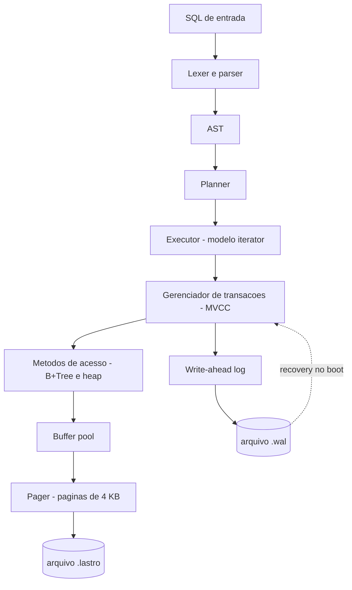

# lastro

**Português** · [English](README.en.md)

[](https://github.com/madeiragab/lastro/actions/workflows/ci.yml)

**Um banco de dados relacional embutido, escrito do zero em Rust.**

Páginas em disco, B+Tree, write-ahead log com crash recovery, parser SQL e MVCC.
Sem dependência de engine externa. O objetivo não é competir com o SQLite — é entender,
linha por linha, o que um banco de dados faz entre o seu `INSERT` e o dado estar seguro no disco.

---

## Status

Em construção. Nada aqui é estável, e as tabelas de resultado estão vazias de propósito —
número só entra depois de medido.

| Camada | Estado |
|---|---|
| Especificação e documentação | concluída |
| Formato de arquivo, slotted page, codificações | concluído |
| Pager e freelist | concluído |
| Buffer pool com política clock | concluído |
| B+Tree | concluído |
| WAL: formato do registro, regra WAL, recovery ARIES | concluído |
| B+Tree transacional sobre o log | concluído |
| Crash fuzzer | não começado |
| SQL (parser, planner, executor) | não começado |
| MVCC / snapshot isolation | não começado |
| Suíte de provas | parcial: modelo e propriedade prontos, crash fuzzer não |

O que já roda: criar e abrir um arquivo `.lastro`, alocar e liberar páginas com reuso pela
freelist, guardar células de tamanho variável em slotted pages com compactação, um índice B+Tree
com split e fusão sobre isso, e um write-ahead log com recovery ARIES completo — uma transação
confirmada sobrevive a uma queda que perdeu a página, e uma não confirmada é desfeita mesmo que
a página já tenha chegado ao disco.

A regra WAL está no caminho de despejo do buffer pool: nenhuma página suja vai ao disco antes do
registro que a descreve. É uma linha de código, e é a diferença entre um banco de dados e um
arquivo que às vezes tem seus dados.

Sem dependência nenhuma na biblioteca: CRC32C, varint e as codificações são escritos aqui.

---

## Documentação

O projeto foi especificado antes de ser escrito. O formato binário do arquivo, o formato do
registro de log e as invariantes de cada estrutura estão definidos abaixo.

| Documento | Assunto |
|---|---|
| [01 · Arquitetura](docs/pt/01-arquitetura.md) | As camadas, o que cada uma esconde da de cima |
| [02 · Formato de arquivo](docs/pt/02-formato-de-arquivo.md) | Layout binário: header, slotted page, células, codificação de chave |
| [03 · Pager e buffer pool](docs/pt/03-pager.md) | Páginas, pin/unpin, política clock, freelist |
| [04 · B+Tree](docs/pt/04-btree.md) | Busca, split, merge, range scan, invariantes |
| [05 · WAL e recovery](docs/pt/05-wal-recovery.md) | Formato do log, regra WAL, as três fases do ARIES |
| [06 · SQL](docs/pt/06-sql.md) | Gramática, planner, operadores do executor |
| [07 · MVCC](docs/pt/07-mvcc.md) | Versionamento, snapshot, regra de visibilidade, coleta |
| [08 · Testes e provas](docs/pt/08-testes.md) | Crash fuzzer, sqllogictest, anomalias, benchmark |
| [09 · Roadmap](docs/pt/09-roadmap.md) | Ordem de construção e critério de pronto por camada |
| [10 · Glossário](docs/pt/10-glossario.md) | Vocabulário de banco de dados, sem enrolação |
| [ADR](docs/pt/adr.md) | Decisões de arquitetura e o que foi descartado |

---

## O que é e o que não é

**É:** um banco embutido single-node e single-writer, no espírito do SQLite. Um arquivo, uma
biblioteca, sem servidor. Transacional e durável de verdade — não um dicionário salvo em disco.

**Não é:** distribuído, replicado, nem otimizado para vencer benchmark. Não tem planner baseado
em custo, nem otimizador de junção, nem paralelismo intra-query. Cada uma dessas coisas é um
projeto inteiro, e um projeto raso em cinco frentes vale menos que um projeto sério em uma.

---

## Arquitetura em uma imagem



Detalhes em [01 · Arquitetura](docs/pt/01-arquitetura.md).

---

## O coração do projeto

A pergunta que move tudo: **o que acontece se a máquina morrer exatamente no meio de um `COMMIT`?**

A resposta certa é que ou a transação inteira aconteceu, ou nenhuma parte dela aconteceu. Nunca
metade. A única forma honesta de afirmar isso é testando — e é para isso que existe o
**crash fuzzer**:

> O processo mata a si mesmo, sem chance de limpar nada, em um ponto aleatório dentro do caminho
> de commit. Reabre o banco. Roda recovery. Um verificador confere que o estado é exatamente ou o
> anterior à transação, ou o posterior a ela. Repete dezenas de milhares de vezes na integração
> contínua.

Escrever um banco é a parte fácil. Provar que ele não perde seus dados é o projeto de verdade.
Detalhes em [05 · WAL e recovery](docs/pt/05-wal-recovery.md) e [08 · Testes](docs/pt/08-testes.md).

---

## Como rodar

Testes, incluindo os de modelo e os baseados em propriedade:

```bash
cargo test
```

Cria um banco vazio:

```bash
cargo run --bin lastro-cli -- create exemplo.lastro
```

Lê a página de metadados e confere as invariantes:

```bash
cargo run --bin lastro-cli -- info exemplo.lastro
```

Resume todas as páginas do arquivo, ou abre uma:

```bash
cargo run --bin lastro-cli -- pages exemplo.lastro
```

```bash
cargo run --bin lastro-cli -- page exemplo.lastro 1
```

---

## Provas

Nenhum número entra aqui sem ter sido medido, com o comando ao lado. Metodologia completa em
[08 · Testes e provas](docs/pt/08-testes.md).

**Compatibilidade** — a suíte SQL Logic Test do SQLite, escrita por terceiros, rodada contra o
subconjunto de SQL implementado aqui.

| Métrica | Valor |
|---|---|
| Testes executados | pendente |
| Aprovados | pendente |

**Correção transacional** — as anomalias clássicas de isolamento. O objetivo não é passar em
todas: snapshot isolation permite *write skew* por definição. A tabela mostra o que é prevenido
e o que não é, porque um banco que mente sobre o próprio isolamento é pior que um banco lento.

| Anomalia | Prevenida? |
|---|---|
| Dirty read | pendente |
| Non-repeatable read | pendente |
| Phantom read | pendente |
| Lost update | pendente |
| Write skew | pendente |

**Desempenho** — comparação com SQLite nas mesmas cargas. Expectativa: o `lastro` perde por
margem larga. O SQLite tem 25 anos de otimização. Os gráficos vão ser publicados perdendo, junto
da análise de onde o tempo vai embora. Benchmark interessante não é o que mostra quem ganhou, é
o que explica por quê.

---

## Diário de bugs

Registro dos erros que custaram caro, porque é a parte que de fato ensinou alguma coisa.

### O redo que pulava tudo, em silêncio

De longe o pior dos que apareceram até agora, porque não quebrava nada de forma visível.

O checkpoint esvazia o log. Como o LSN é o próprio offset do registro no arquivo, esvaziar o
arquivo fazia a numeração recomeçar do zero. Mas as páginas no disco continuam carregando o LSN
com que foram carimbadas — números grandes, da vida anterior do log.

Na fase de redo a comparação é `página.lsn < registro.lsn`, e ela existe justamente para pular o
que a página já reflete. Com a numeração reiniciada, **toda** página parecia mais nova que
**todo** registro. O redo pulava a transação inteira e reportava sucesso.

O sintoma foi uma árvore com uma chave fora da faixa do nó, três camadas longe da causa. O que
achou foi o `check_tree`, não um teste de comportamento — de novo.

A correção usa o campo que a própria especificação já tinha reservado: o offset no arquivo passa
a ser `lsn - base`, e a base fica em `last_checkpoint_lsn` na página de metadados. A numeração
nunca reinicia; só o arquivo.

### A página liberada que o redo ressuscitava

Quando dois nós se fundem, a página que sobra é devolvida à freelist. Isso era feito escrevendo o
cabeçalho de freelist direto no disco, fora do log.

Depois de uma queda, o redo reaplicava os registros antigos daquela página — restaurando conteúdo
de árvore por cima do cabeçalho de freelist. A cadeia de páginas livres passava a apontar para
dentro de dados, e a alocação seguinte devolvia um número de página inventado.

Agora a página só é liberada no checkpoint, quando o log está vazio e não existe mais nada para
reaplicar sobre ela. Uma transação que aborta simplesmente não libera: a página vaza espaço, e
isso está declarado como limitação em vez de disfarçado.

### O contador de páginas que voltava no tempo

`page_count` só era gravado no checkpoint. Depois de uma queda, o alocador voltava a entregar
números de página que já tinham dados confirmados, e a transação seguinte escrevia por cima.

O commit passa a sincronizar a página de metadados **antes** de gravar o registro de commit.
Errar cedo é a direção segura: uma queda entre os dois deixa a transação para desfazer e os
metadados apenas contando páginas a mais, o que vaza espaço em vez de perder dados.

### O intervalo único que cobria a página inteira

Menos grave, mas instrutivo. O log grava a menor diferença entre a imagem anterior e a nova da
página. Com um intervalo contíguo só, isso é péssimo para slotted page: slots crescem da frente,
células crescem do fim, então quase qualquer alteração toca as duas pontas e o intervalo mínimo
cobre os 4096 bytes.

Medido: 4359 bytes de log para uma inserção de 200 bytes — pior que simplesmente gravar a página
inteira. Cortar o diff em trechos separados, unindo os que estão perto demais para valer um
registro próprio, derrubou isso para menos de 1500.

O que ensina: "grave só o que mudou" só é barato se você souber **onde** mudou. Em uma estrutura
que cresce pelas duas pontas, um intervalo não é a resposta.

### A invariante que estava errada duas vezes

A especificação afirmava que todo nó da B+Tree fora da raiz estaria pelo menos 40% cheio. É o
que todo livro diz, e é falso aqui.

**Primeira tentativa.** Escrevi o limiar de 40%, e ele não sobrevive a células de tamanho
variável: uma única célula pode ocupar um terço da página, então uma divisão perfeitamente
equilibrada deixa as duas metades abaixo do piso sem nada estar errado.

**Segunda tentativa.** Troquei por algo mais forte e aparentemente à prova de bala: *nenhum par
de irmãos adjacentes cabe junto em uma única página* — ou seja, nada que poderia ter sido fundido
ficou sem fundir. Escrevi a verificação, rodei o teste de propriedade, e ela falhou.

O caso mínimo que o proptest reduziu **não tinha nenhuma remoção.** Só inserções.

O motivo, óbvio depois: quando um nó cheio racha ao meio, cada metade fica com meia página. Uma
delas agora está ao lado de um vizinho intocado — um vizinho ao qual ela nunca precisou caber
junto, porque antes do split ela fazia parte de um nó grande. Split cria pares fundíveis. Não é
bug de remoção, é a natureza da inserção.

**O que ficou.** O fator de preenchimento não é afirmado, é **medido**, por `BTree::stats`, e os
testes afirmam sobre a medida. A invariante 4 virou algo modesto e verdadeiro: nenhum nó fora da
raiz está vazio.

A lição não é sobre B+Tree. É que uma invariante escrita a partir do que o livro diz, sem ser
executada contra entrada aleatória, é uma hipótese — e as duas primeiras hipóteses aqui estavam
erradas por motivos diferentes.

### O irmão da direita que nunca era olhado

Achado pelo mesmo teste, antes do anterior. O rebalanceamento após uma remoção só tentava fundir
o nó com o irmão da **esquerda**. Um nó que poderia ter fundido para a direita ficava parado.

Nada quebra de forma visível quando isso acontece. Toda consulta continua devolvendo a resposta
certa; a árvore só vai ficando mais esparsa do que deveria, para sempre. É o tipo de defeito que
teste de comportamento nunca pega, e a razão de a verificação de invariante existir.

---

## Referências

- **CMU 15-445 / 15-721**, Andy Pavlo — o currículo desse projeto, aula por aula, em vídeo aberto
- **Database Internals**, Alex Petrov — B-tree e log de recuperação em profundidade
- **Architecture of SQLite** — `sqlite.org/arch.html`
- **ARIES**, Mohan et al., 1992 — o artigo original de write-ahead logging
- **Rust Atomics and Locks**, Mara Bos — para a camada de concorrência

---

## Licença

MIT.
