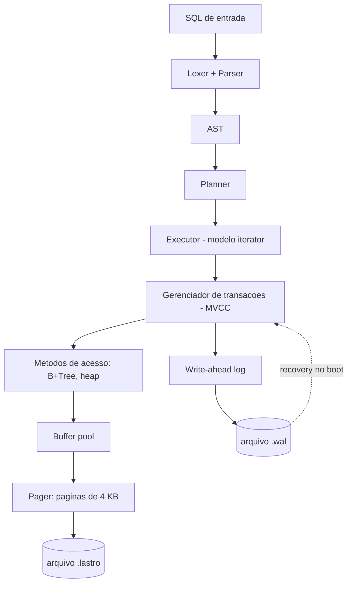

# lastro

**Um banco de dados relacional embutido, escrito do zero em Rust.**

Páginas em disco, B+Tree, write-ahead log com crash recovery, parser SQL e MVCC.
Sem dependência de engine externa. O objetivo não é competir com o SQLite — é entender,
linha por linha, o que um banco de dados faz entre o seu `INSERT` e o dado estar seguro no disco.

> *An embedded relational database written from scratch in Rust: pager, B+Tree, WAL with crash
> recovery, SQL parser and MVCC. Portuguese README; English version on request.*

---

## Status

Em construção. Nada aqui é estável ainda, e os números das seções de benchmark estão vazios
de propósito — só entram quando forem medidos de verdade.

| Camada | Estado |
|---|---|
| Pager / buffer pool | em andamento |
| B+Tree | não começado |
| WAL + crash recovery | não começado |
| SQL (parser, planner, executor) | não começado |
| MVCC / snapshot isolation | não começado |
| Suíte de provas | não começado |

---

## O que é e o que não é

**É:** um banco embutido single-node e single-writer, no espírito do SQLite. Um arquivo, uma
biblioteca, sem servidor. Transacional e durável de verdade — não um dicionário salvo em disco.

**Não é:** distribuído, replicado, nem otimizado para vencer benchmark. Não tem planner baseado
em custo, nem otimizador de junção, nem paralelismo intra-query. Essas coisas são interessantes,
mas cada uma é um projeto inteiro, e um projeto raso em cinco frentes vale menos que um projeto
sério em uma.

---

## Arquitetura



Leitura de baixo para cima: o pager só entende páginas, a B+Tree só entende chave e valor,
o executor só entende tuplas. Cada camada esconde a de baixo. É o mesmo desenho do SQLite e do
Postgres, e o motivo de eu ter escolhido essa ordem é que cada camada pode ser testada sozinha
antes da próxima existir.

---

## As camadas

### 1. Pager

Arquivo dividido em páginas de 4 KB. Header com magic number e versão de formato, freelist para
páginas recicladas, e *slotted pages* para acomodar tuplas de tamanho variável sem fragmentar.

Acima dele, um **buffer pool** com política de substituição clock e contagem de pin/unpin — uma
página em uso não pode ser despejada, e essa é a primeira invariante que o banco precisa nunca
violar.

### 2. B+Tree

Índice ordenado com insert, delete, split, merge e *range scan*. Chaves e valores em bytes; a
tipagem é problema da camada de cima.

Testado com *property-based testing*: um milhão de chaves aleatórias, com as invariantes da
árvore (ordem, taxa de ocupação, integridade dos ponteiros de irmão) verificadas a cada operação.

### 3. WAL e recovery — o coração do projeto

Write-ahead log com LSN, redo e undo, no espírito do ARIES, mais checkpointing para o log não
crescer para sempre.

A regra é a de sempre: **o log vai para o disco antes da página de dados**. É a diferença entre
um banco de dados e um arquivo que às vezes tem seus dados.

E aqui está a parte que dá nome ao projeto, o **crash fuzzer**:

> O processo mata a si mesmo, sem chance de limpar nada, em um ponto aleatório dentro do caminho
> de commit. Reabre o banco. Roda recovery. Verifica que o estado é exatamente ou o anterior à
> transação, ou o posterior a ela — nunca um meio-termo. Repete dezenas de milhares de vezes
> na integração contínua.

Escrever um banco é a parte fácil. Provar que ele não perde seus dados quando a luz cai no meio
de um `COMMIT` é a parte que quase ninguém faz.

### 4. SQL

Lexer, parser recursivo descendente, AST, planner e executor no modelo iterator (Volcano) — cada
nó do plano é um `next()` que puxa a tupla do nó abaixo.

Subconjunto suportado: `CREATE TABLE`, `CREATE INDEX`, `INSERT`, `SELECT` com `WHERE`, `ORDER BY`
e `LIMIT`, `UPDATE`, `DELETE`, junção *nested-loop* e *hash join*, e `EXPLAIN` mostrando o plano
escolhido.

O catálogo de schema fica em tabelas do próprio banco. O `lastro` descreve a si mesmo.

### 5. MVCC

Versionamento de tupla com txid de criação e de remoção, snapshot isolation e uma regra de
visibilidade que decide o que cada transação enxerga. Mais um coletor das versões que ninguém
mais pode ver.

Escolhi MVCC em vez de travamento em duas fases porque é o modelo do Postgres, e porque a parte
interessante — as anomalias que ele previne e as que ele *não* previne — é mensurável.

---

## Como rodar

```bash
cargo test
```

```bash
cargo run --bin lastro-cli -- exemplo.lastro
```

*(Ainda não funciona. Esta seção existe para eu me lembrar de que a experiência de uso importa
tanto quanto o motor.)*

---

## Provas

Três suítes, e nenhum número entra aqui sem ter sido medido nesta máquina, com o comando ao lado.

### Compatibilidade

Execução da suíte **SQL Logic Test** do SQLite — testes escritos por terceiros, não por mim,
contra o subconjunto de SQL que o `lastro` implementa.

| Métrica | Valor |
|---|---|
| Testes executados | pendente |
| Aprovados | pendente |

### Correção transacional

Bateria de anomalias clássicas, no estilo dos testes Jepsen, reduzida a um único nó: *dirty read*,
*non-repeatable read*, *phantom read*, *lost update* e *write skew*.

O resultado esperado não é passar em todas. Snapshot isolation, por definição, permite *write skew*.
A tabela vai mostrar quais são prevenidas e quais não são, porque um banco que mente sobre seu
nível de isolamento é pior que um banco lento.

| Anomalia | Prevenida? |
|---|---|
| Dirty read | pendente |
| Non-repeatable read | pendente |
| Phantom read | pendente |
| Lost update | pendente |
| Write skew | pendente |

### Desempenho

Comparação com SQLite nas mesmas cargas: inserção sequencial, inserção aleatória, busca pontual
por chave primária, varredura de intervalo.

**Expectativa: o `lastro` perde, e por uma margem larga.** O SQLite tem 25 anos de otimização.
Os gráficos vão ser publicados perdendo, com a análise de onde o tempo vai embora. O interessante
de um benchmark não é quem ganha, é o perfil de execução que explica por quê.

---

## Decisões e trade-offs

**Rust.** Sem coletor de lixo significa latência previsível, que é exatamente o que um banco
precisa. O sistema de tipos também transforma boa parte dos bugs de gerenciamento de buffer em
erros de compilação. O custo é uma curva de aprendizado íngreme somada a um domínio já difícil.

**Páginas de 4 KB.** Casa com o tamanho de bloco típico do sistema de arquivos, então uma página
suja é uma escrita, e não duas.

**Single-writer.** Escritor único remove uma classe inteira de problemas de concorrência e me
deixa gastar esse tempo em recovery, que é onde está o aprendizado.

**Nada de otimizador baseado em custo.** Ele merece um projeto próprio.

---

## Diário de bugs

Registro dos erros que custaram caro, porque essa é a parte que de fato ensinou alguma coisa.

*(A preencher. O primeiro provavelmente será corrupção de página.)*

---

## Referências

- **CMU 15-445 / 15-721**, Andy Pavlo — o currículo desse projeto, aula por aula, em vídeo aberto
- **Database Internals**, Alex Petrov — B-tree e log de recuperação em profundidade
- **Architecture of SQLite** — `sqlite.org/arch.html`
- **ARIES**, Mohan et al., 1992 — o artigo original de write-ahead logging
- **Rust Atomics and Locks**, Mara Bos — para a camada de concorrência

---

## Licença

MIT.
