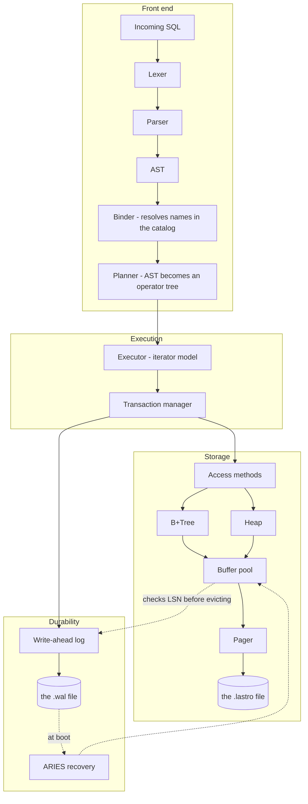
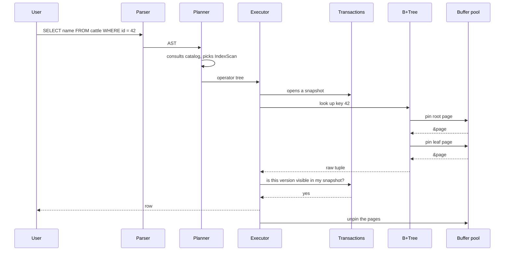
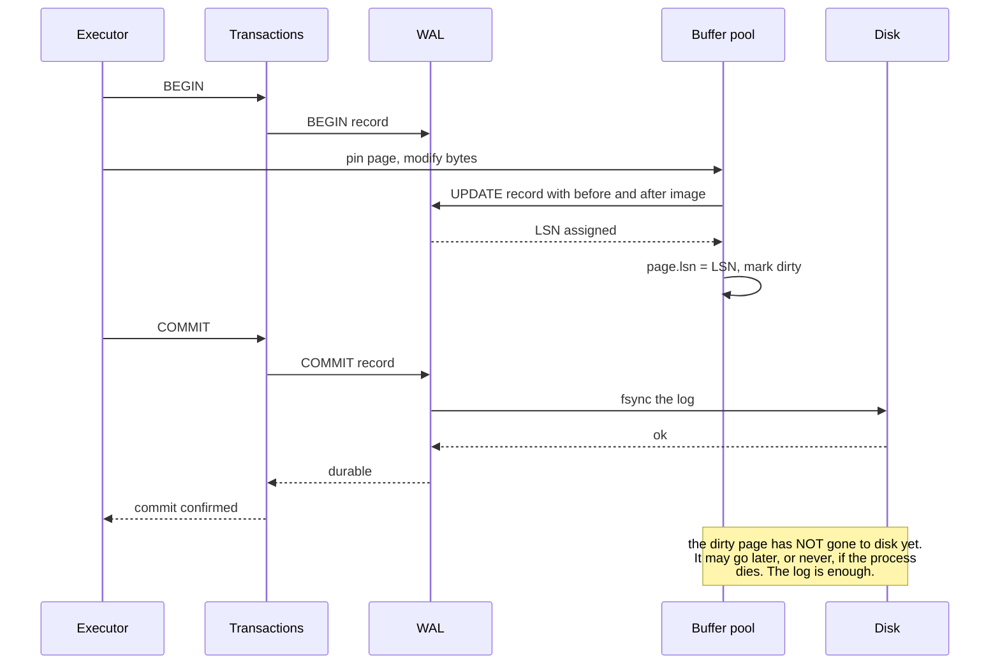
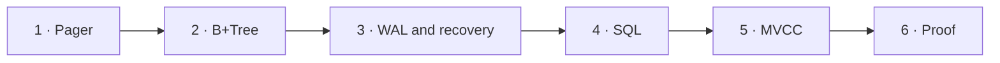

[Português](../pt/01-arquitetura.md) · [English](01-architecture.md) · [↑ README](../../README.en.md)

# 01 · Architecture

## The central idea

A database is a stack of abstractions where each layer lies to the one above it, usefully. The
pager lies by saying memory is infinite. The B+Tree lies by saying there is an ordered map. The
transaction manager lies by saying nobody else is touching the data. The executor lies by saying
tables and rows exist.

None of those things exist. There is a file, and system calls.

The whole project is building those lies one at a time, bottom-up, and proving each one holds
even when the process dies at the worst possible moment.

## The layers



### Each layer's contract

| Layer | Vocabulary it understands | Vocabulary it hides |
|---|---|---|
| Pager | page number, 4096 bytes | file descriptor, `pread`, `pwrite`, `fsync` |
| Buffer pool | a page pinned in memory | disk reads, eviction, replacement policy |
| B+Tree | ordered key and value bytes | split, merge, sibling pointer, height |
| Heap | tuple addressed by RowId | slot, in-page offset, fragmentation |
| Transactions | transaction, snapshot, visible version | txid, xmin, xmax, active list |
| WAL | "make this durable" | LSN, redo, undo, CLR, checkpoint |
| Executor | tuple, operator, `next()` | which access structure is underneath |
| Planner | table, column, predicate | physical ordering, index choice |

The rule is strict: **a layer never calls a layer two levels below it.** The executor does not
know what a page is. The B+Tree does not know what a transaction is. Break that rule and the
project turns into a ball of mud where nothing can be tested in isolation.

## The path of a query



The detail that matters: `pin` and `unpin` are symmetric and mandatory. A pinned page cannot be
evicted from the buffer pool. A forgotten `unpin` is a leak that only shows up under load, when
the pool fills and nothing is eligible for eviction. It is the classic first bug of this layer,
and the reason the pin count is asserted at the end of every test.

## The path of a write

This is where a database stops being a file.



Two consequences that shape the rest of the project:

**The transaction is durable before the page is written.** The `fsync` happens on the log, which
is sequential and small, not on the data file, which is random and large. That is what makes a
database fast at writing.

**A dirty page may only reach disk after its log record.** That is the WAL rule, and the buffer
pool must consult the LSN before evicting anything. Detailed in
[05 · WAL and recovery](05-wal-recovery.md).

## Concurrency

Chosen model: **one writer, many readers.**

A single write transaction at a time, serialized by a database-level mutex. Reads proceed in
parallel without blocking, because MVCC lets every reader see the snapshot that existed when it
started.

This removes an entire class of problems: writer deadlock, cycle detection in the wait-for graph,
lock scheduling. The cost is that write throughput does not scale with core count.

The rationale is in [ADR-003](adr.md#adr-003--a-single-writer). The time saved here goes entirely
into recovery, which is where the real learning is.

## Code layout

```
src/
  lib.rs
  storage/
    pager.rs         page, freelist, file reads and writes
    buffer.rs        buffer pool, pin/unpin, clock policy
    page/
      layout.rs      slotted page, slots, cells
      encoding.rs    varint, order-preserving key encoding
  index/
    btree.rs         search, insert, delete
    split.rs         split and median promotion
    merge.rs         merge and rebalancing
    iter.rs          range scan via sibling pointer
  wal/
    record.rs        log record format
    writer.rs        append, flush, the WAL rule
    recovery.rs      analysis, redo, undo
    checkpoint.rs
  txn/
    manager.rs       txid, active list, snapshot
    visibility.rs    the MVCC visibility rule
    vacuum.rs        dead version collection
  sql/
    lexer.rs
    parser.rs
    ast.rs
    binder.rs        resolves names against the catalog
    planner.rs
    exec/
      mod.rs         the Operator trait with next()
      scan.rs        SeqScan, IndexScan
      join.rs        NestedLoop, HashJoin
      sort.rs
      dml.rs         Insert, Update, Delete
  catalog/
    mod.rs           schema stored in the database's own tables
  bin/
    lastro-cli.rs
tests/
  crash/             the crash fuzzer
  sqllogic/          the SQLite suite runner
  anomalies/         the isolation battery
benches/
```

## Build order

Each layer starts only once the one below passes its own tests. The definition of done for each
is in [09 · Roadmap](09-roadmap.md).



The order is non-negotiable on one point: **WAL comes before SQL.** It is tempting to make
`SELECT` work first, because that is the visible, rewarding part. But retrofitting durability
into a database that already has an executor means rewriting the entire write path. Adding SQL on
top of an already durable engine is purely additive.

---

Next: [02 · File format](02-file-format.md)
