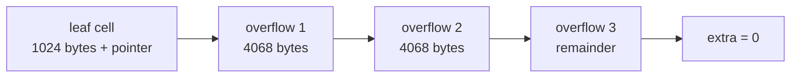

[Português](../pt/02-formato-de-arquivo.md) · [English](02-file-format.md) · [↑ README](../../README.en.md)

# 02 · File format

This is the most important document in the project. Until the binary format is decided there is
no code to write — and once files exist on disk, changing it costs a migration.

**Conventions that hold everywhere below:**

- Integers are **little-endian**, except where explicitly marked big-endian.
  x86 and ARM are little-endian, so this removes conversion from the hot path.
- Offsets are relative to the start of the page, not the start of the file.
- Page size: **4096 bytes**, fixed ([ADR-002](adr.md#adr-002--4-kb-pages)).
- Page 0 is always the metadata page.
- A page number is a `u32`. Theoretical database limit: 2^32 × 4 KB = 16 TB.

---

## The data file

```
+---------------+---------------+---------------+-----+
| page 0        | page 1        | page 2        | ... |
| metadata      | data          | data          |     |
| 4096 bytes    | 4096 bytes    | 4096 bytes    |     |
+---------------+---------------+---------------+-----+
0            4096            8192           12288
```

There is no separate file header. The file is exactly a sequence of pages, and page 0 carries
what would otherwise be the header. This means reading any page is always
`pread(fd, buf, 4096, page_id * 4096)` — no offset arithmetic anywhere.

---

## Page 0 · Metadata

```
offset  size  field                 description
------  ----  --------------------  -------------------------------------------
  0       8   magic                 "LASTRO\x00" — format signature
  8       2   format_version        u16, starts at 1
 10       2   page_size             u16, always 4096; validated on open
 12       4   page_count            u32, total pages allocated
 16       4   freelist_head         u32, first free page; 0 = none
 20       4   freelist_count        u32, how many free pages exist
 24       8   next_txid             u64, next transaction id to hand out
 32       8   last_checkpoint_lsn   u64, where recovery starts its analysis pass
 40       4   catalog_root          u32, root page of the catalog B+Tree
 44       4   schema_version        u32, bumped on every DDL
 48    4040   reserved              zeros
4092       4   checksum              u32, CRC32C of bytes 0..4092
```

`page_size` is stored even though it is a constant: if the value ever changes, the database must
reject the old file with a clear message rather than reading garbage.

Page 0's `checksum` is verified on every open. Corruption there is unrecoverable and must fail
loudly, not silently.

---

## Slotted page

Every page holding variable-length data — B+Tree leaves, interior nodes and heap pages — uses the
same layout. It solves one specific problem: storing records of different sizes in a fixed block,
allowing deletion without leaving permanent holes.

```
0                                                            4096
+--------+------------------+--------------------+--------------+
| header | slots            | free space         | cells        |
| 24 B   | 4 B each -->     |                    | <-- grow     |
+--------+------------------+--------------------+--------------+
         ^                  ^                    ^
         24            free_start            free_end
```

Slots grow from the start toward the end. Cells grow from the end toward the start. They meet in
the middle, and when `free_end - free_start` drops below what is needed, the page is full.

The advantage: **the slot is the stable address**. A tuple referenced as `(page_id, slot_id)` can
be moved within the page during compaction without breaking any external reference. That is
exactly why the heap's RowId is that pair.

### Page header · 24 bytes

```
offset  size  field         description
------  ----  ------------  ------------------------------------------------
  0       1   page_type     1=meta 2=interior 3=leaf 4=heap 5=freelist 6=overflow
  1       1   flags         bit 0: page is the root of a tree
  2       2   slot_count    u16, how many slots exist (dead ones included)
  4       2   free_start    u16, offset of the first free byte after the slots
  6       2   free_end      u16, offset of the lowest cell
  8       2   fragmented    u16, bytes lost to holes between cells
 10       2   reserved
 12       8   lsn           u64, LSN of the last modification to this page
 20       4   extra         u32, meaning depends on page_type
```

The **`lsn` field is what makes recovery possible**. It answers "does this page already reflect
this log change?" during the redo pass. Without it redo would not be idempotent, and running
recovery twice would corrupt the database.

`extra` is reinterpreted per page type:

| `page_type` | Meaning of `extra` |
|---|---|
| 2 · interior | rightmost child page, which has no cell of its own |
| 3 · leaf | next leaf to the right, for range scans; 0 if last |
| 4 · heap | next page of the same table |
| 5 · freelist | next page in the free list |
| 6 · overflow | next page in the overflow chain |

### Slot · 4 bytes

```
offset  size  field    description
------  ----  -------  ---------------------------------------
  0       2   offset   u16, where the cell starts in the page
  2       2   length   u16, cell size in bytes
```

`offset == 0` marks a dead slot. Slots are not removed from the array on deletion, because that
would shift every following slot and invalidate RowIds. Dead slot space is reclaimed only during
compaction.

### Compaction

Triggered when `fragmented` exceeds a quarter of the page and contiguous space is insufficient
for the requested insert. The procedure rewrites live cells packed against the end of the page,
updates slot offsets and zeroes `fragmented`. Slot indices do not change, so no RowId breaks.

---

## Cells

### B+Tree leaf cell

```
+-----------+---------+-------------+-----------+
| key_len   | key     | value_len   | value     |
| varint    | bytes   | varint      | bytes     |
+-----------+---------+-------------+-----------+
```

### Interior node cell

```
+------------+-----------+---------+
| left_child | key_len   | key     |
| u32        | varint    | bytes   |
+------------+-----------+---------+
```

A key in an interior node is a **separator**, not data. It only answers "go left or go right",
and need not exist in any leaf.

### Varint

Variable-length encoding, 7 payload bits per byte, high bit signalling continuation. Same as
Protocol Buffers. A length up to 127 takes one byte, which is the common case and the reason not
to use a fixed `u16`.

### Overflow

A cell larger than **1024 bytes** — a quarter of a page — does not fit alongside others. When
that happens:

1. The first 1024 payload bytes stay in the cell.
2. The remainder goes into a chain of type-6 pages, linked through the `extra` field.
3. The cell gains a trailing `u32` pointing at the first chain page, and the overflow bit is set
   in the length.

The 1024 limit exists to guarantee a **minimum fanout of 4** — at least four cells per interior
page. Without that floor, one giant key could degenerate the tree into a linked list, and the
logarithmic height guarantee would evaporate.



---

## Order-preserving key encoding

This is the detail that keeps the B+Tree simple. If byte-wise comparison of encoded keys produces
exactly the logical ordering of the values, the whole tree needs only `memcmp` and never needs to
know the type of what it is storing.

Achieving that takes care, per type.

### Signed 64-bit integer

```
1. flip the most significant bit:  x XOR 0x8000_0000_0000_0000
2. store big-endian
```

Flipping the sign bit pushes negatives — whose two's complement representation starts with 1 —
below the positives. Big-endian ensures the most significant byte is compared first. Result:
`memcmp` yields exact numeric order, negatives included.

```
value        two's complement           encoded
-2           FF FF FF FF FF FF FF FE    7F FF FF FF FF FF FF FE
-1           FF FF FF FF FF FF FF FF    7F FF FF FF FF FF FF FF
 0           00 00 00 00 00 00 00 00    80 00 00 00 00 00 00 00
 1           00 00 00 00 00 00 00 01    80 00 00 00 00 00 00 01
```

The right column ascends byte-wise. The middle one does not.

### Text

UTF-8 bytes as they are, terminated by `0x00 0x00`. Because a null byte can occur inside the
text, it is escaped: every original `0x00` becomes `0x00 0xFF`.

Without the terminator, `"abc"` and `"abcd"` would be ambiguous inside a composite key. With it
the prefix always sorts first, which is the correct behaviour.

### 64-bit float

```
if the number is positive or zero:  flip only the sign bit
if it is negative:                  flip every bit
then store big-endian
```

`NaN` is rejected at input rather than encoded. A value that is not even equal to itself has no
place in a search tree.

### Null

One prefix byte per column: `0x00` for null, `0x01` for present. Nulls sort before everything.
Same choice SQLite makes.

### Composite key

Concatenation of the individual encodings, in index column order. Since each encoding is
self-delimiting — fixed width for numbers, terminator for text — the concatenation still
preserves lexicographic order.

---

## Tuple encoding

Heap tuples do not need order preservation, so they use a cheaper format.

```
+-------------+---------------+---------------------------+
| col_count   | null_bitmap   | values in schema order    |
| varint      | ceil(n/8) B   |                           |
+-------------+---------------+---------------------------+
```

- Fixed-width types (`INTEGER`, `REAL`, `BOOLEAN`) occupy their native bytes, little-endian.
- Variable types (`TEXT`, `BLOB`) are preceded by a varint length.
- Null columns occupy **no** bytes in the value area; the bitmap already said they are absent.
- `col_count` is stored to allow `ALTER TABLE ADD COLUMN` without rewriting old tuples: a tuple
  with fewer columns than the current schema returns the default for the missing ones.

---

## The log file

Detailed in [05 · WAL and recovery](05-wal-recovery.md). Format summary here for completeness:

```
offset  size  field       description
------  ----  ----------  ------------------------------------------------
  0       8   lsn         u64, offset of this record within the log file
  8       8   txid        u64, owning transaction
 16       8   prev_lsn    u64, previous record of the SAME transaction
 24       1   rec_type    u8
 25       1   flags
 26       2   reserved
 28       4   body_len    u32
 32       4   checksum    u32, CRC32C of header and body
 36     var   body
```

Making the LSN the record's own offset in the file is a deliberate simplification: seeking to an
LSN during undo becomes a `seek`, with no auxiliary index at all.

---

## Validation on open

The sequence run when opening a file, in order, failing immediately at any step:

1. File is at least 4096 bytes.
2. Magic matches `"LASTRO\x00"`.
3. `format_version` is known to this build.
4. `page_size` is 4096.
5. Page 0's CRC32C checks out.
6. File size is a multiple of 4096 and consistent with `page_count`.
7. If a non-empty `.wal` exists, run recovery before allowing any read.

Step 7 is neither optional nor configurable. A database that opens and serves queries before
applying the log is a database that returns wrong data after a crash.

---

Previous: [01 · Architecture](01-architecture.md) · Next: [03 · Pager and buffer pool](03-pager.md)
