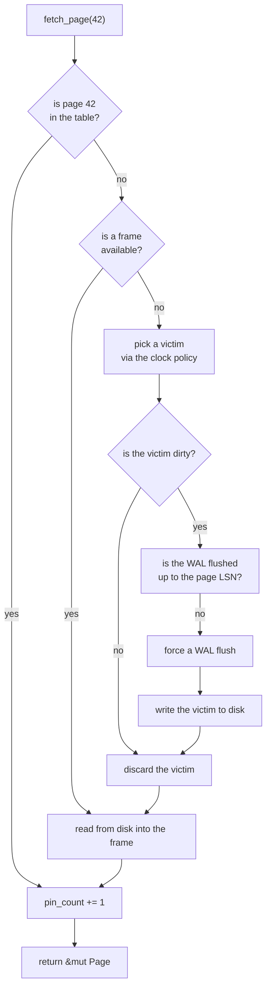

[Português](../pt/03-pager.md) · [English](03-pager.md) · [↑ README](../../README.en.md)

# 03 · Pager and buffer pool

The lowest layer. It understands page numbers and 4096 bytes. It does not know what a key, a
tuple or a transaction is.

## Pager

Responsibilities, and nothing beyond them:

- Read page *n* from the file.
- Write page *n* to the file.
- Allocate a new page, recycling from the freelist when possible.
- Return a page to the freelist.
- Call `fsync` when told to.

```rust
pub struct Pager {
    file: File,
    page_count: u32,
    freelist_head: u32,
    freelist_count: u32,
}

impl Pager {
    pub fn read_page(&self, id: PageId, buf: &mut [u8; PAGE_SIZE]) -> Result<()>;
    pub fn write_page(&mut self, id: PageId, buf: &[u8; PAGE_SIZE]) -> Result<()>;
    pub fn allocate(&mut self) -> Result<PageId>;
    pub fn free(&mut self, id: PageId) -> Result<()>;
    pub fn sync(&self) -> Result<()>;
}
```

Reads and writes use `pread` and `pwrite` — positional variants that take the offset as an
argument instead of depending on the file cursor. That keeps the `Pager` free of mutable position
state, which matters once reads run concurrently.

### Freelist

Freed pages do not shrink the file. They go into a singly linked list whose head lives in page 0
and whose links live in the `extra` field of each free page.


Allocation pops the head. Freeing pushes onto the head. Both are O(1) and touch exactly two
pages.

There is no file compaction. A database that grew to 10 GB and then had 9 GB deleted still
occupies 10 GB on disk, with 9 GB reusable. Returning space to the filesystem would require
moving pages and rewriting every pointer to them — that is Postgres's `VACUUM FULL`, and it is
out of scope.

---

## Buffer pool

The useful lie: to the layers above, every page appears to be in memory.



The middle branch is the **WAL rule** made concrete. No dirty page reaches disk before the log
record describing it. Skip that check and everything works perfectly in tests — and the database
corrupts silently at the first power loss. That branch is precisely what the crash fuzzer exists
to exercise.

### Structures

```rust
pub struct BufferPool {
    frames: Vec<Frame>,                 // fixed memory, allocated once
    table: HashMap<PageId, FrameId>,    // where each page lives
    clock_hand: usize,
    pager: Pager,
    wal: Arc<Wal>,
}

struct Frame {
    data: [u8; PAGE_SIZE],
    page_id: PageId,
    pin_count: u32,
    dirty: bool,
    ref_bit: bool,      // used by the clock policy
}
```

The `Vec<Frame>` is allocated once on open and never grows. A buffer pool that allocates on
demand defeats its own purpose, which is bounding memory use.

### Clock policy

A cheap LRU approximation. A hand cycles through the frames:

1. If the frame is pinned (`pin_count > 0`), skip it.
2. If `ref_bit` is set, clear it and skip — a second chance.
3. If `ref_bit` is clear, that frame is the victim.

`ref_bit` is set on every access. The per-access cost is a bit write, versus the doubly linked
list manipulation an exact LRU would require.

If the hand completes two full revolutions without finding a victim, every frame is pinned. That
is always a forgotten-`unpin` bug, never a normal condition, and must raise an error immediately
rather than wait.

### Pin and unpin

```rust
let page = pool.fetch_page(42)?;   // pin_count += 1
// ... use the page ...
pool.unpin_page(42, dirty)?;       // pin_count -= 1
```

Rust allows better than that: a guard with `Drop` guarantees the unpin even on error or panic
paths.

```rust
pub struct PageGuard<'a> {
    pool: &'a BufferPool,
    frame_id: FrameId,
    dirty: bool,
}

impl Drop for PageGuard<'_> {
    fn drop(&mut self) {
        self.pool.unpin(self.frame_id, self.dirty);
    }
}
```

This is one of the places where choosing Rust pays for itself: the pin leak, which in C would be
a discipline bug, becomes structurally impossible.

---

## Invariants

Checked with `debug_assert!` in the code and at the end of every test:

1. Every frame's `pin_count` is zero when no operation is in flight.
2. A page never occupies two frames at once.
3. Every dirty page has an `lsn` greater than zero.
4. No dirty page is written before the WAL is flushed up to its `lsn`.
5. `table.len()` equals the number of frames holding a valid `page_id`.
6. Allocated pages plus freelist pages equals `page_count`.

---

## Testing this layer

**Unit** — write/read round trips, allocate and free, correct freelist recycling, and eviction
behaviour with a full pool.

**Property-based**, with `proptest` — given a random sequence of allocations, frees, reads and
writes, the six invariants above still hold after every operation.

**Model-based** — an in-memory `HashMap<PageId, [u8; 4096]>` serves as the oracle. Every
operation is applied to both and the states compared. A divergence is a bug, and `proptest`
automatically shrinks the case to the smallest still-failing example.

**I/O fault injection** — a test `Pager` that returns `ENOSPC` or a write error on the nth call.
The database must propagate the error and stay consistent, not panic.

## Definition of done

- All invariants verified under `proptest` with 10,000 cases.
- One million random operations against the model with no divergence.
- Fault injection at every write point, with no inconsistent state.
- No pin leaks on any error path.

---

Previous: [02 · File format](02-file-format.md) · Next: [04 · B+Tree](04-btree.md)
