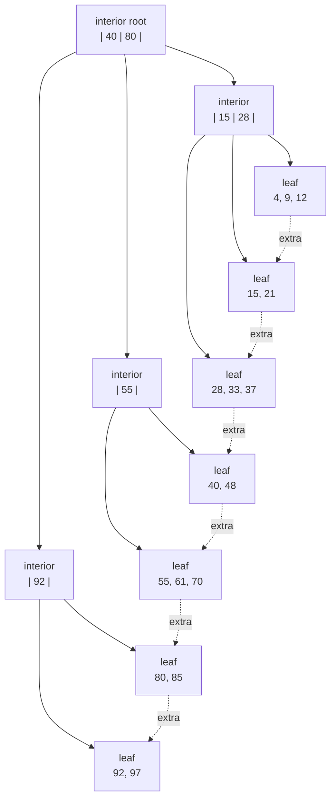
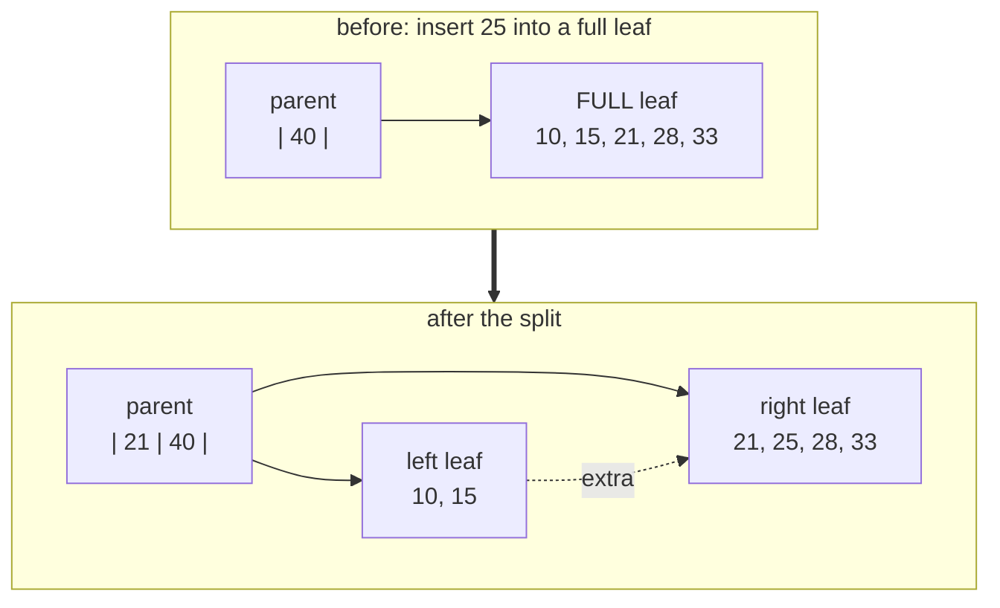

[Português](../pt/04-btree.md) · [English](04-btree.md) · [↑ README](../../README.en.md)

# 04 · B+Tree

An ordered map from bytes to bytes, stored in disk pages. It backs both the indexes and the
database catalog.

## Why B+Tree and not B-Tree

In a B-Tree, values live in every node. In a B+Tree, values live **only in the leaves**, and
interior nodes hold separators alone.

Two consequences decide it:

**Higher fanout.** An interior node with no payload fits far more keys. With 8-byte keys, a 4 KB
interior node holds roughly 340 entries, versus far fewer if each carried a value too. That
lowers tree height, and height is the disk read count.

**Cheap range scans.** Leaves are chained through the page's `extra` field. Scanning a range means
descending once to the starting leaf and then following sibling pointers, never returning to the
root. `WHERE id BETWEEN 100 AND 5000` becomes a sequential read.



The dotted arrows are the sibling pointers. They are what turns a tree into an ordered list when
you need one.

## Separator convention

In an interior node with separators `k1, k2, ..., kn` and children `c0, c1, ..., cn`:

```
c0 holds keys < k1
c1 holds keys in [k1, k2)
c2 holds keys in [k2, k3)
...
cn holds keys >= kn        <- this one is the page's `extra` field
```

Closed on the left, open on the right. Picking that convention and never deviating matters more
than which of the two was picked: half of all B-Tree bugs come from a `<` where a `<=` belonged.

The rightmost child has no separator of its own, which is why it lives in the page header's
`extra` field rather than in a cell.

---

## Search

```
search(key):
    page = root
    while page is interior:
        i = binary_search(page.separators, key)
        page = child(page, i)
    return binary_search(page.cells, key)
```

Cost: one read per level. With a fanout of 340, a million keys fit in three levels and a billion
in four. In practice the root and first level stay resident in the buffer pool, so a lookup costs
one or two physical reads.

The in-page binary search is pure `memcmp`, with no type interpretation, thanks to the
[order-preserving encoding](02-file-format.md#order-preserving-key-encoding).

---

## Insertion and split

If the cell fits in the leaf, insert and adjust the slots. If it does not, the leaf splits.



The procedure:

1. Pick the split point closest to 50/50 **in bytes**, not in cell count. With variable-length
   records, splitting by count produces unbalanced pages.
2. Allocate a new leaf, move the right half into it.
3. Fix the sibling pointers: the new leaf points where the old one pointed, and the old one now
   points at the new one.
4. Promote a separator to the parent.
5. If the parent fills, it splits too, recursively. If the root splits, a new root is created and
   the tree gains a level.

**The difference that matters between leaf and interior:** when splitting a leaf, the first key of
the right half is **copied** to the parent and still exists in the leaf. When splitting an
interior node, the median is **moved** to the parent and disappears from the level below — it is
only a separator, not data.

Swapping copy for move in the leaf deletes a real key from the database. It is one of the most
expensive bugs to diagnose, because the tree stays structurally valid: a single record is simply
missing.

---

## Deletion, merge and rebalancing

Deleting is always harder than inserting.

```
delete(key):
    locate the leaf
    mark the slot dead, update `fragmented`
    if leaf occupancy >= 40%: done

    if a sibling can lend without dropping below 40%:
        redistribute, update the separator in the parent
    else:
        merge with the sibling, remove the separator from the parent
        if the parent drops below 40%: repeat one level up
        if the root ends up with a single child: the tree loses a level
```

The 40% threshold instead of 50% creates hysteresis. At exactly 50%, an alternating
insert/delete sequence at the boundary makes the tree split and merge on every operation, burning
I/O for nothing. The dead band between 40% and 50% kills that oscillation.

### Contingency plan

Merge and rebalancing propagating upward is the hardest part of the entire project to get right.
If it stalls for more than two weeks, the cut is this:

> Deletion only marks a tombstone. No merge. An offline compaction, triggered manually, rebuilds
> the tree.

Quality under delete-heavy load is lost, and that is recorded honestly in the README. Correctness
is not lost. A correct database with a declared limitation is worth more than an ambitious broken
one.

---

## Range scan

```rust
pub struct RangeIter<'a> {
    pool: &'a BufferPool,
    current_leaf: PageId,
    slot: u16,
    upper: Option<Vec<u8>>,
}
```

Descend once to the lower bound's leaf, then consume slots. When the leaf is exhausted, follow
`extra` to the next one. Stop when `extra` is zero or the key passes the upper bound.

Cost: one logarithmic descent plus a sequential read. That is the reason B+Trees exist.

---

## Invariants

Checked by a `check_tree()` called at the end of every test:

1. Every leaf is at the same depth. The tree is perfectly height-balanced.
2. Keys within each page are in strictly increasing order.
3. All keys in a child respect the range defined by the parent's separators.
4. Every node except the root has at least 40% occupancy.
5. Following sibling pointers from the leftmost leaf visits every key exactly once, in
   ascending order.
6. No page is reachable by two distinct paths from the root.
7. The key count reachable through the tree equals the count obtained by range scan.

Invariant 5 is the most valuable of the seven. It cross-checks two independent structures — the
hierarchy and the linked list — and therefore catches nearly every split or merge bug the others
let through.

---

## Testing this layer

**Model-based** — the standard library's `BTreeMap<Vec<u8>, Vec<u8>>` is the oracle. Every
operation goes to both and is compared, including the results of random range scans.

**Property-based** — a million random keys inserted and deleted in arbitrary order, with
`check_tree()` after every operation in debug mode.

**Adversarial patterns**, because uniform randomness does not stress splitting:

- strictly ascending keys, which always fill the rightmost page
- strictly descending keys
- all keys sharing a long common prefix
- maximum-size keys, forcing overflow chains
- insert/delete alternating exactly at the occupancy threshold, to test the hysteresis

**Reproducibility** — every randomized test prints its seed on failure. A B-Tree bug that does
not reproduce cannot be investigated.

## Definition of done

- One million operations against `BTreeMap` with no divergence.
- `check_tree()` passing after every one of those operations in debug mode.
- All five adversarial patterns in the fixed test set.
- Range scan returning exactly the same set as the hierarchical traversal.

---

Previous: [03 · Pager and buffer pool](03-pager.md) · Next: [05 · WAL and recovery](05-wal-recovery.md)
