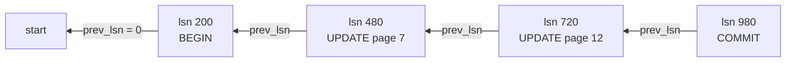
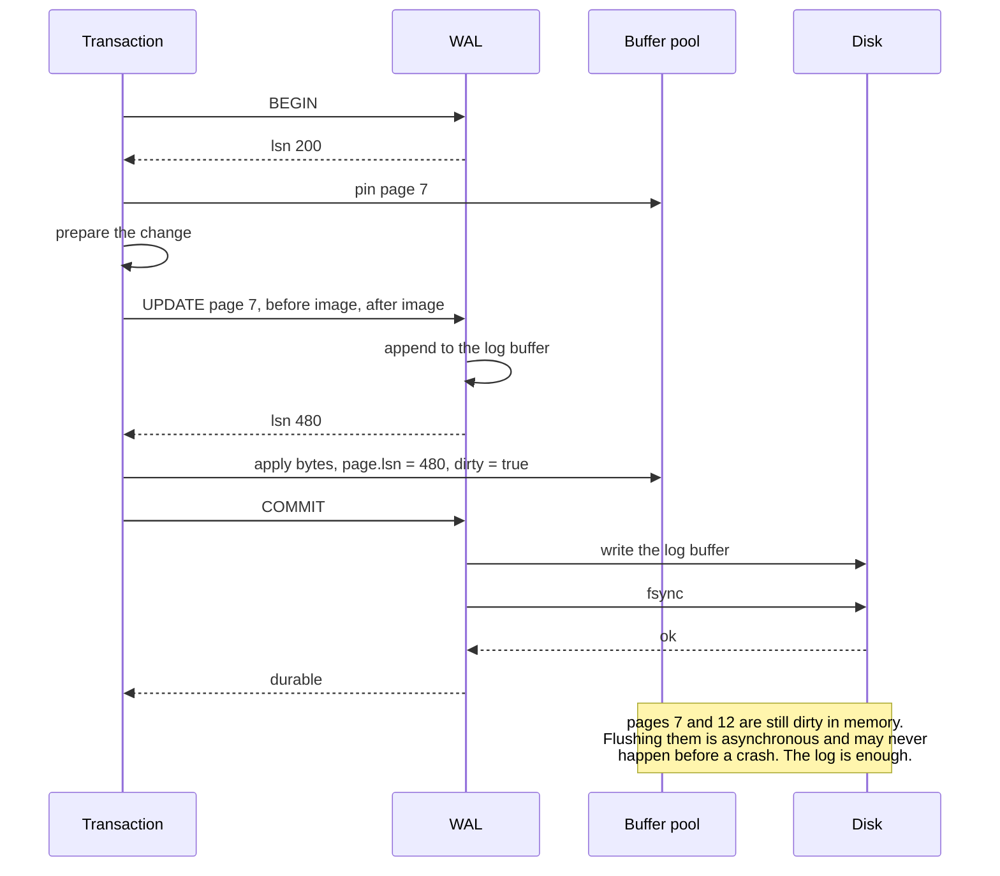
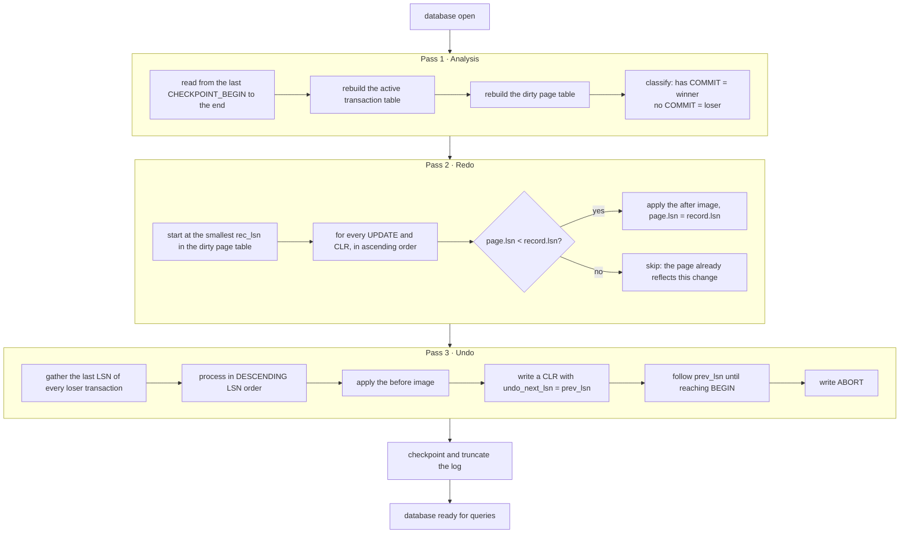
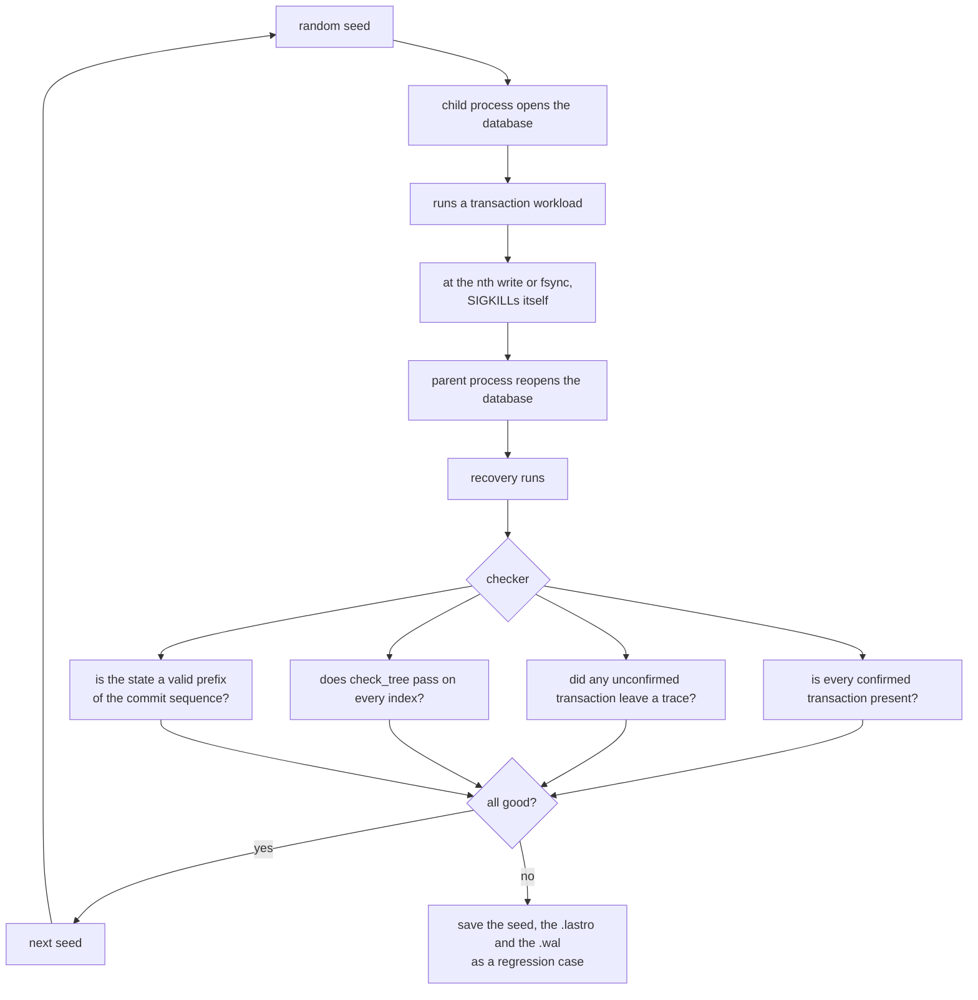

[Português](../pt/05-wal-recovery.md) · [English](05-wal-recovery.md) · [↑ README](../../README.en.md)

# 05 · WAL and recovery

The heart of the project. Everything before this is on-disk data structures; this is where it
becomes a database.

## The problem

Writing a 4 KB page to disk **is not atomic**. The device guarantees atomicity at sector size —
512 bytes, or 4 KB on modern drives, and even that with caveats. Between the `write` and the data
settling there is the operating system cache, the controller cache and the drive's own cache.

Consequence: if power fails mid-write, what remains on disk can be half new and half old. A cell
with a new header and an old body. A slot pointing at bytes that do not exist.

Worse: a transaction that modifies three pages cannot write all three simultaneously. If it dies
after the first, the database is in a state no transaction ever produced.

## The solution

Before changing any page, write to the log what is about to change. The log is sequential,
append-only, and every record carries its own checksum.

**The WAL rule, in one sentence:** the log record describing a change goes to disk before the
changed page does.

With that, after a crash the log answers everything:
- Transaction with a `COMMIT` record but its page unwritten? **Redo.**
- Transaction with no `COMMIT` but its page already written? **Undo.**
- Record with a broken checksum? Torn tail of the log. Discard from there on.

---

## Record format

```
offset  size  field       description
------  ----  ----------  ------------------------------------------------
  0       8   lsn         u64, offset of this record in the log file
  8       8   txid        u64, owning transaction
 16       8   prev_lsn    u64, previous record of the SAME transaction; 0 if first
 24       1   rec_type    u8
 25       1   flags
 26       2   reserved
 28       4   body_len    u32
 32       4   checksum    u32, CRC32C of header and body
 36     var   body
```

**The LSN is the record's own offset in the log file.** A deliberate simplification: jumping to an
LSN during undo is a `seek`, with no auxiliary index. The price is that LSNs are not consecutive,
but they only need to be monotonic, and they are.

**`prev_lsn` chains a transaction's records backwards.** Undo follows that chain and never has to
scan the whole log looking for what belongs to whom.



### Record types

| Value | Type | Body |
|---|---|---|
| 1 | `BEGIN` | empty |
| 2 | `UPDATE` | `page_id` u32, `offset` u16, `old_len` u16, `new_len` u16, old bytes, new bytes |
| 3 | `COMMIT` | empty |
| 4 | `ABORT` | empty |
| 5 | `CLR` | same as `UPDATE`, plus `undo_next_lsn` u64 |
| 6 | `CHECKPOINT_BEGIN` | empty |
| 7 | `CHECKPOINT_END` | serialized active transaction table and dirty page table |
| 8 | `PAGE_ALLOC` | `page_id` u32 |
| 9 | `PAGE_FREE` | `page_id` u32 |

### Physiological logging

`UPDATE` stores **the before and after image of a byte range within an identified page**. Neither
logical ("inserted key 42 into the index") nor purely physical ("the whole page is now this").

- Logical logging is compact, but redo must re-execute the operation, and re-executing a B+Tree
  split during recovery is a recipe for the hardest divergence to debug there is.
- Full-page physical logging is trivially idempotent, but spends 4 KB of log to change one byte.

The middle ground gives idempotence — applying the after image twice has the same effect as once
— at a cost proportional to what actually changed. It is the ARIES choice, and the reasoning is
in [ADR-005](adr.md#adr-005--physiological-logging).

---

## The write path



Three policies, each with a name in the literature:

**Force-at-commit for the log.** The log `fsync` is mandatory at commit. It is the only `fsync` on
the critical path, and it is sequential — the reason a database can sustain thousands of commits
per second.

**No-force for data.** Dirty pages need not reach disk at commit. Redo covers them.

**Steal allowed.** A dirty page belonging to an **uncommitted** transaction may be evicted and
written to disk if the buffer pool needs the frame. Undo covers it. That is why the before image
must be in the log.

`no-force` alone requires redo. `steal` alone requires undo. Together they require both, which is
exactly why ARIES has two passes.

---

## Checkpoint

Without checkpoints, recovery would have to read the log from byte zero. A database a year into
production would take hours to open.

The checkpoint is **fuzzy**: it does not stop the database.

1. Write `CHECKPOINT_BEGIN`, remember that LSN.
2. Under a brief lock, copy the active transaction table and the dirty page table.
3. Release the lock. The database keeps running normally.
4. Write `CHECKPOINT_END` with both tables serialized in the body.
5. Update `last_checkpoint_lsn` in page 0 and `fsync` it.

The **dirty page table** maps `page_id` to `rec_lsn` — the LSN of the record that first dirtied
that page since it was last clean. The smallest `rec_lsn` in the table is where redo will start,
and it is what keeps recovery from rereading the entire log.

Trigger: every 64 MB of log written, or every 30 seconds, whichever comes first.

---

## Recovery: the three passes

Runs automatically on open whenever a non-empty `.wal` exists. Not optional, not configurable.



### The detail that makes pass 2 work

Redo **repeats history**, including changes from transactions that never committed. It looks
wrong, and it is exactly what makes the algorithm simple: after redo, the database is precisely in
the state it was at the moment of the crash. Pass 3 then undoes what needs undoing, with no
special cases anywhere.

The `page.lsn < record.lsn` comparison is what gives idempotence. A page that already reached disk
with the change applied has a greater-or-equal LSN and is skipped. Recovery can run ten times in a
row without changing the outcome.

### The detail that lets pass 3 survive a second crash

Undo writes **CLRs** — compensation log records. A CLR says "I undid record X, and the next one to
undo is Y". If the process dies mid-undo and recovery restarts from scratch, redo reapplies the
CLRs and undo resumes exactly where it left off, guided by `undo_next_lsn`.

Without CLRs, a crash during recovery would lead the database to undo the same change twice. With
physiological logging that is not safe: applying a before image to a byte range that was already
restored, and then modified by something else, corrupts it.

**CLRs are never undone.** They are only redone.

### Torn tail

The last record in the log is almost always incomplete — the crash happened mid-`write`. The
analysis pass validates each record's CRC32C and stops at the first mismatch. Everything from
there on is discarded.

This is safe because `COMMIT` is only reported to the user after the `fsync`. A record that did
not survive its checksum belongs, by definition, to a transaction whose commit was never
confirmed.

---

## The crash fuzzer

The part that gives the project its name, and the only honest way to claim anything about
durability.



**Why `SIGKILL` and not an exception:** `SIGKILL` cannot be caught. No destructor runs, no buffer
is flushed, no `Drop` happens. It is the most faithful simulation of power loss achievable
without hardware.

**Where to kill.** A test layer counts every `write` and every `fsync` the process makes. The
fuzzer draws a number *n* and kills at exactly the nth operation. Sweeping *n* from 1 to the total
covers every possible interruption point in the commit path.

**The property being checked** is atomicity, and the exact phrasing matters: after recovery, the
database must be in a state corresponding to **some prefix** of the confirmed commit sequence. Not
one commit more, not one less, and no intermediate state at all.

**Cases it catches that ordinary tests do not:**
- a dirty page evicted before its log record — the buffer pool's `WALCHK` branch
- a missing or late log `fsync` at commit
- `page.lsn` not updated when applying a change, breaking redo idempotence
- a crash during recovery itself, which only CLRs solve
- a partially applied B+Tree split leaving an orphaned child

Continuous integration target: **50,000 seeds per run**, with every failing seed becoming a
permanent fixed test.

---

## Definition of done

- 50,000 crash fuzzer seeds with no atomicity violation.
- A crash injected into each of the three recovery passes, with the next recovery completing.
- Recovery run ten times over the same log, producing identical state.
- The log truncated at a random position, at every byte of a record, always opening without panic.
- A checkpoint fired mid-workload during fuzzing, without changing the outcome.

---

Previous: [04 · B+Tree](04-btree.md) · Next: [06 · SQL](06-sql.md)
