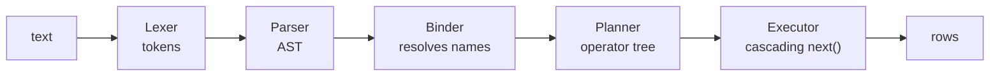

[Português](../pt/06-sql.md) · [English](06-sql.md) · [↑ README](../../README.en.md)

# 06 · SQL

The visible layer. It turns text into an operator tree that pulls tuples from the engine.

## The full path



Each arrow is a data structure transformation, testable in isolation. The parser never touches
disk. The planner does not know what a page is. The executor does not know what a SQL string is.

---

## Supported subset

Deliberately small, and chosen for what it exercises in the engine below, not for what looks
complete.

```sql
CREATE TABLE cattle (
    id      INTEGER PRIMARY KEY,
    tag     TEXT NOT NULL,
    weight  REAL,
    active  BOOLEAN DEFAULT TRUE
);

CREATE INDEX idx_tag ON cattle (tag);

INSERT INTO cattle (id, tag, weight) VALUES (1, 'BR-0042', 431.5);

SELECT c.tag, w.date
FROM cattle c
JOIN weighing w ON w.cattle_id = c.id
WHERE c.weight > 400 AND c.active = TRUE
ORDER BY c.weight DESC
LIMIT 10;

UPDATE cattle SET weight = 450.0 WHERE id = 1;
DELETE FROM cattle WHERE active = FALSE;

BEGIN; COMMIT; ROLLBACK;

EXPLAIN SELECT ...;
```

**Left out:** subqueries, `GROUP BY` and aggregation, `HAVING`, CTEs, window functions,
`OUTER JOIN`, `ALTER TABLE`, views, triggers, foreign keys.

Each is a natural extension once the base stands. None of them teaches anything about storage and
durability, which is the point of the project.

---

## Grammar

EBNF notation. `{ x }` is zero or more, `[ x ]` is optional.

```ebnf
statement    = select | insert | update | delete
             | create_table | create_index
             | begin | commit | rollback | explain ;

select       = "SELECT" proj_list
               "FROM" table_ref { join_clause }
               [ "WHERE" expr ]
               [ "ORDER BY" order_item { "," order_item } ]
               [ "LIMIT" integer [ "OFFSET" integer ] ] ;

proj_list    = "*" | proj_item { "," proj_item } ;
proj_item    = expr [ "AS" identifier ] ;
table_ref    = identifier [ [ "AS" ] identifier ] ;
join_clause  = [ "INNER" ] "JOIN" table_ref "ON" expr ;
order_item   = expr [ "ASC" | "DESC" ] ;

insert       = "INSERT" "INTO" identifier
               [ "(" identifier { "," identifier } ")" ]
               "VALUES" "(" expr { "," expr } ")"
                      { "," "(" expr { "," expr } ")" } ;

update       = "UPDATE" identifier "SET" assign { "," assign } [ "WHERE" expr ] ;
assign       = identifier "=" expr ;

delete       = "DELETE" "FROM" identifier [ "WHERE" expr ] ;

create_table = "CREATE" "TABLE" [ "IF" "NOT" "EXISTS" ] identifier
               "(" col_def { "," col_def } ")" ;
col_def      = identifier type_name { col_constraint } ;
type_name    = "INTEGER" | "REAL" | "TEXT" | "BLOB" | "BOOLEAN" ;
col_constraint = "PRIMARY" "KEY" | "NOT" "NULL" | "UNIQUE" | "DEFAULT" literal ;

create_index = "CREATE" [ "UNIQUE" ] "INDEX" identifier
               "ON" identifier "(" identifier { "," identifier } ")" ;

expr         = or_expr ;
or_expr      = and_expr { "OR" and_expr } ;
and_expr     = not_expr { "AND" not_expr } ;
not_expr     = [ "NOT" ] cmp_expr ;
cmp_expr     = add_expr [ ( "=" | "<>" | "<" | "<=" | ">" | ">=" ) add_expr
                        | "IS" [ "NOT" ] "NULL"
                        | [ "NOT" ] "LIKE" add_expr
                        | [ "NOT" ] "BETWEEN" add_expr "AND" add_expr ] ;
add_expr     = mul_expr { ( "+" | "-" ) mul_expr } ;
mul_expr     = primary { ( "*" | "/" | "%" ) primary } ;
primary      = literal | column_ref | "(" expr ")" | "-" primary ;
column_ref   = [ identifier "." ] identifier ;
literal      = number | string | "TRUE" | "FALSE" | "NULL" ;
```

A recursive descent parser, one function per non-terminal. Operator precedence falls out of the
rule hierarchy — `or_expr` calls `and_expr`, which calls `cmp_expr`, and so on. No precedence
table, no parser generator.

---

## Binder

The stage between parser and planner, and the one nearly every tutorial forgets.

Responsibilities:

- Resolve each table name against the catalog, obtaining its id and schema.
- Resolve each column name to a positional index within the tuple. After this stage, nobody
  compares strings on the hot path.
- Reject ambiguous names in joined queries.
- Infer and check the type of every expression.
- Expand `*` into concrete columns.

Separating this from the parser keeps the parser purely syntactic, and therefore testable with no
catalog, no database and no disk.

---

## Catalog

The database schema lives in the database's own tables. `lastro` describes itself.

```sql
-- internal table, fixed id 1
lastro_tables(table_id INTEGER, name TEXT, root_page INTEGER)

-- internal table, fixed id 2
lastro_columns(table_id INTEGER, ord INTEGER, name TEXT,
               type INTEGER, flags INTEGER, default_value BLOB)

-- internal table, fixed id 3
lastro_indexes(index_id INTEGER, table_id INTEGER, name TEXT,
               root_page INTEGER, unique_flag INTEGER, columns BLOB)
```

The root of `lastro_tables`'s B+Tree lives in page 0's `catalog_root`. It is the only external
pointer that exists; everything else is reached from it.

The concrete payoff: `CREATE TABLE` is an ordinary transaction, with WAL, redo and undo for free.
DDL that crashes halfway is undone by the same mechanism that undoes an `INSERT`. There is no
special code to make DDL atomic — which is a classic bug source in databases that keep schema
outside the transactional engine.

---

## Planner

Rule-based, not cost-based ([ADR-007](adr.md#adr-007--rule-based-planner)). The rules, in
application order:

1. **Access selection.** If the `WHERE` has an equality or range on the leading column of some
   index, use `IndexScan`. Otherwise `SeqScan`.
2. **Predicate pushdown.** A filter mentioning only one table sinks to just above that table's
   scan, cutting volume before the join.
3. **Projection pushdown.** Columns nothing above references stop being materialized.
4. **Join selection.** If the condition is an equality, `HashJoin`, with the smaller estimated
   relation as the build side. Otherwise `NestedLoopJoin`.
5. **Sort elimination.** If the `ORDER BY` matches the order an `IndexScan` already produces, the
   `Sort` node is removed.
6. **Limit pushdown.** `LIMIT` above `Sort` becomes a bounded-heap top-N instead of sorting
   everything and discarding.

### A sample plan

```sql
EXPLAIN
SELECT c.tag, w.date
FROM cattle c JOIN weighing w ON w.cattle_id = c.id
WHERE c.weight > 400
ORDER BY c.weight DESC
LIMIT 10;
```

```
Limit (n=10)
  Sort (c.weight DESC, top-10)
    HashJoin (w.cattle_id = c.id)
      build: SeqScan cattle
               Filter: weight > 400
               Project: id, tag, weight
      probe: SeqScan weighing
               Project: cattle_id, date
```

`EXPLAIN` ships from day one of this layer. A planner whose plan cannot be inspected is
impossible to debug, and the printed plan is the cheapest possible test for all six rules.

---

## Executor

Iterator model, also called Volcano. Each operator is a `next()` that pulls a tuple from the
operator below.

```rust
pub trait Operator {
    fn open(&mut self, ctx: &mut ExecCtx) -> Result<()>;
    fn next(&mut self, ctx: &mut ExecCtx) -> Result<Option<Tuple>>;
    fn close(&mut self) -> Result<()>;
}
```

The operator tree is a tree of `Box<dyn Operator>`. Calling `next()` on the root pulls one row
through the entire chain, on demand.

The property that justifies the choice: **constant memory for pipelined queries**. A `SELECT`
with a filter over a 100 GB table streams through the executor one tuple at a time. Only blocking
operators — `Sort` and the `HashJoin` build side — must materialize, and they are the only ones
with a spill-to-disk policy.

### Operators

| Operator | Behaviour | Memory |
|---|---|---|
| `SeqScan` | walks the table's heap pages | O(1) |
| `IndexScan` | B+Tree range scan, fetches the tuple by RowId | O(1) |
| `Filter` | drops tuples failing the predicate | O(1) |
| `Project` | selects and computes output columns | O(1) |
| `NestedLoopJoin` | for each outer tuple, scans the inner | O(1) |
| `HashJoin` | builds a hash table from the smaller side, probes with the larger | O(build side) |
| `Sort` | external merge sort, spills to disk | O(work memory) |
| `Limit` | counts and stops | O(1) |
| `Insert` | writes to the heap and every index | O(1) |
| `Update` | new MVCC version, updates affected indexes | O(1) |
| `Delete` | stamps `xmax` on the visible version | O(1) |

### External sort

When `Sort` exceeds its memory budget:

1. Sort what fits, write a sorted run to a temporary file.
2. Repeat until the input is exhausted.
3. K-way merge the runs with a min-heap.

It is the only place in the executor that writes outside the database file. Temporaries live next
to the `.lastro` and are deleted in `close()`, or on the next open if the process died first.

### Expression evaluation

An interpreted expression tree, dispatching via `match` over the node enum. No bytecode
compilation, no code generation.

SQLite compiles to a register virtual machine and gains a lot from it. That is a legitimate
optimization, but it belongs to a different project — here it would hide the semantics behind one
more layer at the exact moment the semantics are still being defined.

**Three-valued logic**, mandatory and easy to get wrong:

| a | b | `a AND b` | `a OR b` |
|---|---|---|---|
| true | null | null | true |
| false | null | false | null |
| null | null | null | null |

And the rule that follows: `WHERE` only admits a tuple when the predicate is **true**. Null does
not pass. `NULL = NULL` is null, not true.

---

## Definition of done

- The parser accepts the whole grammar and rejects malformed input with an error position.
- Parser fuzzing: a hundred thousand random strings with no panic, only structured errors.
- AST to SQL and back to AST round-trip producing the same tree.
- `EXPLAIN` covering all six planner rules in fixed tests.
- Three-valued logic checked against the complete truth table.
- `Sort` spilling correctly with an artificially tiny memory budget.

---

Previous: [05 · WAL and recovery](05-wal-recovery.md) · Next: [07 · MVCC](07-mvcc.md)
