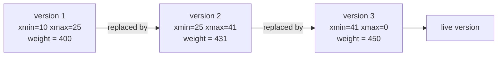
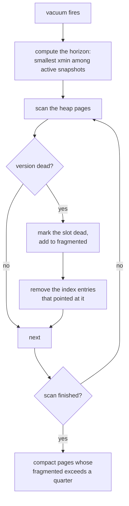

[Português](../pt/07-mvcc.md) · [English](07-mvcc.md) · [↑ README](../../README.en.md)

# 07 · MVCC

Multiversion concurrency control. The whole idea fits in one sentence: **a write never overwrites
— it creates a new version.**

With that, a reader never waits for a writer and a writer never waits for a reader. Every
transaction sees the database as it stood the instant it began.

## Version header

Every heap tuple gains two fields beyond its data:

```
+--------+--------+---------------------------+
| xmin   | xmax   | encoded tuple             |
| u64    | u64    |                           |
+--------+--------+---------------------------+
```

- **`xmin`** — id of the transaction that created this version.
- **`xmax`** — id of the transaction that deleted or replaced it. Zero means the version is live.

And the operations become:

| Operation | What actually happens |
|---|---|
| `INSERT` | writes a version with `xmin = txid` and `xmax = 0` |
| `DELETE` | stamps `xmax = txid` on the visible version; the bytes stay |
| `UPDATE` | `xmax = txid` on the old version, **plus** a new version with `xmin = txid` |

An `UPDATE` is a `DELETE` followed by an `INSERT`. That is the Postgres choice, and it has a
consequence worth stating: **the index must point at the new version**, because the old one still
exists elsewhere in the page or in another page.

---

## Snapshot

When a transaction begins, it photographs the concurrency state:

```rust
pub struct Snapshot {
    xmin: TxId,          // smallest txid active at creation time
    xmax: TxId,          // next txid to be handed out
    active: Vec<TxId>,   // txids in flight at this instant
}
```

Interpretation:

- `txid < snapshot.xmin` — definitely finished before this snapshot.
- `txid >= snapshot.xmax` — definitely started after. Invisible.
- Between the two — depends on membership in `active`.

The snapshot is immutable and holds for the whole transaction, which gives **repeatable read**
for free: the same query run twice in one transaction returns exactly the same result, no matter
how much committed in between.

---

## The visibility rule

The heart of MVCC. A version is visible to a snapshot if and only if:

```
visible(version, snap) =
       creator_visible(version.xmin, snap)
   AND NOT deleter_visible(version.xmax, snap)

creator_visible(x, snap) =
       x == my_own_txid
    OR ( committed(x) AND x < snap.xmax AND x NOT IN snap.active )

deleter_visible(x, snap) =
       x != 0
   AND ( x == my_own_txid
         OR ( committed(x) AND x < snap.xmax AND x NOT IN snap.active ) )
```

In plain terms: **the version is visible if whoever created it had already committed when I
started, and whoever deleted it had not yet committed when I started.**

The `x == my_own_txid` case is what lets a transaction see its own uncommitted changes. Without
it, an `INSERT` followed by a `SELECT` in the same transaction would not return the row just
inserted.

### Timeline example

```
time →

T10  BEGIN ────── INSERT id=1 ────── COMMIT
T20        BEGIN ─────────────────────────── SELECT ──── COMMIT
T30                    BEGIN ── SELECT ────────────────── COMMIT
```

- **T20** began before T10 committed. T10 is in T20's `active` list.
  Result: T20 does **not** see `id=1`, not even in the later `SELECT`.
- **T30** began after T10 committed. T10 is not in `active`.
  Result: T30 **does** see `id=1`.

Two transactions running at the same time, reading the same table, with different results — both
correct. That is the behaviour the anomaly tests must confirm.

---

## Version chain



A transaction whose snapshot predates 25 reads version 1. Between 25 and 41, version 2. After 41,
version 3. All three coexist in the file simultaneously.

**Storage choice:** versions live in the heap, linked by a `next_version` pointer in the tuple
header. That is the Postgres model. The alternative is MySQL's undo log, where the newest version
stays in place and older ones live in a separate segment.

Trade-off: in the Postgres model, reading the newest version is direct and reading old versions
costs a chain walk; writes are cheap. In the MySQL model it is inverted. Since this database is
single-writer and the typical workload reads far more than it writes, the Postgres model wins —
and it is simpler to build on the heap that already exists.

---

## Isolation level

**Snapshot isolation.** Nothing stronger, and that is stated in the README.

What it prevents:

| Anomaly | Prevented? | Why |
|---|---|---|
| Dirty read | yes | an uncommitted version never passes the visibility rule |
| Non-repeatable read | yes | the snapshot is fixed for the whole transaction |
| Phantom read | yes | new rows have `xmin` greater than or equal to `snap.xmax` |
| Lost update | yes | write conflict detection, below |
| **Write skew** | **no** | see below |

### Write conflict detection

When a transaction is about to stamp `xmax` on a version, it checks whether another transaction
already did:

```
if version.xmax != 0 and transaction(version.xmax) committed after my snapshot:
    abort with a serialization conflict error
```

This is the *first-updater-wins* rule, and it is what prevents lost update. In a single-writer
database the conflict is rare, but the check must exist anyway — without it, a long transaction
would silently overwrite the work of a short one that committed in between.

### Write skew, and why it stays

The classic counterexample. Business rule: at least one veterinarian on call at all times. Two on
call, Ana and Bruno.

```
T1: SELECT COUNT(*) FROM on_call WHERE active = TRUE   -- reads 2, fine
T2: SELECT COUNT(*) FROM on_call WHERE active = TRUE   -- reads 2, fine
T1: UPDATE on_call SET active = FALSE WHERE name = 'Ana'
T2: UPDATE on_call SET active = FALSE WHERE name = 'Bruno'
T1: COMMIT
T2: COMMIT
```

Both commit. Nobody is on call. No anomaly from the list was violated — they wrote to **different
rows**, so there was no write conflict, and each read a perfectly consistent snapshot.

Preventing this requires serializable snapshot isolation, which tracks read/write dependencies in
a graph and aborts on cycle detection. That is a large project on its own, and it is
[documented as not implemented](adr.md#adr-004--mvcc-instead-of-two-phase-locking) rather than
faked.

The anomaly battery will show exactly this table, with the `no` right there. A database that
honestly declares what it does not do is more trustworthy than one that promises serializability
and delivers snapshot isolation — which, incidentally, is what Oracle does when you ask for
`SERIALIZABLE`.

---

## Dead version collection

Without collection the file grows forever. A table with a thousand `UPDATE`s on one row would
have a thousand versions, and every read would walk the whole chain.

A version is **dead** when no present or future transaction can see it:

```
dead(version) =
    version.xmax != 0
    AND committed(version.xmax)
    AND version.xmax < oldest_active_snapshot
```

`oldest_active_snapshot` is the horizon. Nothing below it is of interest to anyone.



Trigger: when dead versions exceed 20% of the table, tracked by an incremental estimator updated
on every `UPDATE` and `DELETE`.

**The long transaction problem**, worth recording because it bites in practice: a transaction left
open for hours holds the horizon back, and no version newer than it can be collected. The table
bloats even with vacuum running. In Postgres this is called bloat, it causes half of all
production incidents with that database, and the mitigation here is the same: expose the age of
the oldest transaction as a metric and complain loudly past a threshold.

---

## Interaction with the WAL

MVCC does not replace the log. They solve different problems:

- **MVCC** solves concurrency: who sees what, without blocking.
- **WAL** solves durability: what survives a crash.

A new version is a page change like any other, and therefore produces an `UPDATE` log record.
Each transaction's commit status also goes to the log — the `COMMIT` record is what answers
`committed(x)` after a recovery.

One detail that needs care: during recovery the active transaction list is rebuilt by the
analysis pass. A transaction with no `COMMIT` in the log is a loser, is undone, and every version
it created vanishes in the undo. After that, no snapshot can see them — which is exactly the
correct behaviour, obtained with no MVCC-specific code in recovery at all.

---

### Implementation status

Implemented: the version header with `xmin` and `xmax`, a snapshot taken at
`BEGIN` and held to the end, the full visibility rule with its truth table as a
test, and `INSERT`, `UPDATE` and `DELETE` creating versions rather than
overwriting.

**The question "had whoever wrote this committed" needs no status table here.**
The engine takes one writer at a time, and a transaction that rolls back has its
versions undone by the log rather than left behind. So any version still on disk
was written either by somebody who committed or by the one open transaction — and
the snapshot already knows which that is. It is a simplification bought by the
single-writer choice, and it stops being sound the moment a second writer exists.

**Write conflict detection** (*first-updater-wins*) is not implemented either,
for the same reason: with one writer at a time there is no second transaction to
conflict with. It becomes necessary alongside the second writer.

**Dead version collection does not exist.** A delete gives no pages back: the
removed version keeps its bytes so a reader that started earlier still finds it.
Reclaiming that space is the vacuum's job, and it is what this stage is missing.

**An index is allowed to go stale on purpose.** An entry is not removed when its
version is superseded, so it may point at a row whose visible version no longer
matches. The planner keeps the equality in the filter above for exactly that
reason, and the fetch checks visibility before handing the row back. It is
cheaper than keeping the index exact, and what it costs is a dead entry until the
vacuum runs.

---

## Definition of done

- Complete visibility truth table as a fixed test, covering all `xmin`/`xmax` combinations
  against snapshots before, during and after.
- Anomaly battery producing exactly the table declared above, including write skew reproduced on
  purpose.
- Vacuum collecting every dead version and no live one, verified against a model.
- An artificial long transaction confirming the horizon holds collection back as expected.
- Crash fuzzer running with a concurrent MVCC workload, with no atomicity violation.

---

Previous: [06 · SQL](06-sql.md) · Next: [08 · Testing and proof](08-testing.md)
