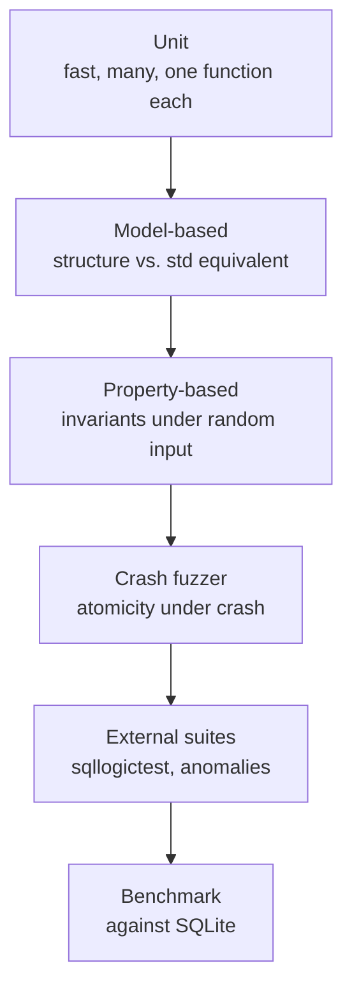

[Português](../pt/08-testes.md) · [English](08-testing.md) · [↑ README](../../README.en.md)

# 08 · Testing and proof

The project's thesis: writing the database is the easy part, proving it correct is the real work.
This document describes how the README's claims will be backed.

## The pyramid



The higher up, the slower and the more valuable per run. The first three levels run on every
commit. The crash fuzzer and external suites run on merge to `main`. The benchmark runs on demand
and always on the same machine.

---

## 1 · Model-based

The technique with the best effort-to-bug-found ratio. For every structure there is a trustworthy
standard library equivalent:

| `lastro` structure | Oracle |
|---|---|
| Buffer pool | `HashMap<PageId, [u8; 4096]>` |
| B+Tree | `BTreeMap<Vec<u8>, Vec<u8>>` |
| Heap | `Vec<Option<Tuple>>` |
| Catalog | `HashMap<String, Schema>` |

Every operation goes to both. The states are compared after each one. A divergence is a bug, and
`proptest` automatically shrinks the sequence to the smallest still-failing example — turning a
ten-thousand-operation failure into a three-line case.

```rust
proptest! {
    #[test]
    fn btree_agrees_with_btreemap(ops in vec(any::<Op>(), 0..10_000)) {
        let mut real = BTree::new_temp()?;
        let mut model = BTreeMap::new();
        for op in ops {
            match op {
                Op::Insert(k, v) => { real.insert(&k, &v)?; model.insert(k, v); }
                Op::Delete(k)    => { real.delete(&k)?;     model.remove(&k); }
                Op::Range(a, b)  => {
                    prop_assert_eq!(
                        real.range(&a..&b)?.collect::<Vec<_>>(),
                        model.range(a..b).map(|(k,v)| (k.clone(), v.clone())).collect::<Vec<_>>()
                    );
                }
            }
            real.check_tree()?;
        }
        prop_assert_eq!(real.iter()?.collect::<Vec<_>>(), model.into_iter().collect::<Vec<_>>());
    }
}
```

---

## 2 · Invariants

Each layer declares its own, checked with `debug_assert!` on the normal path and explicitly at
the end of every test. Full lists live in each document:
[pager](03-pager.md#invariants), [B+Tree](04-btree.md#invariants).

The point: a violated invariant is detected **at the operation that broke it**, not ten thousand
operations later when the trail has gone cold. That is the difference between an afternoon and a
week of debugging.

---

## 3 · Crash fuzzer

Described in detail in [05 · WAL and recovery](05-wal-recovery.md#the-crash-fuzzer). The
operational summary:

```bash
cargo test --release --test crash -- --seeds 50000
```

**The property being checked**, precisely: after recovery, the database state corresponds to some
**prefix** of the confirmed commit sequence. Not one more, not one less, no intermediate state.

**How to kill.** An injection layer wraps `write` and `fsync`, counting every call. The fuzzer
draws *n* and issues `SIGKILL` at the nth. Sweeping *n* from 1 to the total covers every possible
interruption point.

**The checker**, four questions in order:

1. Is every transaction whose `COMMIT` was confirmed to the client fully present?
2. Did any transaction without a `COMMIT` leave a visible trace?
3. Does `check_tree()` pass on every index?
4. Do heap and indexes agree on which RowIds exist?

Every failing seed becomes a permanent fixed test, with the `.lastro` and `.wal` from the moment
of failure committed to the repository. The regression set grows and never shrinks.

---

## 4 · SQL Logic Test

SQLite's test suite. Millions of assertions in text files, written by third parties, comparing
query results against expected output.

```
statement ok
CREATE TABLE t1(a INTEGER, b INTEGER)

statement ok
INSERT INTO t1 VALUES(1, 2)

query II rowsort
SELECT a, b FROM t1 WHERE a > 0
----
1
2
```

**Why this is worth more than any homegrown test:** it was written by people who had no idea this
project existed, to exercise a database that is not this one. It cannot be accidentally shaped
around the implementation choices made here — which is exactly the flaw in every test suite
written by its own author.

**How it will be reported.** The whole suite is not applicable: much of it uses `GROUP BY`,
subqueries and other things [out of scope](06-sql.md#supported-subset). The report declares the
filtering before the number:

```
Files considered:          N     (only those using the supported subset)
Assertions run:            N
Passed:                    N     (NN.N%)
Failed, missing feature:   N     (listed by name)
Failed, actual bug:        N     (each with an open issue)
```

Publishing "99% pass" while hiding that 90% of the files were discarded would be a statistical
lie. The denominator ships with the numerator.

---

## 5 · Anomaly battery

Jepsen reduced to one node. Each anomaly is a script of two interleaved transactions, with the
expected outcome declared before the run.

```rust
#[test]
fn write_skew_happens_as_documented() {
    let db = Db::temp();
    db.exec("CREATE TABLE on_call (name TEXT, active BOOLEAN)");
    db.exec("INSERT INTO on_call VALUES ('ana', TRUE), ('bruno', TRUE)");

    let t1 = db.begin();
    let t2 = db.begin();

    assert_eq!(t1.query_int("SELECT COUNT(*) FROM on_call WHERE active"), 2);
    assert_eq!(t2.query_int("SELECT COUNT(*) FROM on_call WHERE active"), 2);

    t1.exec("UPDATE on_call SET active = FALSE WHERE name = 'ana'");
    t2.exec("UPDATE on_call SET active = FALSE WHERE name = 'bruno'");

    t1.commit().unwrap();
    t2.commit().unwrap();   // commits: different rows, no write conflict

    // The business invariant has been violated. This is expected under
    // snapshot isolation and is declared in the README.
    assert_eq!(db.query_int("SELECT COUNT(*) FROM on_call WHERE active"), 0);
}
```

The test **asserts the anomaly** rather than hiding it. If isolation is ever hardened to
serializable, this test fails, and that failure is the correct signal that the documentation must
change with it.

---

## 6 · Benchmark

### Methodology, declared before the result

- One machine, specification published, no variation between runs.
- SQLite as the reference, version pinned and cited.
- Equivalent configuration on both sides: same sync mode, same page size, same cache size.
  Comparing `lastro` with `fsync` against SQLite at `PRAGMA synchronous=OFF` would be fraud.
- Five runs, reporting median and deviation.
- OS cache dropped between runs.
- Numbers presented as median and p99, never mean alone.

### Workloads

| Workload | What it stresses |
|---|---|
| Sequential insert, 1 M rows | best-case B+Tree splits, WAL throughput |
| Random insert, 1 M rows | worst-case splits, buffer pool hit rate |
| Point lookup, 100 k | tree height, search cost |
| Range scan, 10% of the table | leaf sibling pointers, sequential reads |
| Point update, 100 k | MVCC version chains, log volume |
| Small transactions, 10 k commits | `fsync` cost, commit latency |

### What will be published

**The expectation is to lose, by a wide margin.** SQLite has 25 years of optimization and this
project has one semester.

What goes into the README, alongside the chart:

1. The chart, with the loss visible.
2. The execution profile showing where the time goes — `perf` or `flamegraph`.
3. The analysis: which architectural decision costs how much, and what would have to change to
   close the gap.

A benchmark that shows a loss with a profile explaining why teaches more, and reads as more
mature engineering, than a number chosen to flatter the author. That is why the section exists.

---

## Continuous integration

```yaml
# .github/workflows/ci.yml
on every push:
  - cargo fmt --check
  - cargo clippy -- -D warnings
  - cargo test                        # unit and model, ~2 min
  - cargo test --release -- proptest  # property-based, ~5 min

on pull request to main:
  - crash fuzzer, 5,000 seeds         # ~15 min
  - sqllogictest, filtered suite
  - anomaly battery

daily:
  - crash fuzzer, 50,000 seeds        # ~2 h
  - cargo miri test                   # undefined behaviour detection
```

`cargo miri` on the daily job because the `unsafe` parts — raw byte manipulation inside pages —
are exactly where the compiler stops helping.

---

## What this suite still does not cover

Recorded for honesty, because a test suite that declares itself complete is always wrong:

- **Silent disk corruption.** A bit flip with no I/O error. Partially mitigated by the per-page
  checksum, not systematically tested.
- **Lying `fsync`.** Some devices acknowledge without persisting. Without specific hardware it is
  impossible to verify from software.
- **Real write concurrency.** The model is single-writer, so the entire class of concurrent-writer
  bugs does not exist here — but it is also untested, and would start mattering if the model
  changed.
- **Production volume.** Everything is tested in the millions of rows. Billions may reveal scale
  problems that do not show up earlier.

---

Previous: [07 · MVCC](07-mvcc.md) · Next: [09 · Roadmap](09-roadmap.md)
