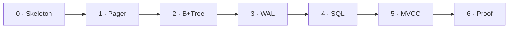

[Português](../pt/09-roadmap.md) · [English](09-roadmap.md) · [↑ README](../../README.en.md)

# 09 · Roadmap

Six stages. Each one starts only when the previous passes its own definition of done.

The estimates assume someone learning Rust and databases at the same time, at side-project pace.
They exist to detect drift, not as a promise.

---

## Stage 0 · Skeleton — 1 week

`cargo init`, module layout, base types (`PageId`, `Lsn`, `TxId`), the error type, continuous
integration running, `README` published.

**Done when:** `cargo test` passes with one trivial test and CI is green.

---

## Stage 1 · Pager and buffer pool — 4 to 6 weeks

Includes learning Rust. The curve is real, and this stage is the right place to pay it, because
the domain is the simplest in the project.

Deliverable: `Pager` with read, write, allocate and freelist. `BufferPool` with clock policy and
a `PageGuard` with `Drop`. Slotted page layout, varint, order-preserving key encoding.

**Done when** ([details](03-pager.md#definition-of-done)):
- six invariants verified under `proptest` with 10,000 cases
- one million operations against the model with no divergence
- I/O fault injection at every write point
- no pin leaks on any error path

---

## Stage 2 · B+Tree — 6 to 8 weeks

The longest stage. Splitting is fine; merging is not.

Deliverable: search, insert with split, delete with merge and rebalancing, range scan via sibling
pointers, overflow chains, and `check_tree()` verifying the seven invariants.

**Done when** ([details](04-btree.md#definition-of-done)):
- one million operations against `BTreeMap` with no divergence
- `check_tree()` after every operation in debug mode
- all five adversarial patterns in the fixed set
- range scan agreeing with the hierarchical traversal

**Cut point:** if merge and rebalancing stall for more than two weeks, ship tombstones plus
offline compaction, record the limitation in the README, and move on. A declared limitation costs
less than the entire schedule.

---

## Stage 3 · WAL and recovery — 6 to 8 weeks

The heart. Not cut, not simplified, not deferred.

Deliverable: record format, `WalWriter` with the WAL rule enforced in the buffer pool, fuzzy
checkpointing, the three ARIES passes, CLRs, and the crash fuzzer with its four-question checker.

**Done when** ([details](05-wal-recovery.md#definition-of-done)):
- 50,000 seeds with no atomicity violation
- a crash injected into each of the three passes, with the next recovery completing
- recovery ten times over the same log, producing identical state
- the log truncated at every byte of a record, always opening without panic

When this stage closes, a real database exists — without SQL, but transactional and durable,
which is the hard part.

---

## Stage 4 · SQL — 5 to 7 weeks

The bulkiest layer in lines of code and the simplest conceptually. Nothing here can corrupt data.

Deliverable: lexer, recursive descent parser, binder, catalog in the database's own tables,
planner with six rules, executor with eleven operators, `EXPLAIN`, `lastro-cli`.

**Done when** ([details](06-sql.md#definition-of-done)):
- the whole grammar accepted, malformed input rejected with a position
- parser fuzzing with a hundred thousand strings and no panic
- AST to SQL and back round-trip
- `EXPLAIN` covering all six rules
- three-valued logic checked against the truth table

---

## Stage 5 · MVCC — 4 to 5 weeks

Deliverable: `xmin` and `xmax` in the tuple header, snapshots, the visibility rule,
first-updater-wins conflict detection, vacuum with a horizon.

**Done when** ([details](07-mvcc.md#definition-of-done)):
- complete visibility truth table as a fixed test
- anomaly battery producing exactly the declared table, write skew included
- vacuum collecting every dead version and no live one
- crash fuzzer with a concurrent MVCC workload

---

## Stage 6 · Proof and publication — 3 to 4 weeks

Deliverable: sqllogictest runner with an honest-denominator report, the full anomaly battery,
benchmark against SQLite with execution profiles, README filled with measured numbers, a devlog
series.

**Done when:**
- the sqllogictest report is published, with its filtering declared
- the anomaly table is complete in the README
- benchmark charts with `flamegraph` and the loss analysis
- one devlog per layer, published

---

## Summary

| Stage | Estimate | Cumulative |
|---|---|---|
| 0 · Skeleton | 1 week | 1 |
| 1 · Pager | 4 to 6 weeks | 5 to 7 |
| 2 · B+Tree | 6 to 8 weeks | 11 to 15 |
| 3 · WAL | 6 to 8 weeks | 17 to 23 |
| 4 · SQL | 5 to 7 weeks | 22 to 30 |
| 5 · MVCC | 4 to 5 weeks | 26 to 35 |
| 6 · Proof | 3 to 4 weeks | 29 to 39 |

**Seven to nine months** at side-project pace. The initial five-month horizon was optimistic;
this table is the honest estimate after writing the specification.

Cutting B+Tree merge and trimming the SQL scope fits it into five. Cutting the WAL would fit it
into three — and it would no longer be a database.

---

## Afterwards

Out of scope for this version, recorded so it does not become scope by accident:

- `GROUP BY` and aggregate functions
- Subqueries and CTEs
- Cost-based planner, with statistics and histograms
- Serializable snapshot isolation, closing write skew
- Page compression
- Replication by WAL shipping
- Incremental backup from the log

---

Previous: [08 · Testing and proof](08-testing.md) · Next: [10 · Glossary](10-glossary.md)
