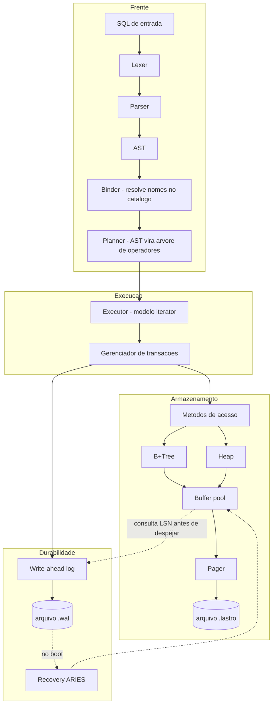
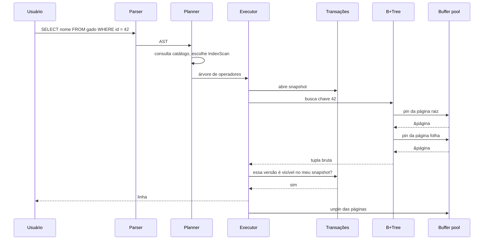
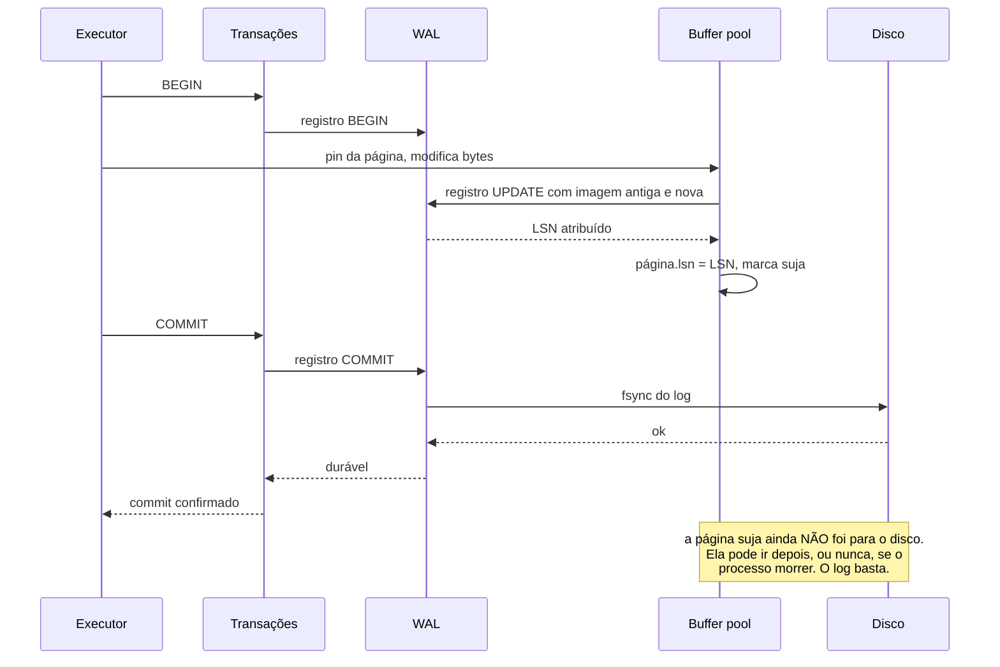
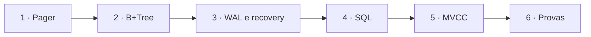

[Português](01-arquitetura.md) · [English](../en/01-architecture.md) · [↑ README](../../README.md)

# 01 · Arquitetura

## A ideia central

Um banco de dados é uma pilha de abstrações onde cada camada mente para a de cima, de um jeito
útil. O pager mente dizendo que existe memória infinita. A B+Tree mente dizendo que existe um
mapa ordenado. O gerenciador de transações mente dizendo que ninguém mais está mexendo nos
dados. O executor mente dizendo que existem tabelas e linhas.

Nenhuma dessas coisas existe. Existe um arquivo, e chamadas de sistema.

O projeto inteiro é construir essas mentiras uma de cada vez, de baixo para cima, e provar que
cada uma se sustenta mesmo quando o processo morre no pior momento possível.

## As camadas



### Contrato de cada camada

| Camada | Vocabulário que ela entende | Vocabulário que ela esconde |
|---|---|---|
| Pager | número de página, 4096 bytes | descritor de arquivo, `pread`, `pwrite`, `fsync` |
| Buffer pool | página fixada em memória | leitura de disco, despejo, política de substituição |
| B+Tree | chave e valor em bytes, ordenados | split, merge, ponteiro de irmão, altura |
| Heap | tupla identificada por RowId | slot, offset dentro da página, fragmentação |
| Transações | transação, snapshot, versão visível | txid, xmin, xmax, lista de ativas |
| WAL | "torne isto durável" | LSN, redo, undo, CLR, checkpoint |
| Executor | tupla, operador, `next()` | qual estrutura de acesso está por baixo |
| Planner | tabela, coluna, predicado | ordem física, escolha de índice |

A regra é rígida: **uma camada nunca chama uma camada duas abaixo dela.** O executor não sabe o
que é uma página. A B+Tree não sabe o que é uma transação. Quando essa regra é quebrada, o
projeto vira uma bola de barro e não dá mais para testar nada isoladamente.

## O caminho de uma consulta



O detalhe que importa: o `pin` e o `unpin` são simétricos e obrigatórios. Uma página fixada não
pode ser despejada do buffer pool. Esquecer um `unpin` é um vazamento que só aparece sob carga,
quando o pool enche e não há nada elegível para despejo. É o primeiro bug clássico dessa
camada, e a razão de o contador de pins ser verificado no fim de cada teste.

## O caminho de uma escrita

Aqui é onde o banco se diferencia de um arquivo.



Duas consequências que definem o resto do projeto:

**A transação é durável antes da página ser escrita.** O `fsync` acontece no log, que é
sequencial e pequeno, não no arquivo de dados, que é aleatório e grande. É isso que torna um
banco rápido em escrita.

**A página suja só pode ir ao disco depois do log correspondente.** Essa é a regra WAL, e o
buffer pool precisa consultar o LSN antes de despejar qualquer coisa. Está detalhado em
[05 · WAL e recovery](05-wal-recovery.md).

## Concorrência

Modelo escolhido: **um escritor, muitos leitores.**

Uma única transação de escrita por vez, serializada por um mutex no nível do banco. Leituras
acontecem em paralelo, sem bloqueio, porque MVCC deixa cada leitor enxergar o snapshot que
existia quando ele começou.

Isso remove uma classe inteira de problemas: deadlock entre escritores, detecção de ciclo no
grafo de espera, escalonamento de travas. O custo é que a taxa de escrita não escala com o
número de núcleos.

A justificativa está em [ADR-003](adr.md#adr-003--um-único-escritor). O tempo economizado aqui
vai inteiro para recovery, que é onde está o aprendizado de verdade.

## Organização do código

```
src/
  lib.rs
  storage/
    pager.rs         página, freelist, leitura e escrita no arquivo
    buffer.rs        buffer pool, pin/unpin, política clock
    page/
      layout.rs      slotted page, slots, células
      encoding.rs    varint, codificação de chave que preserva ordem
  index/
    btree.rs         busca, insert, delete
    split.rs         split e promoção de mediana
    merge.rs         merge e rebalanceamento
    iter.rs          range scan pelo ponteiro de irmão
  wal/
    record.rs        formato do registro de log
    writer.rs        append, flush, regra WAL
    recovery.rs      analysis, redo, undo
    checkpoint.rs
  txn/
    manager.rs       txid, lista de ativas, snapshot
    visibility.rs    a regra de visibilidade MVCC
    vacuum.rs        coleta de versões mortas
  sql/
    lexer.rs
    parser.rs
    ast.rs
    binder.rs        resolve nomes contra o catálogo
    planner.rs
    exec/
      mod.rs         o trait Operator com next()
      scan.rs        SeqScan, IndexScan
      join.rs        NestedLoop, HashJoin
      sort.rs
      dml.rs         Insert, Update, Delete
  catalog/
    mod.rs           schema guardado em tabelas do próprio banco
  bin/
    lastro-cli.rs
tests/
  crash/             o crash fuzzer
  sqllogic/          runner da suíte do SQLite
  anomalies/         a bateria de isolamento
benches/
```

## Ordem de construção

Cada camada só começa quando a de baixo passa nos próprios testes. O critério de pronto de cada
uma está em [09 · Roadmap](09-roadmap.md).



A ordem não é negociável em um ponto: **o WAL vem antes do SQL.** É tentador fazer o `SELECT`
funcionar primeiro, porque é a parte visível e gratificante. Mas colocar durabilidade em um banco
que já tem executor significa reescrever todo o caminho de escrita. Colocar SQL em cima de um
motor já durável é só somar código.

---

Próximo: [02 · Formato de arquivo](02-formato-de-arquivo.md)
