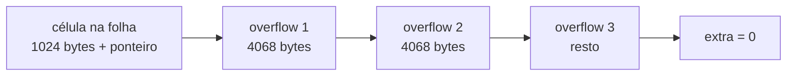

[Português](02-formato-de-arquivo.md) · [English](../en/02-file-format.md) · [↑ README](../../README.md)

# 02 · Formato de arquivo

Este é o documento mais importante do projeto. Enquanto o formato binário não estiver decidido,
não existe código para escrever — e depois que existirem arquivos gravados, mudá-lo custa uma
migração.

**Convenções válidas para tudo abaixo:**

- Inteiros são **little-endian**, exceto onde explicitamente marcado como big-endian.
  x86 e ARM são little-endian, então isso elimina conversão no caminho quente.
- Offsets são relativos ao início da página, não ao início do arquivo.
- Tamanho de página: **4096 bytes**, fixo ([ADR-002](adr.md#adr-002--páginas-de-4-kb)).
- Página 0 é sempre a página de metadados.
- O número de página é um `u32`. Limite teórico do banco: 2^32 × 4 KB = 16 TB.

---

## O arquivo de dados

```
+---------------+---------------+---------------+-----+
| página 0      | página 1      | página 2      | ... |
| metadados     | dados         | dados         |     |
| 4096 bytes    | 4096 bytes    | 4096 bytes    |     |
+---------------+---------------+---------------+-----+
0            4096            8192           12288
```

Sem cabeçalho de arquivo separado. O arquivo é exatamente uma sequência de páginas, e a página 0
carrega o que seria o cabeçalho. Isso significa que ler qualquer página é sempre
`pread(fd, buf, 4096, page_id * 4096)` — sem aritmética de deslocamento em lugar nenhum.

---

## Página 0 · Metadados

```
offset  tam  campo                 descrição
------  ---  --------------------  --------------------------------------------
  0      8   magic                 "LASTRO\x00" — assinatura do formato
  8      2   format_version        u16, começa em 1
 10      2   page_size             u16, sempre 4096; validado na abertura
 12      4   page_count            u32, total de páginas alocadas
 16      4   freelist_head         u32, primeira página livre; 0 = nenhuma
 20      4   freelist_count        u32, quantas páginas livres existem
 24      8   next_txid             u64, próximo id de transação a distribuir
 32      8   last_checkpoint_lsn   u64, onde o recovery começa a fase de análise
 40      4   catalog_root          u32, página raiz da B+Tree do catálogo
 44      4   schema_version        u32, incrementado a cada DDL
 48   4040   reservado             zeros
4092      4   checksum              u32, CRC32C dos bytes 0..4092
```

`page_size` está gravado mesmo sendo constante: se um dia o valor mudar, o banco precisa
recusar o arquivo antigo com uma mensagem clara em vez de ler lixo.

O `checksum` da página 0 é verificado em toda abertura. Corrupção nessa página é irrecuperável
e precisa falhar alto, não silenciosamente.

---

## Slotted page

Todas as páginas que guardam dados de tamanho variável — folhas da B+Tree, nós internos e
páginas de heap — usam o mesmo layout. Ele resolve um problema específico: guardar registros de
tamanhos diferentes em um bloco fixo, permitindo remoção sem deixar buracos permanentes.

```
0                                                            4096
+--------+------------------+--------------------+--------------+
| header | slots            | espaço livre       | células      |
| 24 B   | 4 B cada -->     |                    | <-- crescem  |
+--------+------------------+--------------------+--------------+
         ^                  ^                    ^
         24            free_start            free_end
```

Slots crescem do início para o fim. Células crescem do fim para o início. Elas se encontram no
meio, e quando `free_end - free_start` fica menor que o necessário, a página está cheia.

A vantagem: o **slot é o endereço estável**. Uma tupla referenciada por `(page_id, slot_id)`
pode ser movida dentro da página durante uma compactação sem que nenhuma referência externa
quebre. É por isso que o RowId do heap é exatamente esse par.

### Cabeçalho de página · 24 bytes

```
offset  tam  campo         descrição
------  ---  ------------  ------------------------------------------------
  0      1   page_type     1=meta 2=interior 3=folha 4=heap 5=freelist 6=overflow
  1      1   flags         bit 0: página é a raiz da árvore
  2      2   slot_count    u16, quantos slots existem (incluindo os mortos)
  4      2   free_start    u16, offset do primeiro byte livre após os slots
  6      2   free_end      u16, offset do início da célula mais baixa
  8      2   fragmented    u16, bytes perdidos em buracos entre células
 10      2   reservado
 12      8   lsn           u64, LSN da última modificação nesta página
 20      4   extra         u32, sentido depende de page_type
```

O campo **`lsn` é o que torna o recovery possível**. Ele responde à pergunta "esta página já
reflete esta alteração do log?" durante a fase de redo. Sem ele, o redo não seria idempotente e
recovery rodado duas vezes corromperia o banco.

O campo `extra` é reinterpretado por tipo de página:

| `page_type` | Significado de `extra` |
|---|---|
| 2 · interior | página do filho mais à direita, que não tem célula própria |
| 3 · folha | próxima folha à direita, para range scan; 0 se for a última |
| 4 · heap | página seguinte da mesma tabela |
| 5 · freelist | próxima página da lista de livres |
| 6 · overflow | próxima página da cadeia de overflow |

### Slot · 4 bytes

```
offset  tam  campo    descrição
------  ---  -------  ---------------------------------------
  0      2   offset   u16, onde a célula começa na página
  2      2   length   u16, tamanho da célula em bytes
```

`offset == 0` marca um slot morto. O slot não é removido do array na exclusão, porque isso
deslocaria todos os slots seguintes e invalidaria RowIds. Espaço de slots mortos é recuperado
apenas na compactação.

### Compactação

Disparada quando `fragmented` passa de 1/4 da página e o espaço contíguo não basta para a
inserção pedida. O procedimento reescreve as células vivas coladas ao fim da página, atualiza os
offsets dos slots e zera `fragmented`. Os slots não mudam de índice, então nenhum RowId quebra.

---

## Células

### Célula de folha da B+Tree

```
+-----------+---------+-------------+-----------+
| key_len   | key     | value_len   | value     |
| varint    | bytes   | varint      | bytes     |
+-----------+---------+-------------+-----------+
```

### Célula de nó interior

```
+------------+-----------+---------+
| left_child | key_len   | key     |
| u32        | varint    | bytes   |
+------------+-----------+---------+
```

A chave em um nó interior é um **separador**, não um dado. Ela responde apenas "vá para a
esquerda ou para a direita", e não precisa existir em nenhuma folha.

### Varint

Codificação de comprimento variável, 7 bits úteis por byte, bit mais significativo indicando
continuação. Igual à do Protocol Buffers. Um comprimento até 127 ocupa 1 byte, que é o caso
comum e o motivo de não usar `u16` fixo.

### Overflow

Uma célula maior que **1024 bytes**, ou seja, um quarto da página, não cabe na página junto com
outras. Quando isso acontece:

1. Os primeiros 1024 bytes do payload ficam na célula.
2. O resto vai para uma cadeia de páginas de tipo 6, ligadas pelo campo `extra`.
3. A célula recebe um `u32` extra ao final, apontando para a primeira página da cadeia, e o bit
   de overflow é marcado no comprimento.

O limite de 1024 existe para garantir **fanout mínimo de 4** — pelo menos quatro células por
página interna. Sem esse piso, uma chave gigante poderia degenerar a árvore em uma lista ligada,
e a altura logarítmica deixaria de valer.



---

## Codificação de chave que preserva ordem

Este é o detalhe que faz a B+Tree ficar simples. Se a comparação byte a byte das chaves
codificadas produzir exatamente a ordem lógica dos valores, a árvore inteira só precisa de
`memcmp` e nunca precisa saber o tipo do que está guardando.

Conseguir isso exige cuidado por tipo.

### Inteiro de 64 bits com sinal

```
1. inverte o bit mais significativo:  x XOR 0x8000_0000_0000_0000
2. grava em big-endian
```

A inversão do bit de sinal empurra os negativos, cuja representação em complemento de dois
começa com 1, para baixo dos positivos. O big-endian garante que o byte mais significativo seja
comparado primeiro. Resultado: `memcmp` dá exatamente a ordem numérica, negativos inclusos.

```
valor        complemento de dois        codificado
-2           FF FF FF FF FF FF FF FE    7F FF FF FF FF FF FF FE
-1           FF FF FF FF FF FF FF FF    7F FF FF FF FF FF FF FF
 0           00 00 00 00 00 00 00 00    80 00 00 00 00 00 00 00
 1           00 00 00 00 00 00 00 01    80 00 00 00 00 00 00 01
```

A coluna da direita está em ordem crescente byte a byte. A do meio não está.

### Texto

Bytes UTF-8 como estão, terminados por `0x00 0x00`. Como o byte nulo pode aparecer dentro do
texto, ele é escapado: cada `0x00` do original vira `0x00 0xFF`.

Sem o terminador, `"abc"` e `"abcd"` ficariam ambíguos em uma chave composta. Com ele, o prefixo
sempre ordena antes, que é o comportamento correto.

### Real de 64 bits

```
se o número for positivo ou zero:  inverte só o bit de sinal
se for negativo:                   inverte todos os bits
depois, grava em big-endian
```

`NaN` é rejeitado na entrada em vez de codificado. Um valor que não é igual nem a si mesmo não
tem lugar em uma árvore de busca.

### Nulo

Um byte de prefixo por coluna: `0x00` para nulo, `0x01` para presente. Nulos ordenam antes de
tudo. É a mesma escolha do SQLite.

### Chave composta

Concatenação das codificações individuais, na ordem das colunas do índice. Como cada codificação
é autodelimitada — comprimento fixo para números, terminador para texto — a concatenação
continua preservando a ordem lexicográfica.

---

## Codificação de tupla

Tuplas do heap não precisam preservar ordem, então usam um formato mais barato.

```
+-------------+---------------+---------------------------+
| col_count   | null_bitmap   | valores em ordem de schema|
| varint      | ceil(n/8) B   |                           |
+-------------+---------------+---------------------------+
```

- Tipos de tamanho fixo (`INTEGER`, `REAL`, `BOOLEAN`) ocupam seus bytes nativos em little-endian.
- Tipos variáveis (`TEXT`, `BLOB`) vêm precedidos de um varint de comprimento.
- Colunas nulas não ocupam **nenhum** byte na área de valores; o bitmap já disse que elas não estão lá.
- `col_count` está gravado para permitir `ALTER TABLE ADD COLUMN` sem reescrever tuplas antigas:
  uma tupla com menos colunas que o schema atual devolve o valor padrão para as que faltam.

---

## O arquivo de log

Detalhado em [05 · WAL e recovery](05-wal-recovery.md). Resumo do formato aqui, por completude:

```
offset  tam  campo       descrição
------  ---  ----------  ------------------------------------------------
  0      8   lsn         u64, offset deste registro dentro do arquivo
  8      8   txid        u64, transação dona do registro
 16      8   prev_lsn    u64, registro anterior da MESMA transação
 24      1   rec_type    u8
 25      1   flags
 26      2   reservado
 28      4   body_len    u32
 32      4   checksum    u32, CRC32C do cabeçalho e do corpo
 36    var   body
```

O LSN ser o próprio offset do registro no arquivo é uma simplificação deliberada: localizar um
LSN durante o undo vira um `seek`, sem índice auxiliar nenhum.

---

## Validação na abertura

Sequência executada ao abrir um arquivo, em ordem, com falha imediata em qualquer passo:

1. Arquivo tem pelo menos 4096 bytes.
2. Magic bate com `"LASTRO\x00"`.
3. `format_version` é conhecida por esta build.
4. `page_size` é 4096.
5. CRC32C da página 0 confere.
6. Tamanho do arquivo é múltiplo de 4096 e coerente com `page_count`.
7. Se existe `.wal` não vazio, roda recovery antes de liberar qualquer leitura.

O passo 7 não é opcional nem configurável. Um banco que abre e serve consultas antes de aplicar
o log é um banco que devolve dados errados após uma queda.

---

Anterior: [01 · Arquitetura](01-arquitetura.md) · Próximo: [03 · Pager e buffer pool](03-pager.md)
