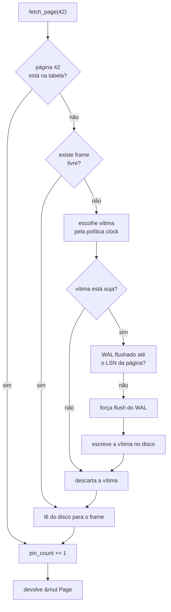

[Português](03-pager.md) · [English](../en/03-pager.md) · [↑ README](../../README.md)

# 03 · Pager e buffer pool

A camada mais baixa. Só entende número de página e 4096 bytes. Não sabe o que é uma chave, uma
tupla ou uma transação.

## Pager

Responsabilidades, e nada além delas:

- Ler a página *n* do arquivo.
- Escrever a página *n* no arquivo.
- Alocar uma página nova, reciclando da freelist quando houver.
- Devolver uma página à freelist.
- Chamar `fsync` quando mandado.

```rust
pub struct Pager {
    file: File,
    page_count: u32,
    freelist_head: u32,
    freelist_count: u32,
}

impl Pager {
    pub fn read_page(&self, id: PageId, buf: &mut [u8; PAGE_SIZE]) -> Result<()>;
    pub fn write_page(&mut self, id: PageId, buf: &[u8; PAGE_SIZE]) -> Result<()>;
    pub fn allocate(&mut self) -> Result<PageId>;
    pub fn free(&mut self, id: PageId) -> Result<()>;
    pub fn sync(&self) -> Result<()>;
}
```

Leitura e escrita usam `pread` e `pwrite` — variantes posicionais que recebem o offset como
argumento em vez de depender do cursor do arquivo. Isso mantém o `Pager` livre de estado mutável
de posição, o que importa quando várias leituras concorrem.

### Freelist

Páginas liberadas não encolhem o arquivo. Elas entram em uma lista simplesmente ligada, cuja
cabeça mora na página 0 e cujos elos moram no campo `extra` de cada página livre.


Alocar tira da cabeça. Liberar coloca na cabeça. Ambas as operações são O(1) e tocam exatamente
duas páginas.

Não há compactação de arquivo. Um banco que cresceu para 10 GB e depois teve 9 GB apagados
continua ocupando 10 GB no disco, com 9 GB reutilizáveis. Devolver espaço ao sistema de arquivos
exigiria mover páginas e reescrever todos os ponteiros que apontam para elas — isso é o `VACUUM
FULL` do Postgres, e fica fora do escopo.

---

## Buffer pool

A mentira útil: para as camadas de cima, todas as páginas parecem estar em memória.



O ramo do meio é a **regra WAL** materializada. Nenhuma página suja chega ao disco antes do
registro de log que a descreve. Se essa checagem for esquecida, tudo funciona perfeitamente em
teste — e o banco corrompe silenciosamente na primeira queda de energia. É exatamente esse ramo
que o crash fuzzer existe para exercitar.

### Estruturas

```rust
pub struct BufferPool {
    frames: Vec<Frame>,                 // memória fixa, alocada uma vez
    table: HashMap<PageId, FrameId>,    // onde cada página vive
    clock_hand: usize,
    pager: Pager,
    wal: Arc<Wal>,
}

struct Frame {
    data: [u8; PAGE_SIZE],
    page_id: PageId,
    pin_count: u32,
    dirty: bool,
    ref_bit: bool,      // usado pela política clock
}
```

O `Vec<Frame>` é alocado uma única vez na abertura e nunca cresce. Um buffer pool que aloca sob
demanda perde o propósito, que é justamente limitar a memória usada.

### Política clock

Aproximação barata de LRU. Um ponteiro circula pelos frames:

1. Se o frame está fixado (`pin_count > 0`), pula.
2. Se `ref_bit` está ligado, desliga e pula — segunda chance.
3. Se `ref_bit` está desligado, esse é a vítima.

O `ref_bit` é ligado a cada acesso. O custo por acesso é uma escrita de bit, contra a
manipulação de lista duplamente ligada que um LRU exato exigiria.

Se o ponteiro der duas voltas completas sem encontrar vítima, todos os frames estão fixados. Isso
é sempre um bug de `unpin` esquecido, nunca uma condição normal, e deve gerar erro imediato em
vez de espera.

### Pin e unpin

```rust
let page = pool.fetch_page(42)?;   // pin_count += 1
// ... usa a página ...
pool.unpin_page(42, dirty)?;       // pin_count -= 1
```

Em Rust dá para fazer melhor que isso: um guard com `Drop` garante o `unpin` mesmo em caminho de
erro ou panic.

```rust
pub struct PageGuard<'a> {
    pool: &'a BufferPool,
    frame_id: FrameId,
    dirty: bool,
}

impl Drop for PageGuard<'_> {
    fn drop(&mut self) {
        self.pool.unpin(self.frame_id, self.dirty);
    }
}
```

É um dos lugares onde a escolha de Rust paga: o vazamento de pin, que em C seria um bug de
disciplina, vira estruturalmente impossível.

**Estado da implementação.** O `PageGuard` com `Drop` exige interior mutability no pool, e isso
chega junto com o WAL. Até lá o pin é um token `PinnedPage` que precisa ser devolvido ao
`unpin`. O token não é `Copy` nem `Clone`, então não dá para duplicá-lo sem querer, e
`BufferPool::check_invariants` falha se sobrar qualquer pin ao fim de uma operação — o
vazamento aparece na operação que o causou, que é o que importa.

---

## Invariantes

Verificadas por `debug_assert!` no código e no fim de cada teste:

1. `pin_count` de todo frame é zero quando nenhuma operação está em curso.
2. Uma página nunca ocupa dois frames ao mesmo tempo.
3. Toda página suja tem `lsn` maior que zero.
4. Nenhuma página suja é escrita antes de o WAL estar flushado até o `lsn` dela.
5. `table.len()` é igual ao número de frames com `page_id` válido.
6. A soma de páginas alocadas e páginas na freelist é igual a `page_count`.

---

## Testes desta camada

**Unitários** — round-trip de escrita e leitura, alocação e liberação, reciclagem correta pela
freelist, e o comportamento de despejo com o pool cheio.

**Baseados em propriedade**, com `proptest` — dada uma sequência aleatória de alocações,
liberações, leituras e escritas, as seis invariantes acima continuam valendo depois de cada
operação.

**Contra um modelo** — um `HashMap<PageId, [u8; 4096]>` em memória serve como oráculo. Toda
operação é aplicada nos dois e os estados são comparados. Divergência é bug, e o `proptest`
reduz automaticamente o caso até o menor exemplo que ainda falha.

**Injeção de falha de E/S** — um `Pager` de teste que devolve `ENOSPC` ou erro de escrita na
n-ésima chamada. O banco tem que propagar o erro e continuar consistente, não entrar em pânico.

## Critério de pronto

- Todas as invariantes verificadas em `proptest` com 10 mil casos.
- Um milhão de operações aleatórias contra o modelo, sem divergência.
- Injeção de falha em cada ponto de escrita, sem estado inconsistente.
- Sem vazamento de pin após qualquer caminho de erro.

---

Anterior: [02 · Formato de arquivo](02-formato-de-arquivo.md) · Próximo: [04 · B+Tree](04-btree.md)
