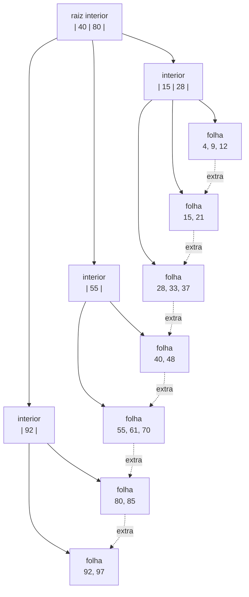
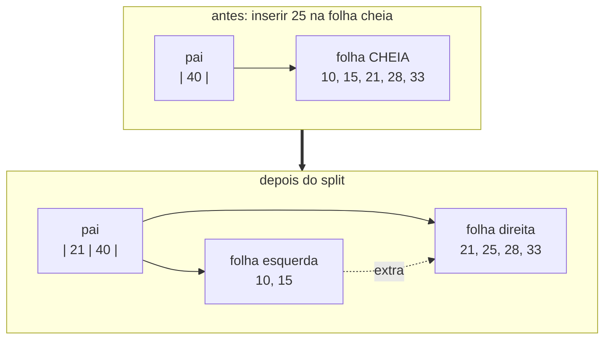

[Português](04-btree.md) · [English](../en/04-btree.md) · [↑ README](../../README.md)

# 04 · B+Tree

Um mapa ordenado de bytes para bytes, guardado em páginas de disco. É a estrutura que sustenta
tanto os índices quanto o catálogo do banco.

## Por que B+Tree e não B-Tree

Numa B-Tree, valores ficam em todos os nós. Numa B+Tree, valores ficam **apenas nas folhas**, e
os nós internos guardam somente separadores.

Duas consequências decidem a escolha:

**Fanout maior.** Um nó interno sem payload cabe muito mais chaves. Com chaves de 8 bytes, um nó
interno de 4 KB comporta em torno de 340 entradas, contra bem menos se cada uma carregasse um
valor junto. Isso derruba a altura da árvore, e a altura é a contagem de leituras de disco.

**Range scan barato.** As folhas são ligadas em lista pelo campo `extra` da página. Varrer um
intervalo é descer uma vez até a folha inicial e depois seguir ponteiros de irmão, sem voltar
para a raiz nenhuma vez. `WHERE id BETWEEN 100 AND 5000` vira leitura sequencial.



As setas pontilhadas são os ponteiros de irmão. Elas são o que transforma uma árvore em uma lista
ordenada quando você precisa de uma.

## Convenção dos separadores

Em um nó interior com separadores `k1, k2, ..., kn` e filhos `c0, c1, ..., cn`:

```
c0 contém chaves < k1
c1 contém chaves em [k1, k2)
c2 contém chaves em [k2, k3)
...
cn contém chaves >= kn        <- este é o campo `extra` da página
```

Intervalo fechado à esquerda, aberto à direita. Escolher essa convenção e nunca desviar dela é
mais importante do que qual das duas foi escolhida: metade dos bugs de B-Tree nascem de um `<`
onde devia haver `<=`.

O filho mais à direita não tem separador próprio, e por isso mora no campo `extra` do cabeçalho
da página em vez de em uma célula.

---

## Busca

```
buscar(chave):
    página = raiz
    enquanto página é interior:
        i = busca_binária(página.separadores, chave)
        página = filho(página, i)
    devolve busca_binária(página.células, chave)
```

Custo: uma leitura por nível. Com fanout de 340, um milhão de chaves cabe em três níveis, e um
bilhão em quatro. A raiz e o primeiro nível ficam residentes no buffer pool na prática, então uma
busca custa uma ou duas leituras físicas.

A busca binária dentro da página é comparação `memcmp` pura, sem interpretação de tipo, graças à
[codificação que preserva ordem](02-formato-de-arquivo.md#codificação-de-chave-que-preserva-ordem).

---

## Inserção e split

Se a célula cabe na folha, é só inserir e ajustar os slots. Se não cabe, a folha racha.



O procedimento:

1. Escolhe o ponto de corte que aproxima 50/50 **em bytes**, não em contagem de células. Com
   registros de tamanhos diferentes, dividir pela contagem produz páginas desbalanceadas.
2. Aloca uma folha nova, move a metade direita para lá.
3. Ajusta os ponteiros de irmão: a nova folha aponta para quem a antiga apontava, e a antiga
   passa a apontar para a nova.
4. Promove um separador para o pai.
5. Se o pai encher, ele racha também, recursivamente. Se a raiz rachar, uma raiz nova é criada e
   a árvore ganha um nível.

**Diferença que importa entre folha e interior:** ao rachar uma folha, a primeira chave da metade
direita é **copiada** para o pai, e continua existindo na folha. Ao rachar um nó interior, a
mediana é **movida** para o pai e some do nível de baixo — ela é só um separador, não um dado.

Trocar cópia por movimento na folha apaga uma chave real do banco. É um dos bugs mais caros de
diagnosticar, porque a árvore continua estruturalmente válida: só falta um registro.

---

## Remoção, merge e rebalanceamento

Remover é sempre mais difícil que inserir.

```
remover(chave):
    localiza a folha
    marca o slot como morto, atualiza `fragmented`
    se ocupação da folha >= 40%: termina

    se um irmão pode emprestar sem cair abaixo de 40%:
        redistribui, atualiza o separador no pai
    senão:
        funde com o irmão, remove o separador do pai
        se o pai cair abaixo de 40%: repete no nível acima
        se a raiz ficar com um único filho: a árvore perde um nível
```

O limiar de 40% em vez de 50% cria histerese. Com 50% exato, uma sequência alternada de inserção
e remoção na fronteira faz a árvore rachar e fundir a cada operação, queimando E/S sem mudar
nada. A faixa morta entre 40% e 50% mata essa oscilação.

### Plano de contingência

Merge e rebalanceamento propagando para cima são a parte mais difícil de acertar do projeto
inteiro. Se travar mais de duas semanas aqui, o corte é este:

> Remoção só marca tombstone. Nada de merge. Uma compactação offline, disparada manualmente,
> reconstrói a árvore.

Perde-se qualidade sob carga de remoção pesada, e isso fica registrado honestamente no README.
Não se perde correção. Um banco correto com uma limitação declarada vale mais que um banco
ambicioso e quebrado.

---

## Range scan

```rust
pub struct RangeIter<'a> {
    pool: &'a BufferPool,
    current_leaf: PageId,
    slot: u16,
    upper: Option<Vec<u8>>,
}
```

Desce uma vez até a folha do limite inferior, depois consome slots. Ao esgotar a folha, segue o
campo `extra` para a próxima. Para quando o `extra` é zero ou a chave passa do limite superior.

Custo: uma descida logarítmica mais leitura sequencial. É a razão de a B+Tree existir.

---

## Invariantes

Verificadas por um `check_tree()` chamado no fim de cada teste:

1. Toda folha está na mesma profundidade. A árvore é perfeitamente balanceada em altura.
2. Chaves dentro de cada página estão em ordem estritamente crescente.
3. Todas as chaves de um filho respeitam a faixa definida pelos separadores do pai.
4. Todo nó exceto a raiz tem ocupação de pelo menos 40%.
5. Seguir os ponteiros de irmão da folha mais à esquerda visita todas as chaves, uma vez cada, em
   ordem crescente.
6. Nenhuma página é alcançável por dois caminhos distintos a partir da raiz.
7. A contagem de chaves alcançáveis pela árvore é igual à contagem obtida pelo range scan.

A invariante 5 é a mais valiosa das sete. Ela cruza duas estruturas independentes — a hierarquia
e a lista ligada — e por isso pega quase todo bug de split ou merge que as outras deixam passar.

---

## Testes desta camada

**Contra um modelo** — um `BTreeMap<Vec<u8>, Vec<u8>>` da biblioteca padrão é o oráculo. Toda
operação é aplicada nos dois e comparada, incluindo o resultado de range scans aleatórios.

**Baseados em propriedade** — um milhão de chaves aleatórias inseridas e removidas em ordem
arbitrária, com `check_tree()` a cada operação em modo debug.

**Padrões adversariais**, porque aleatório uniforme não estressa split:

- chaves estritamente crescentes, que enchem sempre a página mais à direita
- chaves estritamente decrescentes
- todas as chaves com prefixo comum longo
- chaves de tamanho máximo, forçando cadeias de overflow
- inserção e remoção alternadas exatamente no limiar de ocupação, para testar a histerese

**Reprodutibilidade** — todo teste aleatório imprime a semente na falha. Um bug de B-Tree que não
reproduz não é investigável.

## Critério de pronto

- Um milhão de operações contra o `BTreeMap`, sem divergência.
- `check_tree()` passando após cada uma das operações em modo debug.
- Os cinco padrões adversariais no conjunto de testes fixos.
- Range scan devolvendo exatamente o mesmo conjunto que a travessia hierárquica.

---

Anterior: [03 · Pager e buffer pool](03-pager.md) · Próximo: [05 · WAL e recovery](05-wal-recovery.md)
