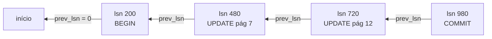
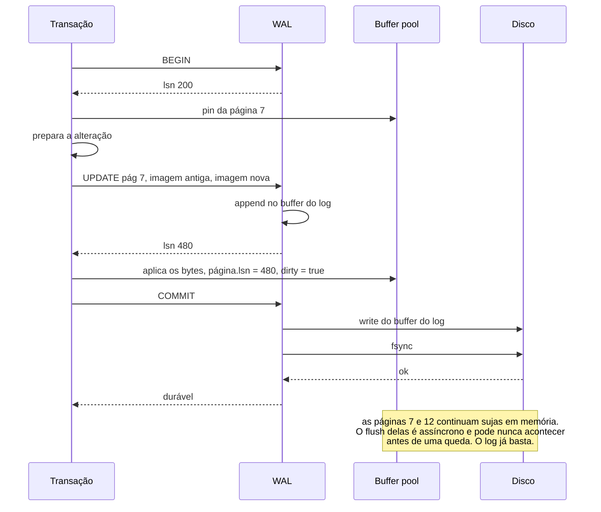
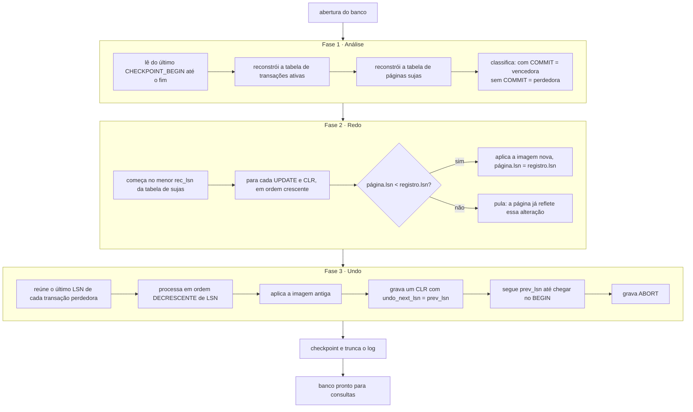
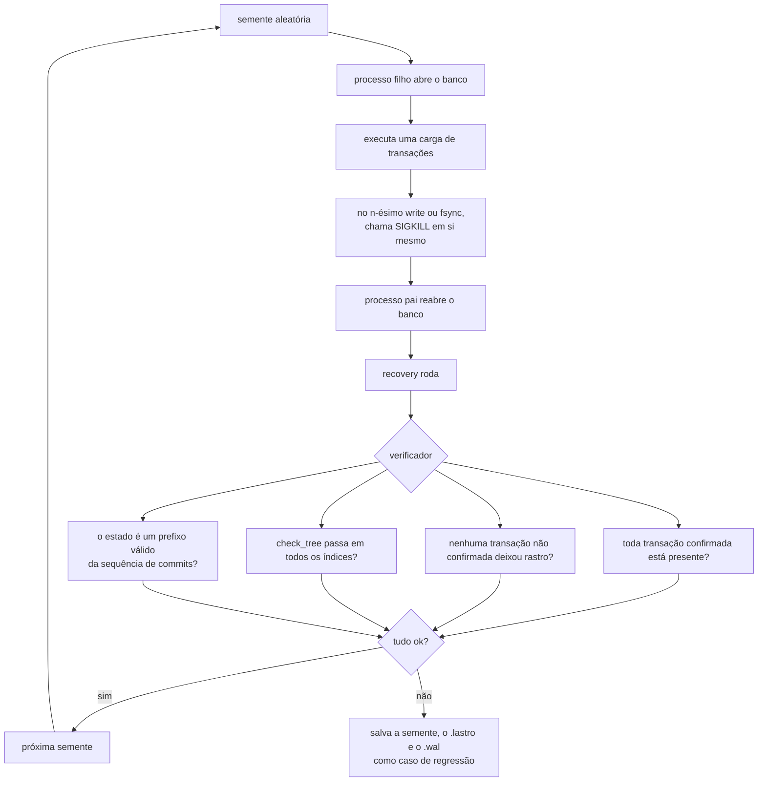

[Português](05-wal-recovery.md) · [English](../en/05-wal-recovery.md) · [↑ README](../../README.md)

# 05 · WAL e recovery

O coração do projeto. Tudo que veio antes é estrutura de dados em disco; é aqui que vira banco
de dados.

## O problema

Escrever uma página de 4 KB no disco **não é atômico**. O dispositivo garante atomicidade no
tamanho do setor — 512 bytes, ou 4 KB em discos modernos, e mesmo isso com ressalvas. Entre o
`write` e o dado assentado, existe cache do sistema operacional, cache do controlador e cache do
próprio disco.

Consequência: se a energia cair no meio da escrita de uma página, o que fica no disco pode ser
metade nova e metade velha. Uma célula com o cabeçalho novo e o corpo antigo. Um slot apontando
para bytes que não existem.

Pior ainda: uma transação que altera três páginas não tem como escrever as três
simultaneamente. Se cair depois da primeira, o banco fica em um estado que nenhuma transação
jamais produziu.

## A solução

Antes de mudar qualquer página, escreve-se no log o que vai ser mudado. O log é sequencial,
append-only, e cada registro carrega um checksum próprio.

**A regra WAL, em uma frase:** o registro de log que descreve uma alteração vai para o disco
antes da página alterada.

Com isso, depois de uma queda, o log responde a tudo:
- Transação com registro `COMMIT` no log mas página não escrita? **Redo.**
- Transação sem `COMMIT` mas com página já escrita? **Undo.**
- Registro com checksum quebrado? Cauda incompleta do log. Descarta dali para frente.

---

## Formato do registro

```
offset  tam  campo       descrição
------  ---  ----------  ------------------------------------------------
  0      8   lsn         u64, offset deste registro no arquivo de log
  8      8   txid        u64, transação dona do registro
 16      8   prev_lsn    u64, registro anterior da MESMA transação; 0 se primeiro
 24      1   rec_type    u8
 25      1   flags
 26      2   reservado
 28      4   body_len    u32
 32      4   checksum    u32, CRC32C do cabeçalho e do corpo
 36    var   body
```

**O LSN é o próprio offset do registro no arquivo.** Simplificação deliberada: saltar para um LSN
durante o undo é um `seek`, sem índice auxiliar. O preço é que o LSN não é sequencial, mas ele só
precisa ser monotônico, e é.

**`prev_lsn` encadeia os registros de uma mesma transação de trás para frente.** O undo segue essa
corrente e nunca precisa varrer o log inteiro procurando o que pertence a quem.



### Tipos de registro

| Valor | Tipo | Corpo |
|---|---|---|
| 1 | `BEGIN` | vazio |
| 2 | `UPDATE` | `page_id` u32, `offset` u16, `old_len` u16, `new_len` u16, bytes antigos, bytes novos |
| 3 | `COMMIT` | vazio |
| 4 | `ABORT` | vazio |
| 5 | `CLR` | igual ao `UPDATE`, mais `undo_next_lsn` u64 |
| 6 | `CHECKPOINT_BEGIN` | vazio |
| 7 | `CHECKPOINT_END` | tabela de transações ativas e tabela de páginas sujas, serializadas |
| 8 | `PAGE_ALLOC` | `page_id` u32 |
| 9 | `PAGE_FREE` | `page_id` u32 |

### Logging fisiológico

O `UPDATE` guarda **a imagem antiga e a nova de uma faixa de bytes dentro de uma página
identificada**. Nem lógico ("inseriu a chave 42 no índice"), nem puramente físico ("a página
inteira agora é isto").

- Log lógico é compacto, mas o redo precisa reexecutar a operação, e reexecutar um split de
  B+Tree durante recovery é a receita para a divergência mais difícil de depurar que existe.
- Log físico de página inteira é trivialmente idempotente, mas gasta 4 KB de log por alteração
  de um byte.

O meio-termo dá idempotência — aplicar a imagem nova duas vezes tem o mesmo efeito de aplicar uma
— com custo proporcional ao que mudou de fato. É a escolha do ARIES, e o motivo está em
[ADR-005](adr.md#adr-005--logging-fisiológico).

---

## O caminho de escrita



Três políticas, com nome próprio na literatura:

**Force-at-commit para o log.** O `fsync` do log é obrigatório no commit. É o único `fsync` no
caminho crítico, e é sequencial — o motivo de um banco conseguir milhares de commits por segundo.

**No-force para os dados.** Páginas sujas não precisam ir ao disco no commit. O redo cobre.

**Steal permitido.** Uma página suja de transação **não** commitada pode ser despejada e escrita
no disco se o buffer pool precisar do frame. O undo cobre. É por isso que a imagem antiga precisa
estar no log.

`no-force` sozinho exige redo. `steal` sozinho exige undo. Juntos exigem os dois, e é exatamente
por isso que o ARIES tem as duas fases.

---

## Checkpoint

Sem checkpoint, o recovery teria que ler o log desde o byte zero. Um banco de um ano em produção
levaria horas para abrir.

O checkpoint é **fuzzy**: não interrompe o funcionamento do banco.

1. Grava `CHECKPOINT_BEGIN`, guarda esse LSN.
2. Copia, sob trava breve, a tabela de transações ativas e a tabela de páginas sujas.
3. Libera a trava. O banco continua operando normalmente.
4. Grava `CHECKPOINT_END` com as duas tabelas serializadas no corpo.
5. Atualiza `last_checkpoint_lsn` na página 0 e faz `fsync` dela.

A **tabela de páginas sujas** mapeia `page_id` para `rec_lsn` — o LSN do registro que sujou
aquela página pela primeira vez desde que ela foi limpa pela última vez. O menor `rec_lsn` da
tabela é onde o redo vai começar, e é o que impede o recovery de reler o log inteiro.

Disparo: a cada 64 MB de log escrito, ou a cada 30 segundos, o que vier primeiro.

### Desvio na implementação: checkpoint sharp, não fuzzy

O checkpoint implementado **para o mundo** enquanto roda: força todas as páginas sujas ao disco,
sincroniza o arquivo de dados, e então trunca o log a zero. Não existem registros
`CHECKPOINT_BEGIN` e `CHECKPOINT_END` — não são necessários quando o log é esvaziado, porque o
recovery sempre começa do byte zero de um log curto.

O que se perde: sob carga, o banco fica parado durante o checkpoint. O que se ganha: a fase de
análise não precisa reconstruir tabela de transações ativas nem tabela de páginas sujas a partir
de um ponto de checkpoint, porque não há nada antes dele. Menos código, menos a errar, e o
limite de tempo do recovery continua sendo a frequência do checkpoint.

O checkpoint fuzzy é a evolução natural e está registrada como trabalho futuro, não como
omissão.

---

## Recovery: as três fases

Roda automaticamente na abertura, sempre que existe um `.wal` não vazio. Não é opcional nem
configurável.



### O detalhe que faz a fase 2 funcionar

O redo **repete a história**, incluindo as alterações de transações que não commitaram. Parece
errado, e é justamente o que torna o algoritmo simples: depois do redo, o banco está exatamente
no estado do instante da queda. A fase 3 então desfaz o que precisa ser desfeito, e não há caso
especial nenhum.

A comparação `página.lsn < registro.lsn` é o que dá idempotência. Uma página que já foi ao disco
com a alteração aplicada tem LSN maior ou igual, e é pulada. Recovery pode rodar dez vezes
seguidas sem mudar o resultado.

### O detalhe que faz a fase 3 sobreviver a uma segunda queda

O undo grava **CLRs** — registros de compensação. Um CLR diz "desfiz o registro X, e o próximo a
desfazer é Y". Se o processo morrer no meio do undo e o recovery recomeçar do zero, o redo
reaplica os CLRs, e o undo continua exatamente de onde parou, guiado por `undo_next_lsn`.

Sem CLR, uma queda durante o recovery levaria o banco a tentar desfazer duas vezes a mesma
alteração. Com logging fisiológico isso não é seguro: aplicar a imagem antiga em uma faixa de
bytes que já foi restaurada, e depois modificada por outra coisa, corrompe.

**CLRs nunca são desfeitos.** Eles só são refeitos.

### Cauda truncada

O último registro do log quase sempre está incompleto — a queda aconteceu no meio de um `write`.
A fase de análise valida o CRC32C de cada registro e para no primeiro que não confere. Tudo dali
para frente é descartado.

É seguro porque o `COMMIT` só é reportado ao usuário depois do `fsync`. Um registro que não
sobreviveu ao checksum é, por definição, de uma transação que nunca teve seu commit confirmado.

---

## O crash fuzzer

A parte que dá nome ao projeto e a única maneira honesta de afirmar qualquer coisa sobre
durabilidade.



**Por que `SIGKILL` e não uma exceção:** `SIGKILL` não pode ser capturado. Nenhum destrutor roda,
nenhum buffer é esvaziado, nenhum `Drop` acontece. É a simulação mais fiel de queda de energia
que dá para fazer sem hardware.

**Onde matar.** Uma camada de teste conta cada `write` e cada `fsync` do processo. O fuzzer sorteia
um número *n* e mata exatamente na n-ésima operação. Varrendo *n* de 1 até o total, todo ponto de
interrupção possível do caminho de commit é coberto.

**A propriedade verificada** é atomicidade, e a formulação exata importa: após o recovery, o banco
tem que estar em um estado correspondente a **algum prefixo** da sequência de commits confirmados.
Nem um commit a mais, nem um a menos, nem estado intermediário nenhum.

**Casos que ele pega e que teste normal não pega:**
- página suja despejada antes do log correspondente — o ramo `WALCHK` do buffer pool
- `fsync` do log ausente ou tardio no commit
- `page.lsn` não atualizado ao aplicar uma alteração, quebrando a idempotência do redo
- queda durante o próprio recovery, que só o CLR resolve
- split de B+Tree parcialmente aplicado, deixando a árvore com filho órfão

Meta na integração contínua: **50 mil sementes por execução**, com toda semente que falhou virando
teste fixo permanente.

---

## Critério de pronto

- 50 mil sementes do crash fuzzer sem violação de atomicidade.
- Queda injetada em cada uma das três fases do recovery, com o recovery seguinte concluindo.
- Recovery rodado dez vezes seguidas sobre o mesmo log, produzindo estado idêntico.
- Log truncado em posição aleatória, em cada byte de um registro, sempre abrindo sem pânico.
- Checkpoint disparado no meio da carga do fuzzer, sem alterar o resultado.

---

Anterior: [04 · B+Tree](04-btree.md) · Próximo: [06 · SQL](06-sql.md)
