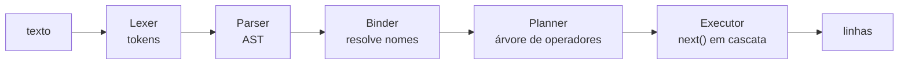

[Português](06-sql.md) · [English](../en/06-sql.md) · [↑ README](../../README.md)

# 06 · SQL

A camada visível. Transforma texto em uma árvore de operadores que puxa tuplas do motor.

## O caminho completo



Cada seta é uma transformação de estrutura de dados, testável isoladamente. O parser não toca em
disco. O planner não sabe o que é uma página. O executor não sabe o que é uma string de SQL.

---

## Subconjunto suportado

Deliberadamente pequeno, e escolhido pelo que exercita o motor abaixo, não pelo que parece
completo.

```sql
CREATE TABLE gado (
    id     INTEGER PRIMARY KEY,
    brinco TEXT NOT NULL,
    peso   REAL,
    ativo  BOOLEAN DEFAULT TRUE
);

CREATE INDEX idx_brinco ON gado (brinco);

INSERT INTO gado (id, brinco, peso) VALUES (1, 'BR-0042', 431.5);

SELECT g.brinco, p.data
FROM gado g
JOIN pesagem p ON p.gado_id = g.id
WHERE g.peso > 400 AND g.ativo = TRUE
ORDER BY g.peso DESC
LIMIT 10;

UPDATE gado SET peso = 450.0 WHERE id = 1;
DELETE FROM gado WHERE ativo = FALSE;

BEGIN; COMMIT; ROLLBACK;

EXPLAIN SELECT ...;
```

**Fica de fora:** subconsultas, `GROUP BY` e agregação, `HAVING`, CTE, window function,
`OUTER JOIN`, `ALTER TABLE`, view, trigger, chave estrangeira.

Cada uma é uma extensão natural depois que a base estiver de pé. Nenhuma delas ensina algo sobre
armazenamento e durabilidade, que é o objetivo do projeto.

---

## Gramática

Notação EBNF. `{ x }` é zero ou mais, `[ x ]` é opcional.

```ebnf
statement    = select | insert | update | delete
             | create_table | create_index
             | begin | commit | rollback | explain ;

select       = "SELECT" proj_list
               "FROM" table_ref { join_clause }
               [ "WHERE" expr ]
               [ "ORDER BY" order_item { "," order_item } ]
               [ "LIMIT" integer [ "OFFSET" integer ] ] ;

proj_list    = "*" | proj_item { "," proj_item } ;
proj_item    = expr [ "AS" identifier ] ;
table_ref    = identifier [ [ "AS" ] identifier ] ;
join_clause  = [ "INNER" ] "JOIN" table_ref "ON" expr ;
order_item   = expr [ "ASC" | "DESC" ] ;

insert       = "INSERT" "INTO" identifier
               [ "(" identifier { "," identifier } ")" ]
               "VALUES" "(" expr { "," expr } ")"
                      { "," "(" expr { "," expr } ")" } ;

update       = "UPDATE" identifier "SET" assign { "," assign } [ "WHERE" expr ] ;
assign       = identifier "=" expr ;

delete       = "DELETE" "FROM" identifier [ "WHERE" expr ] ;

create_table = "CREATE" "TABLE" [ "IF" "NOT" "EXISTS" ] identifier
               "(" col_def { "," col_def } ")" ;
col_def      = identifier type_name { col_constraint } ;
type_name    = "INTEGER" | "REAL" | "TEXT" | "BLOB" | "BOOLEAN" ;
col_constraint = "PRIMARY" "KEY" | "NOT" "NULL" | "UNIQUE" | "DEFAULT" literal ;

create_index = "CREATE" [ "UNIQUE" ] "INDEX" identifier
               "ON" identifier "(" identifier { "," identifier } ")" ;

expr         = or_expr ;
or_expr      = and_expr { "OR" and_expr } ;
and_expr     = not_expr { "AND" not_expr } ;
not_expr     = [ "NOT" ] cmp_expr ;
cmp_expr     = add_expr [ ( "=" | "<>" | "<" | "<=" | ">" | ">=" ) add_expr
                        | "IS" [ "NOT" ] "NULL"
                        | [ "NOT" ] "LIKE" add_expr
                        | [ "NOT" ] "BETWEEN" add_expr "AND" add_expr ] ;
add_expr     = mul_expr { ( "+" | "-" ) mul_expr } ;
mul_expr     = primary { ( "*" | "/" | "%" ) primary } ;
primary      = literal | column_ref | "(" expr ")" | "-" primary ;
column_ref   = [ identifier "." ] identifier ;
literal      = number | string | "TRUE" | "FALSE" | "NULL" ;
```

Parser recursivo descendente, uma função por não-terminal. Precedência de operador resolvida pela
própria hierarquia de regras — `or_expr` chama `and_expr`, que chama `cmp_expr`, e assim por
diante. Sem tabela de precedência, sem gerador de parser.

---

## Binder

Etapa entre o parser e o planner, e a que quase todo tutorial esquece.

Responsabilidades:

- Resolver cada nome de tabela contra o catálogo, obtendo o id e o schema.
- Resolver cada nome de coluna para um índice posicional dentro da tupla. Depois desta etapa,
  ninguém mais compara strings no caminho quente.
- Rejeitar nome ambíguo em consulta com junção.
- Inferir e conferir tipos de cada expressão.
- Expandir `*` na lista de colunas concretas.

Separar isso do parser mantém o parser puramente sintático, e portanto testável sem catálogo,
sem banco e sem disco.

---

## Catálogo

O schema do banco mora em tabelas do próprio banco. O `lastro` descreve a si mesmo.

```sql
-- tabela interna, id fixo 1
lastro_tables(table_id INTEGER, name TEXT, root_page INTEGER)

-- tabela interna, id fixo 2
lastro_columns(table_id INTEGER, ord INTEGER, name TEXT,
               type INTEGER, flags INTEGER, default_value BLOB)

-- tabela interna, id fixo 3
lastro_indexes(index_id INTEGER, table_id INTEGER, name TEXT,
               root_page INTEGER, unique_flag INTEGER, columns BLOB)
```

A raiz da B+Tree de `lastro_tables` está no campo `catalog_root` da página 0. É o único ponteiro
externo que existe; todo o resto é alcançado a partir dele.

Vantagem concreta: um `CREATE TABLE` é uma transação normal, com WAL, redo e undo de graça. DDL
que cai no meio é desfeito pelo mesmo mecanismo que desfaz um `INSERT`. Não existe código
especial para tornar DDL atômico — o que é uma fonte clássica de bugs em bancos que guardam
schema fora do motor transacional.

---

## Planner

Baseado em regras, não em custo ([ADR-007](adr.md#adr-007--planner-baseado-em-regras)). As regras,
em ordem de aplicação:

1. **Escolha de acesso.** Se o `WHERE` tem igualdade ou faixa sobre a coluna líder de algum
   índice, usa `IndexScan`. Senão, `SeqScan`.
2. **Empurrar o predicado.** Filtro que menciona só uma tabela desce para logo acima do scan
   daquela tabela, reduzindo o volume antes da junção.
3. **Empurrar a projeção.** Colunas não referenciadas por ninguém acima param de ser
   materializadas.
4. **Escolha de junção.** Se a condição é igualdade, `HashJoin`, com a menor relação estimada
   como lado de construção. Senão, `NestedLoopJoin`.
5. **Eliminar ordenação.** Se o `ORDER BY` casa com a ordem que o `IndexScan` já produz, o nó
   `Sort` é removido.
6. **Empurrar o limite.** `LIMIT` acima de `Sort` vira um top-N com heap limitado, em vez de
   ordenar tudo e descartar.

### Exemplo de plano

```sql
EXPLAIN
SELECT g.brinco, p.data
FROM gado g JOIN pesagem p ON p.gado_id = g.id
WHERE g.peso > 400
ORDER BY g.peso DESC
LIMIT 10;
```

```
Limit (n=10)
  Sort (g.peso DESC, top-10)
    HashJoin (p.gado_id = g.id)
      build: SeqScan gado
               Filter: peso > 400
               Project: id, brinco, peso
      probe: SeqScan pesagem
               Project: gado_id, data
```

O `EXPLAIN` sai desde o primeiro dia da camada. Um planner cujo plano não é inspecionável é
impossível de depurar, e o plano impresso é o teste mais barato que existe para as seis regras.

---

## Executor

Modelo iterator, também chamado de Volcano. Cada operador é um `next()` que puxa uma tupla do
operador abaixo.

```rust
pub trait Operator {
    fn open(&mut self, ctx: &mut ExecCtx) -> Result<()>;
    fn next(&mut self, ctx: &mut ExecCtx) -> Result<Option<Tuple>>;
    fn close(&mut self) -> Result<()>;
}
```

A árvore de operadores é uma árvore de `Box<dyn Operator>`. Chamar `next()` na raiz puxa uma
linha por toda a cadeia, sob demanda.

A propriedade que justifica a escolha: **memória constante para consultas em pipeline**. Um
`SELECT` com filtro sobre uma tabela de 100 GB atravessa o executor uma tupla por vez. Só
operadores bloqueantes — `Sort` e o lado de construção do `HashJoin` — precisam materializar, e
por isso são os únicos com política de derrame para disco.

### Operadores

| Operador | Comportamento | Memória |
|---|---|---|
| `SeqScan` | percorre as páginas de heap da tabela | O(1) |
| `IndexScan` | range scan na B+Tree, busca a tupla pelo RowId | O(1) |
| `Filter` | descarta tuplas que não satisfazem o predicado | O(1) |
| `Project` | seleciona e calcula colunas de saída | O(1) |
| `NestedLoopJoin` | para cada tupla externa, varre a interna | O(1) |
| `HashJoin` | constrói tabela hash do lado menor, sonda com o maior | O(lado de construção) |
| `Sort` | ordenação externa por merge, com derrame para disco | O(memória de trabalho) |
| `Limit` | conta e para | O(1) |
| `Insert` | grava no heap e em todos os índices | O(1) |
| `Update` | nova versão MVCC, atualiza os índices afetados | O(1) |
| `Delete` | marca `xmax` na versão visível | O(1) |

### Ordenação externa

Quando o `Sort` estoura o orçamento de memória:

1. Ordena o que cabe, grava uma partição ordenada em arquivo temporário.
2. Repete até esgotar a entrada.
3. Faz merge de k vias das partições, com um heap de mínimo.

É o único lugar do executor que escreve fora do arquivo do banco. Os temporários vivem ao lado do
`.lastro` e são apagados no `close()`, ou na abertura seguinte se o processo tiver morrido antes.

### Avaliação de expressão

Árvore de expressão interpretada, com despacho por `match` sobre o enum do nó. Sem compilação
para bytecode e sem geração de código.

O SQLite compila para uma máquina virtual de registradores, e ganha bastante com isso. É uma
otimização legítima, mas pertence a outro projeto — aqui ela esconderia a semântica atrás de uma
camada a mais no momento em que a semântica ainda está sendo definida.

**Lógica de três valores**, obrigatória e fácil de errar:

| a | b | `a AND b` | `a OR b` |
|---|---|---|---|
| verdadeiro | nulo | nulo | verdadeiro |
| falso | nulo | falso | nulo |
| nulo | nulo | nulo | nulo |

E a regra que segue dela: `WHERE` só deixa passar a tupla quando o predicado é **verdadeiro**.
Nulo não passa. `NULL = NULL` é nulo, não verdadeiro.

---

## Critério de pronto

- Parser aceita a gramática inteira e rejeita entrada malformada com posição de erro.
- Fuzzer de parser: cem mil strings aleatórias sem pânico, só erro estruturado.
- Round-trip AST para SQL e de volta para AST, produzindo a mesma árvore.
- `EXPLAIN` cobrindo as seis regras do planner em testes fixos.
- Lógica de três valores conferida contra a tabela verdade completa.
- `Sort` derramando para disco corretamente com orçamento de memória artificialmente pequeno.

---

Anterior: [05 · WAL e recovery](05-wal-recovery.md) · Próximo: [07 · MVCC](07-mvcc.md)
