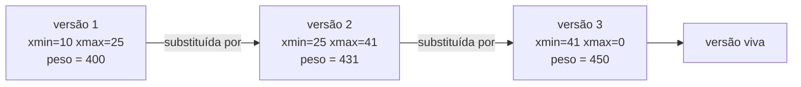
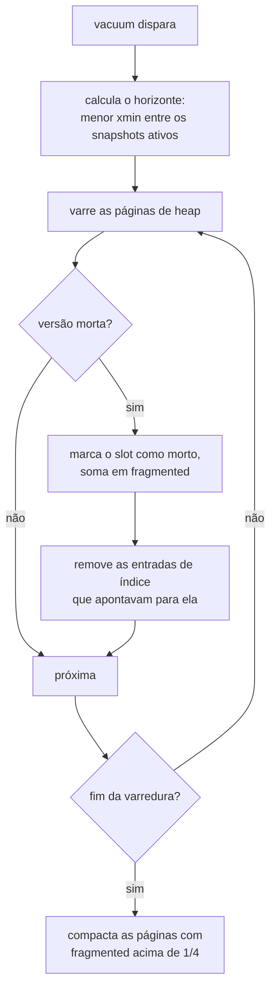

[Português](07-mvcc.md) · [English](../en/07-mvcc.md) · [↑ README](../../README.md)

# 07 · MVCC

Controle de concorrência multiversão. A ideia toda cabe em uma frase: **escrever nunca sobrescreve
— cria uma versão nova.**

Com isso, um leitor nunca precisa esperar por um escritor, e um escritor nunca precisa esperar por
um leitor. Cada transação enxerga o banco como ele estava no instante em que ela começou.

## Cabeçalho de versão

Toda tupla no heap ganha dois campos além dos dados:

```
+--------+--------+---------------------------+
| xmin   | xmax   | tupla codificada          |
| u64    | u64    |                           |
+--------+--------+---------------------------+
```

- **`xmin`** — id da transação que criou esta versão.
- **`xmax`** — id da transação que a apagou ou substituiu. Zero significa versão viva.

E as operações viram:

| Operação | O que acontece de fato |
|---|---|
| `INSERT` | grava versão com `xmin = txid` e `xmax = 0` |
| `DELETE` | grava `xmax = txid` na versão visível; os bytes continuam lá |
| `UPDATE` | `xmax = txid` na versão antiga, **mais** uma versão nova com `xmin = txid` |

Um `UPDATE` é um `DELETE` seguido de um `INSERT`. Essa é a escolha do Postgres, e ela tem uma
consequência que vale declarar: **o índice precisa apontar para a versão nova**, porque a antiga
continua existindo em outro lugar da página ou em outra página.

---

## Snapshot

Quando uma transação começa, ela tira uma fotografia do estado de concorrência:

```rust
pub struct Snapshot {
    xmin: TxId,          // menor txid ativo no momento da criação
    xmax: TxId,          // próximo txid a ser distribuído
    active: Vec<TxId>,   // txids em andamento neste instante
}
```

Interpretação:

- `txid < snapshot.xmin` — com certeza terminou antes deste snapshot.
- `txid >= snapshot.xmax` — com certeza começou depois. Invisível.
- Entre os dois — depende de estar ou não em `active`.

O snapshot é imutável e vale pela transação inteira, o que dá **repeatable read** de graça: a
mesma consulta rodada duas vezes na mesma transação devolve exatamente o mesmo resultado, mesmo
que meio mundo tenha commitado no intervalo.

---

## A regra de visibilidade

O coração do MVCC. Uma versão é visível para um snapshot se, e somente se:

```
visível(versão, snap) =
       criador_visível(versão.xmin, snap)
   AND NOT removedor_visível(versão.xmax, snap)

criador_visível(x, snap) =
       x == txid_da_propria_transacao
    OR ( commitada(x) AND x < snap.xmax AND x NOT IN snap.active )

removedor_visível(x, snap) =
       x != 0
   AND ( x == txid_da_propria_transacao
         OR ( commitada(x) AND x < snap.xmax AND x NOT IN snap.active ) )
```

Em português: **a versão é visível se quem a criou já tinha commitado quando eu comecei, e quem a
apagou ainda não tinha commitado quando eu comecei.**

O caso `x == txid_da_propria_transacao` é o que faz uma transação enxergar as próprias
alterações antes do commit. Sem ele, um `INSERT` seguido de `SELECT` dentro da mesma transação
não devolveria a linha recém inserida.

### Exemplo em linha do tempo

```
tempo →

T10  BEGIN ────── INSERT id=1 ────── COMMIT
T20        BEGIN ─────────────────────────── SELECT ──── COMMIT
T30                    BEGIN ── SELECT ────────────────── COMMIT
```

- **T20** começou antes de T10 commitar. T10 está em `active` no snapshot de T20.
  Resultado: T20 **não** vê `id=1`, nem no `SELECT` tardio.
- **T30** começou depois de T10 commitar. T10 não está em `active`.
  Resultado: T30 **vê** `id=1`.

Duas transações rodando ao mesmo tempo, lendo a mesma tabela, com resultados diferentes e ambos
corretos. É esse o comportamento que o teste de anomalias precisa confirmar.

---

## Cadeia de versões



Uma transação com snapshot anterior a 25 lê a versão 1. Entre 25 e 41, lê a versão 2. Depois de
41, lê a versão 3. Todas as três coexistem no arquivo ao mesmo tempo.

**Armazenamento escolhido:** as versões ficam no heap, ligadas por um ponteiro `next_version` no
cabeçalho da tupla. É o modelo do Postgres. A alternativa é o *undo log* do MySQL, onde a versão
mais nova fica no lugar e as antigas vivem num segmento separado.

Trade-off: no modelo do Postgres, ler a versão mais recente é direto e ler versões antigas custa
seguir a cadeia; escrita é barata. No modelo do MySQL, é o inverso. Como este banco é
single-writer e a carga típica lê muito mais do que escreve, o modelo do Postgres ganha — além
de ser mais simples de implementar com o heap que já existe.

---

## Nível de isolamento

**Snapshot isolation.** Nada mais forte, e isso está declarado no README.

O que ele previne:

| Anomalia | Prevenida? | Por quê |
|---|---|---|
| Dirty read | sim | versão não commitada nunca passa na regra de visibilidade |
| Non-repeatable read | sim | o snapshot é fixo durante a transação inteira |
| Phantom read | sim | linhas novas têm `xmin` maior ou igual a `snap.xmax` |
| Lost update | sim | detecção de conflito de escrita, abaixo |
| **Write skew** | **não** | ver abaixo |

### Detecção de conflito de escrita

Quando uma transação vai gravar `xmax` em uma versão, ela checa se outra transação já gravou ali:

```
se versão.xmax != 0 e transação(versão.xmax) commitou depois do meu snapshot:
    aborta com erro de conflito de serialização
```

É a regra *first-updater-wins*. Ela é o que impede lost update. Em um banco single-writer o
conflito é raro, mas a checagem precisa existir de qualquer forma — sem ela, uma transação longa
sobrescreveria silenciosamente o trabalho de uma curta que commitou no meio.

### Write skew, e por que ele fica

O contraexemplo clássico. Regra de negócio: pelo menos um veterinário de plantão a qualquer
momento. Dois de plantão, Ana e Bruno.

```
T1: SELECT COUNT(*) FROM plantao WHERE ativo = TRUE   -- lê 2, ok
T2: SELECT COUNT(*) FROM plantao WHERE ativo = TRUE   -- lê 2, ok
T1: UPDATE plantao SET ativo = FALSE WHERE nome = 'Ana'
T2: UPDATE plantao SET ativo = FALSE WHERE nome = 'Bruno'
T1: COMMIT
T2: COMMIT
```

As duas commitam. Nenhum veterinário de plantão. Nenhuma anomalia da lista foi violada — elas
escreveram em **linhas diferentes**, então não houve conflito de escrita, e cada uma leu um
snapshot perfeitamente consistente.

Prevenir isso exige *serializable snapshot isolation*, que rastreia dependências de leitura e
escrita em um grafo e aborta quando detecta um ciclo. É um projeto grande por si só, e
[fica documentado como não implementado](adr.md#adr-004--mvcc-em-vez-de-travamento-em-duas-fases)
em vez de ser fingido.

A bateria de testes de anomalia vai mostrar exatamente esta tabela, com o `não` no lugar dele.
Um banco que declara honestamente o que não faz é mais confiável que um que promete
serializabilidade e entrega snapshot isolation — que, por sinal, é o que o Oracle faz quando você
pede `SERIALIZABLE`.

---

## Coleta de versões mortas

Sem coleta, o arquivo cresce para sempre. Uma tabela com mil `UPDATE` na mesma linha teria mil
versões, e cada leitura percorreria a cadeia inteira.

Uma versão está **morta** quando nenhuma transação presente ou futura pode enxergá-la:

```
morta(versão) =
    versão.xmax != 0
    AND commitada(versão.xmax)
    AND versão.xmax < menor_snapshot_ativo
```

O `menor_snapshot_ativo` é o horizonte. Nada abaixo dele interessa a ninguém.



Disparo: quando as versões mortas passarem de 20% da tabela, contabilizadas por um estimador
incremental atualizado a cada `UPDATE` e `DELETE`.

**O problema da transação longa**, que vale registrar porque morde na prática: uma transação
aberta por horas segura o horizonte lá atrás, e nenhuma versão mais recente que ela pode ser
coletada. A tabela incha mesmo com o vacuum rodando. No Postgres isso se chama *bloat*, é a causa
de metade dos incidentes de produção com o banco, e a mitigação aqui é a mesma: registrar a idade
da transação mais antiga como métrica e reclamar alto quando passar de um limiar.

---

## Interação com o WAL

MVCC não substitui o log. As duas coisas resolvem problemas diferentes:

- **MVCC** resolve concorrência: quem enxerga o quê, sem travar.
- **WAL** resolve durabilidade: o que sobrevive a uma queda.

Uma versão nova é uma alteração de página como qualquer outra, e portanto gera registro `UPDATE`
no log. O status de commit de cada transação também vai para o log — é o registro `COMMIT` que
responde `commitada(x)` depois de um recovery.

Detalhe que exige cuidado: durante o recovery, a lista de transações ativas é reconstruída pela
fase de análise. Uma transação sem `COMMIT` no log é perdedora, é desfeita, e todas as versões
que ela criou desaparecem no undo. Depois disso, nenhum snapshot pode enxergá-las — o que é
exatamente o comportamento correto, obtido sem nenhum código específico de MVCC no recovery.

---

## Critério de pronto

- Tabela verdade completa da regra de visibilidade em teste fixo, com todas as combinações de
  `xmin` e `xmax` contra snapshots antes, durante e depois.
- Bateria de anomalias produzindo exatamente a tabela declarada acima, incluindo o write skew
  reproduzido de propósito.
- Vacuum coletando toda versão morta e nenhuma versão viva, verificado contra um modelo.
- Transação longa artificial confirmando que o horizonte segura a coleta como esperado.
- Crash fuzzer rodando com carga MVCC concorrente, sem violação de atomicidade.

---

Anterior: [06 · SQL](06-sql.md) · Próximo: [08 · Testes e provas](08-testes.md)
