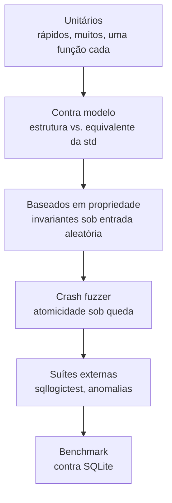

[Português](08-testes.md) · [English](../en/08-testing.md) · [↑ README](../../README.md)

# 08 · Testes e provas

A tese do projeto: escrever o banco é a parte fácil, provar que ele está correto é o trabalho de
verdade. Este documento descreve como as afirmações do README vão ser sustentadas.

## A pirâmide



Quanto mais alto, mais lento e mais valioso por execução. Os três primeiros níveis rodam em cada
commit. O crash fuzzer e as suítes externas rodam no merge para a `main`. O benchmark roda quando
pedido e sempre na mesma máquina.

---

## 1 · Contra modelo

A técnica com melhor relação entre esforço e bug encontrado. Para cada estrutura, existe um
equivalente confiável na biblioteca padrão:

| Estrutura do `lastro` | Oráculo |
|---|---|
| Buffer pool | `HashMap<PageId, [u8; 4096]>` |
| B+Tree | `BTreeMap<Vec<u8>, Vec<u8>>` |
| Heap | `Vec<Option<Tuple>>` |
| Catálogo | `HashMap<String, Schema>` |

Toda operação vai para os dois. Os estados são comparados depois de cada uma. Divergência é bug,
e o `proptest` reduz automaticamente a sequência até o menor exemplo que ainda falha — o que
transforma uma falha de dez mil operações em um caso de três linhas.

```rust
proptest! {
    #[test]
    fn btree_concorda_com_btreemap(ops in vec(any::<Op>(), 0..10_000)) {
        let mut real = BTree::new_temp()?;
        let mut modelo = BTreeMap::new();
        for op in ops {
            match op {
                Op::Insert(k, v) => { real.insert(&k, &v)?; modelo.insert(k, v); }
                Op::Delete(k)    => { real.delete(&k)?;     modelo.remove(&k); }
                Op::Range(a, b)  => {
                    prop_assert_eq!(
                        real.range(&a..&b)?.collect::<Vec<_>>(),
                        modelo.range(a..b).map(|(k,v)| (k.clone(), v.clone())).collect::<Vec<_>>()
                    );
                }
            }
            real.check_tree()?;
        }
        prop_assert_eq!(real.iter()?.collect::<Vec<_>>(), modelo.into_iter().collect::<Vec<_>>());
    }
}
```

---

## 2 · Invariantes

Cada camada declara as suas, verificadas por `debug_assert!` no caminho normal e explicitamente
no fim de cada teste. A lista completa está em cada documento:
[pager](03-pager.md#invariantes), [B+Tree](04-btree.md#invariantes).

O ponto: uma invariante violada é detectada **na operação que a quebrou**, não dez mil operações
depois, quando o rastro já sumiu. É a diferença entre uma tarde e uma semana de depuração.

---

## 3 · Crash fuzzer

Descrito em detalhe em [05 · WAL e recovery](05-wal-recovery.md#o-crash-fuzzer). O resumo
operacional:

```bash
cargo test --release --test crash -- --seeds 50000
```

**A propriedade verificada**, com precisão: após o recovery, o estado do banco corresponde a algum
**prefixo** da sequência de commits confirmados. Nem um a mais, nem um a menos, nem estado
intermediário.

**Como matar.** Uma camada de injeção envolve `write` e `fsync`, contando cada chamada. O fuzzer
sorteia *n* e emite `SIGKILL` na n-ésima. Varrer *n* de 1 até o total cobre todo ponto de
interrupção possível.

**Verificador**, quatro perguntas em ordem:

1. Toda transação cujo `COMMIT` foi confirmado ao cliente está presente na íntegra?
2. Nenhuma transação sem `COMMIT` deixou rastro visível?
3. `check_tree()` passa em todos os índices?
4. Heap e índices concordam sobre quais RowIds existem?

Toda semente que falha vira teste fixo permanente, com o `.lastro` e o `.wal` do momento da falha
salvos no repositório. O conjunto de regressão cresce e nunca encolhe.

---

## 4 · SQL Logic Test

A suíte de testes do SQLite. Milhões de asserções em arquivos de texto, escritas por terceiros,
comparando resultado de consulta contra saída esperada.

```
statement ok
CREATE TABLE t1(a INTEGER, b INTEGER)

statement ok
INSERT INTO t1 VALUES(1, 2)

query II rowsort
SELECT a, b FROM t1 WHERE a > 0
----
1
2
```

**Por que isso vale mais do que qualquer teste próprio:** foi escrito por gente que não sabia da
existência deste projeto, para exercitar um banco que não é este. Não tem como estar
acidentalmente moldado às escolhas de implementação daqui — que é exatamente o vício de todo
conjunto de testes escrito pelo próprio autor.

**Como será reportado.** A suíte inteira não é aplicável: boa parte usa `GROUP BY`, subconsulta e
outras coisas [fora do escopo](06-sql.md#subconjunto-suportado). O relatório declara a filtragem
antes do número:

```
Arquivos considerados:      N     (apenas os que usam o subconjunto suportado)
Asserções executadas:       N
Aprovadas:                  N     (NN,N%)
Falhas por recurso ausente: N     (listadas nominalmente)
Falhas por bug:             N     (cada uma com issue aberta)
```

Publicar "passa 99%" escondendo que 90% dos arquivos foram descartados seria mentira estatística.
O denominador vai junto do numerador.

---

## 5 · Bateria de anomalias

Jepsen reduzido a um nó. Cada anomalia é um roteiro de duas transações intercaladas, com o
resultado esperado declarado antes de rodar.

```rust
#[test]
fn write_skew_acontece_como_documentado() {
    let db = Db::temp();
    db.exec("CREATE TABLE plantao (nome TEXT, ativo BOOLEAN)");
    db.exec("INSERT INTO plantao VALUES ('ana', TRUE), ('bruno', TRUE)");

    let t1 = db.begin();
    let t2 = db.begin();

    assert_eq!(t1.query_int("SELECT COUNT(*) FROM plantao WHERE ativo"), 2);
    assert_eq!(t2.query_int("SELECT COUNT(*) FROM plantao WHERE ativo"), 2);

    t1.exec("UPDATE plantao SET ativo = FALSE WHERE nome = 'ana'");
    t2.exec("UPDATE plantao SET ativo = FALSE WHERE nome = 'bruno'");

    t1.commit().unwrap();
    t2.commit().unwrap();   // commita: linhas diferentes, sem conflito de escrita

    // A invariante de negócio foi violada. Isso é esperado sob snapshot
    // isolation e está declarado no README.
    assert_eq!(db.query_int("SELECT COUNT(*) FROM plantao WHERE ativo"), 0);
}
```

O teste **afirma a anomalia**, em vez de escondê-la. Se um dia o isolamento for endurecido para
serializable, este teste falha, e a falha é o aviso correto de que a documentação precisa mudar
junto.

---

## 6 · Benchmark

### Metodologia, declarada antes do resultado

- Máquina única, especificação publicada, sem variação entre execuções.
- SQLite como referência, versão fixada e citada.
- Configuração equivalente dos dois lados: mesmo modo de sincronização, mesmo tamanho de página,
  mesmo tamanho de cache. Comparar `lastro` com `fsync` contra SQLite em `PRAGMA synchronous=OFF`
  seria fraude.
- Cinco execuções, reportando mediana e desvio.
- Cache do sistema operacional limpo entre execuções.
- Números apresentados como mediana e p99, nunca só a média.

### Cargas

| Carga | O que estressa |
|---|---|
| Inserção sequencial, 1 M linhas | split da B+Tree no caso melhor, taxa do WAL |
| Inserção aleatória, 1 M linhas | split no caso pior, taxa de acerto do buffer pool |
| Busca pontual, 100 k lookups | altura da árvore, custo de busca |
| Range scan, 10% da tabela | ponteiro de irmão da folha, leitura sequencial |
| Update pontual, 100 k | cadeia de versões MVCC, volume de log |
| Transações pequenas, 10 k commits | custo do `fsync`, latência de commit |

### O que será publicado

**A expectativa é perder, por margem larga.** O SQLite tem 25 anos de otimização e este projeto
tem um semestre.

O que entra no README, junto do gráfico:

1. O gráfico, com a derrota visível.
2. O perfil de execução mostrando onde o tempo vai — `perf` ou `flamegraph`.
3. A análise: qual decisão de arquitetura custa quanto, e o que seria preciso mudar para fechar a
   diferença.

Um benchmark que mostra derrota com o perfil explicando o porquê ensina mais, e lê como
engenharia mais madura, do que um número escolhido para favorecer o autor. É por isso que a seção
existe.

---

## Integração contínua

```yaml
# .github/workflows/ci.yml
em cada push:
  - cargo fmt --check
  - cargo clippy -- -D warnings
  - cargo test                        # unitários e modelo, ~2 min
  - cargo test --release -- proptest  # propriedade, ~5 min

em pull request para a main:
  - crash fuzzer, 5.000 sementes      # ~15 min
  - sqllogictest, suíte filtrada
  - bateria de anomalias

diariamente:
  - crash fuzzer, 50.000 sementes     # ~2 h
  - cargo miri test                   # detecção de comportamento indefinido
```

`cargo miri` na rotina diária porque as partes de `unsafe` — manipulação de bytes crus dentro das
páginas — são exatamente onde o compilador para de ajudar.

---

## O que este conjunto ainda não cobre

Registrado por honestidade, porque conjunto de testes que se declara completo está sempre errado:

- **Corrupção silenciosa de disco.** Bit flip sem erro de E/S. Mitigado parcialmente pelo checksum
  por página, não testado sistematicamente.
- **Mentira do `fsync`.** Alguns dispositivos confirmam sem ter persistido. Sem hardware
  específico, é impossível verificar do lado do software.
- **Concorrência real de escrita.** O modelo é single-writer, então a classe inteira de bugs de
  escritores concorrentes não existe aqui — mas também não está testada, e passaria a importar se
  o modelo mudasse.
- **Volume de produção.** Tudo é testado na casa dos milhões de linhas. Bilhões podem revelar
  problemas de escala que não aparecem antes.

---

Anterior: [07 · MVCC](07-mvcc.md) · Próximo: [09 · Roadmap](09-roadmap.md)
